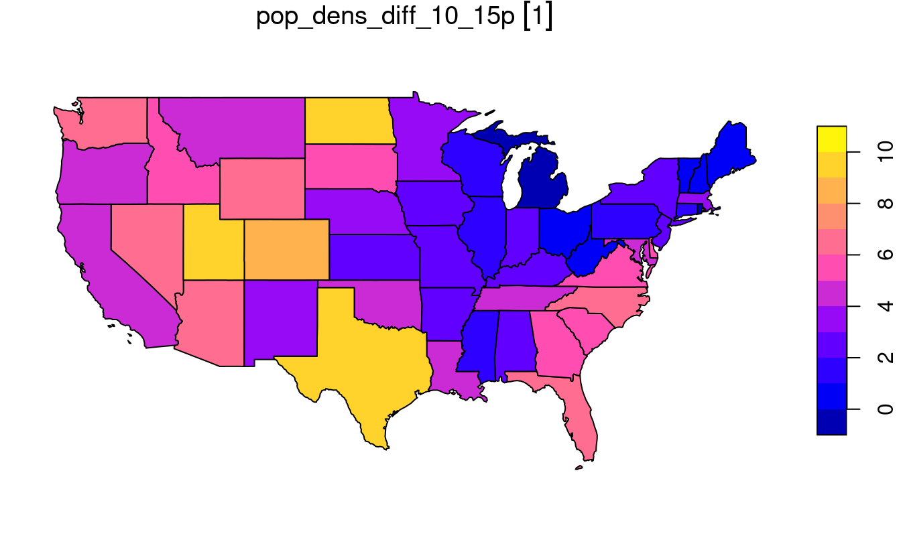
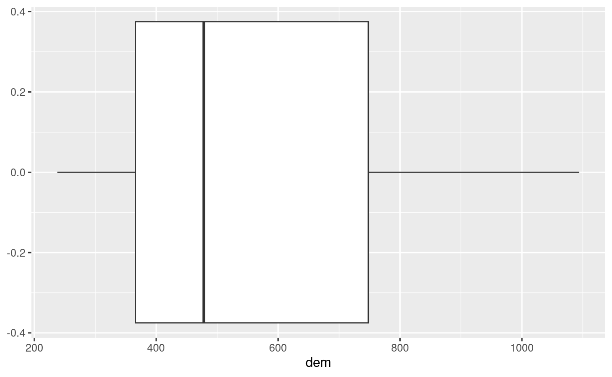

# Attribute data operations {#attr}


For these exercises we will use the `us_states` and `us_states_df` datasets from the **spData** package.
You must have attached the package, and other packages used in the attribute operations chapter (**sf**, **dplyr**, **terra**) with commands such as `library(spData)` before attempting these exercises:

``` r
library(sf)
library(dplyr)
library(terra)
library(spData)
data(us_states)
data(us_states_df)
```

`us_states` is a spatial object (of class `sf`), containing geometry and a few attributes (including name, region, area, and population) of states within the contiguous United States.
`us_states_df` is a data frame (of class `data.frame`) containing the name and additional variables (including median income and poverty level, for the years 2010 and 2015) of US states, including Alaska, Hawaii and Puerto Rico.
The data comes from the United States Census Bureau, and is documented in `?us_states` and `?us_states_df`.

E1. Create a new object called `us_states_name` that contains only the `NAME` column from the `us_states` object using either base R (`[`) or tidyverse (`select()`) syntax.
What is the class of the new object and what makes it geographic?

``` r
us_states_name = us_states["NAME"]
class(us_states_name)
#> [1] "sf"         "data.frame"
attributes(us_states_name)
#> $names
#> [1] "NAME"     "geometry"
#> 
#> $row.names
#>  [1]  1  2  3  4  5  6  7  8  9 10 11 12 13 14 15 16 17 18 19 20 21 22 23 24 25
#> [26] 26 27 28 29 30 31 32 33 34 35 36 37 38 39 40 41 42 43 44 45 46 47 48 49
#> 
#> $class
#> [1] "sf"         "data.frame"
#> 
#> $sf_column
#> [1] "geometry"
#> 
#> $agr
#> NAME 
#> <NA> 
#> Levels: constant aggregate identity
attributes(us_states_name$geometry)
#> $n_empty
#> [1] 0
#> 
#> $crs
#> Coordinate Reference System:
#>   User input: EPSG:4269 
#>   wkt:
#> GEOGCS["NAD83",
#>     DATUM["North_American_Datum_1983",
#>         SPHEROID["GRS 1980",6378137,298.257222101,
#>             AUTHORITY["EPSG","7019"]],
#>         TOWGS84[0,0,0,0,0,0,0],
#>         AUTHORITY["EPSG","6269"]],
#>     PRIMEM["Greenwich",0,
#>         AUTHORITY["EPSG","8901"]],
#>     UNIT["degree",0.0174532925199433,
#>         AUTHORITY["EPSG","9122"]],
#>     AUTHORITY["EPSG","4269"]]
#> 
#> $class
#> [1] "sfc_MULTIPOLYGON" "sfc"             
#> 
#> $precision
#> [1] 0
#> 
#> $bbox
#>   xmin   ymin   xmax   ymax 
#> -124.7   24.6  -67.0   49.4
```

- It is of class `sf` and `data.frame`: it has 2 classes.
- It is the `sf` class that makes in geographic.
- More specifically it is the attributes of the object (`sf_column`) and the geometry column (such as `bbox`, `crs`) that make it geographic.

E2. Select columns from the `us_states` object which contain population data.
Obtain the same result using a different command (bonus: try to find three ways of obtaining the same result).
Hint: try to use helper functions, such as `contains` or `matches` from **dplyr** (see `?contains`).

``` r
us_states |> select(total_pop_10, total_pop_15)
#> Simple feature collection with 49 features and 2 fields
#> Geometry type: MULTIPOLYGON
#> Dimension:     XY
#> Bounding box:  xmin: -125 ymin: 24.6 xmax: -67 ymax: 49.4
#> Geodetic CRS:  NAD83
#> First 10 features:
#>    total_pop_10 total_pop_15                       geometry
#> 1       4712651      4830620 MULTIPOLYGON (((-88.2 35, -...
#> 2       6246816      6641928 MULTIPOLYGON (((-115 32.7, ...
#> 3       4887061      5278906 MULTIPOLYGON (((-109 41, -1...
#> 4       3545837      3593222 MULTIPOLYGON (((-73.5 42, -...
#> 5      18511620     19645772 MULTIPOLYGON (((-81.8 24.6,...
#> 6       9468815     10006693 MULTIPOLYGON (((-85.6 35, -...
#> 7       1526797      1616547 MULTIPOLYGON (((-117 46, -1...
#> 8       6417398      6568645 MULTIPOLYGON (((-87.5 41.7,...
#> 9       2809329      2892987 MULTIPOLYGON (((-102 40, -1...
#> 10      4429940      4625253 MULTIPOLYGON (((-92 29.6, -...

# or
us_states |> select(starts_with("total_pop"))
#> Simple feature collection with 49 features and 2 fields
#> Geometry type: MULTIPOLYGON
#> Dimension:     XY
#> Bounding box:  xmin: -125 ymin: 24.6 xmax: -67 ymax: 49.4
#> Geodetic CRS:  NAD83
#> First 10 features:
#>    total_pop_10 total_pop_15                       geometry
#> 1       4712651      4830620 MULTIPOLYGON (((-88.2 35, -...
#> 2       6246816      6641928 MULTIPOLYGON (((-115 32.7, ...
#> 3       4887061      5278906 MULTIPOLYGON (((-109 41, -1...
#> 4       3545837      3593222 MULTIPOLYGON (((-73.5 42, -...
#> 5      18511620     19645772 MULTIPOLYGON (((-81.8 24.6,...
#> 6       9468815     10006693 MULTIPOLYGON (((-85.6 35, -...
#> 7       1526797      1616547 MULTIPOLYGON (((-117 46, -1...
#> 8       6417398      6568645 MULTIPOLYGON (((-87.5 41.7,...
#> 9       2809329      2892987 MULTIPOLYGON (((-102 40, -1...
#> 10      4429940      4625253 MULTIPOLYGON (((-92 29.6, -...

# or
us_states |> select(contains("total_pop"))
#> Simple feature collection with 49 features and 2 fields
#> Geometry type: MULTIPOLYGON
#> Dimension:     XY
#> Bounding box:  xmin: -125 ymin: 24.6 xmax: -67 ymax: 49.4
#> Geodetic CRS:  NAD83
#> First 10 features:
#>    total_pop_10 total_pop_15                       geometry
#> 1       4712651      4830620 MULTIPOLYGON (((-88.2 35, -...
#> 2       6246816      6641928 MULTIPOLYGON (((-115 32.7, ...
#> 3       4887061      5278906 MULTIPOLYGON (((-109 41, -1...
#> 4       3545837      3593222 MULTIPOLYGON (((-73.5 42, -...
#> 5      18511620     19645772 MULTIPOLYGON (((-81.8 24.6,...
#> 6       9468815     10006693 MULTIPOLYGON (((-85.6 35, -...
#> 7       1526797      1616547 MULTIPOLYGON (((-117 46, -1...
#> 8       6417398      6568645 MULTIPOLYGON (((-87.5 41.7,...
#> 9       2809329      2892987 MULTIPOLYGON (((-102 40, -1...
#> 10      4429940      4625253 MULTIPOLYGON (((-92 29.6, -...

# or
us_states |> select(matches("tal_p"))
#> Simple feature collection with 49 features and 2 fields
#> Geometry type: MULTIPOLYGON
#> Dimension:     XY
#> Bounding box:  xmin: -125 ymin: 24.6 xmax: -67 ymax: 49.4
#> Geodetic CRS:  NAD83
#> First 10 features:
#>    total_pop_10 total_pop_15                       geometry
#> 1       4712651      4830620 MULTIPOLYGON (((-88.2 35, -...
#> 2       6246816      6641928 MULTIPOLYGON (((-115 32.7, ...
#> 3       4887061      5278906 MULTIPOLYGON (((-109 41, -1...
#> 4       3545837      3593222 MULTIPOLYGON (((-73.5 42, -...
#> 5      18511620     19645772 MULTIPOLYGON (((-81.8 24.6,...
#> 6       9468815     10006693 MULTIPOLYGON (((-85.6 35, -...
#> 7       1526797      1616547 MULTIPOLYGON (((-117 46, -1...
#> 8       6417398      6568645 MULTIPOLYGON (((-87.5 41.7,...
#> 9       2809329      2892987 MULTIPOLYGON (((-102 40, -1...
#> 10      4429940      4625253 MULTIPOLYGON (((-92 29.6, -...
```

E3. Find all states with the following characteristics (bonus: find *and* plot them):

- Belong to the Midwest region.
- Belong to the West region, have an area below 250,000 km^2^ *and* in 2015 a population greater than 5,000,000 residents (hint: you may need to use the function `units::set_units()` or `as.numeric()`).
- Belong to the South region, had an area larger than 150,000 km^2^ and a total population in 2015 larger than 7,000,000 residents.

``` r
us_states |> 
  filter(REGION == "Midwest")
#> Simple feature collection with 12 features and 6 fields
#> Geometry type: MULTIPOLYGON
#> Dimension:     XY
#> Bounding box:  xmin: -104 ymin: 36 xmax: -80.5 ymax: 49.4
#> Geodetic CRS:  NAD83
#> First 10 features:
#>    GEOID         NAME  REGION          AREA total_pop_10 total_pop_15
#> 1     18      Indiana Midwest  93648 [km^2]      6417398      6568645
#> 2     20       Kansas Midwest 213037 [km^2]      2809329      2892987
#> 3     27    Minnesota Midwest 218566 [km^2]      5241914      5419171
#> 4     29     Missouri Midwest 180716 [km^2]      5922314      6045448
#> 5     38 North Dakota Midwest 183178 [km^2]       659858       721640
#> 6     46 South Dakota Midwest 199767 [km^2]       799462       843190
#> 7     17     Illinois Midwest 145993 [km^2]     12745359     12873761
#> 8     19         Iowa Midwest 145744 [km^2]      3016267      3093526
#> 9     26     Michigan Midwest 151119 [km^2]      9952687      9900571
#> 10    31     Nebraska Midwest 200272 [km^2]      1799125      1869365
#>                          geometry
#> 1  MULTIPOLYGON (((-87.5 41.7,...
#> 2  MULTIPOLYGON (((-102 40, -1...
#> 3  MULTIPOLYGON (((-97.2 49, -...
#> 4  MULTIPOLYGON (((-95.8 40.6,...
#> 5  MULTIPOLYGON (((-104 49, -1...
#> 6  MULTIPOLYGON (((-104 45, -1...
#> 7  MULTIPOLYGON (((-91.4 40.4,...
#> 8  MULTIPOLYGON (((-96.5 43.5,...
#> 9  MULTIPOLYGON (((-85.6 45.6,...
#> 10 MULTIPOLYGON (((-104 43, -1...

us_states |> filter(REGION == "West", AREA < units::set_units(250000, km^2), total_pop_15 > 5000000)
#> Simple feature collection with 1 feature and 6 fields
#> Geometry type: MULTIPOLYGON
#> Dimension:     XY
#> Bounding box:  xmin: -125 ymin: 45.5 xmax: -117 ymax: 49
#> Geodetic CRS:  NAD83
#>   GEOID       NAME REGION          AREA total_pop_10 total_pop_15
#> 1    53 Washington   West 175436 [km^2]      6561297      6985464
#>                         geometry
#> 1 MULTIPOLYGON (((-123 48.2, ...
# or
us_states |> filter(REGION == "West", as.numeric(AREA) < 250000, total_pop_15 > 5000000)
#> Simple feature collection with 1 feature and 6 fields
#> Geometry type: MULTIPOLYGON
#> Dimension:     XY
#> Bounding box:  xmin: -125 ymin: 45.5 xmax: -117 ymax: 49
#> Geodetic CRS:  NAD83
#>   GEOID       NAME REGION          AREA total_pop_10 total_pop_15
#> 1    53 Washington   West 175436 [km^2]      6561297      6985464
#>                         geometry
#> 1 MULTIPOLYGON (((-123 48.2, ...

us_states |> filter(REGION == "South", AREA > units::set_units(150000, km^2), total_pop_15 > 7000000)
#> Simple feature collection with 3 features and 6 fields
#> Geometry type: MULTIPOLYGON
#> Dimension:     XY
#> Bounding box:  xmin: -107 ymin: 24.6 xmax: -80 ymax: 36.5
#> Geodetic CRS:  NAD83
#>   GEOID    NAME REGION          AREA total_pop_10 total_pop_15
#> 1    12 Florida  South 151052 [km^2]     18511620     19645772
#> 2    13 Georgia  South 152725 [km^2]      9468815     10006693
#> 3    48   Texas  South 687714 [km^2]     24311891     26538614
#>                         geometry
#> 1 MULTIPOLYGON (((-81.8 24.6,...
#> 2 MULTIPOLYGON (((-85.6 35, -...
#> 3 MULTIPOLYGON (((-103 36.5, ...
# or
us_states |> filter(REGION == "South", as.numeric(AREA) > 150000, total_pop_15 > 7000000)
#> Simple feature collection with 3 features and 6 fields
#> Geometry type: MULTIPOLYGON
#> Dimension:     XY
#> Bounding box:  xmin: -107 ymin: 24.6 xmax: -80 ymax: 36.5
#> Geodetic CRS:  NAD83
#>   GEOID    NAME REGION          AREA total_pop_10 total_pop_15
#> 1    12 Florida  South 151052 [km^2]     18511620     19645772
#> 2    13 Georgia  South 152725 [km^2]      9468815     10006693
#> 3    48   Texas  South 687714 [km^2]     24311891     26538614
#>                         geometry
#> 1 MULTIPOLYGON (((-81.8 24.6,...
#> 2 MULTIPOLYGON (((-85.6 35, -...
#> 3 MULTIPOLYGON (((-103 36.5, ...
```

E4. What was the total population in 2015 in the `us_states` dataset?
What was the minimum and maximum total population in 2015?

``` r
us_states |> summarize(total_pop = sum(total_pop_15),
                        min_pop = min(total_pop_15),
                        max_pop = max(total_pop_15))
#> Simple feature collection with 1 feature and 3 fields
#> Geometry type: MULTIPOLYGON
#> Dimension:     XY
#> Bounding box:  xmin: -125 ymin: 24.6 xmax: -67 ymax: 49.4
#> Geodetic CRS:  NAD83
#>   total_pop min_pop  max_pop                       geometry
#> 1  3.14e+08  579679 38421464 MULTIPOLYGON (((-123 48.2, ...
```

E5. How many states are there in each region?

``` r
us_states |>
  group_by(REGION) |>
  summarize(nr_of_states = n())
#> Simple feature collection with 4 features and 2 fields
#> Geometry type: MULTIPOLYGON
#> Dimension:     XY
#> Bounding box:  xmin: -125 ymin: 24.6 xmax: -67 ymax: 49.4
#> Geodetic CRS:  NAD83
#> # A tibble: 4 × 3
#>   REGION   nr_of_states                                                 geometry
#>   <fct>           <int>                                       <MULTIPOLYGON [°]>
#> 1 Norteast            9 (((-70.8 42.9, -70.7 43.1, -70.6 43.1, -70.5 43.3, -70.…
#> 2 Midwest            12 (((-85.5 45.6, -85.5 45.8, -85.6 45.8, -85.6 45.6, -85.…
#> 3 South              17 (((-81.4 30.7, -81.4 30.8, -81.4 30.9, -81.4 31, -81.3 …
#> 4 West               11 (((-118 33.4, -118 33.3, -118 33.3, -118 33.4, -119 33.…
```

E6. What was the minimum and maximum total population in 2015 in each region?
What was the total population in 2015 in each region?

``` r
us_states |>
  group_by(REGION) |>
  summarize(min_pop = min(total_pop_15),
            max_pop = max(total_pop_15),
            tot_pop = sum(total_pop_15))
#> Simple feature collection with 4 features and 4 fields
#> Geometry type: MULTIPOLYGON
#> Dimension:     XY
#> Bounding box:  xmin: -125 ymin: 24.6 xmax: -67 ymax: 49.4
#> Geodetic CRS:  NAD83
#> # A tibble: 4 × 5
#>   REGION   min_pop  max_pop   tot_pop                                   geometry
#>   <fct>      <dbl>    <dbl>     <dbl>                         <MULTIPOLYGON [°]>
#> 1 Norteast  626604 19673174  55989520 (((-70.8 42.9, -70.7 43.1, -70.6 43.1, -7…
#> 2 Midwest   721640 12873761  67546398 (((-85.5 45.6, -85.5 45.8, -85.6 45.8, -8…
#> 3 South     647484 26538614 118575377 (((-81.4 30.7, -81.4 30.8, -81.4 30.9, -8…
#> 4 West      579679 38421464  72264052 (((-118 33.4, -118 33.3, -118 33.3, -118 …
```

E7. Add variables from `us_states_df` to `us_states`, and create a new object called `us_states_stats`.
What function did you use and why?
Which variable is the key in both datasets?
What is the class of the new object?

``` r
us_states_stats = us_states |>
  left_join(us_states_df, by = c("NAME" = "state"))
class(us_states_stats)
#> [1] "sf"         "data.frame"
```

E8. `us_states_df` has two more rows than `us_states`.
How can you find them? (Hint: try to use the `dplyr::anti_join()` function.)

``` r
us_states_df |>
  anti_join(st_drop_geometry(us_states), by = c("state" = "NAME"))
#> # A tibble: 2 × 5
#>   state  median_income_10 median_income_15 poverty_level_10 poverty_level_15
#>   <chr>             <dbl>            <dbl>            <dbl>            <dbl>
#> 1 Alaska            29509            31455            64245            72957
#> 2 Hawaii            29945            31051           124627           153944
```

E9. What was the population density in 2015 in each state?
What was the population density in 2010 in each state?

``` r
us_states2 = us_states |>
  mutate(pop_dens_15 = total_pop_15/AREA,
         pop_dens_10 = total_pop_10/AREA)
```

E10. How much has population density changed between 2010 and 2015 in each state?
Calculate the change in percentages and map them.

``` r
us_popdens_change = us_states2 |>
  mutate(pop_dens_diff_10_15 = pop_dens_15 - pop_dens_10,
         pop_dens_diff_10_15p = (pop_dens_diff_10_15/pop_dens_10) * 100)
plot(us_popdens_change["pop_dens_diff_10_15p"])
```



E11. Change the columns' names in `us_states` to lowercase. (Hint: helper functions - `tolower()` and `colnames()` may help.)

``` r
us_states %>%
  setNames(tolower(colnames(.)))
#> Simple feature collection with 49 features and 6 fields
#> Geometry type: MULTIPOLYGON
#> Dimension:     XY
#> Bounding box:  xmin: -125 ymin: 24.6 xmax: -67 ymax: 49.4
#> Geodetic CRS:  NAD83
#> First 10 features:
#>    geoid        name   region          area total_pop_10 total_pop_15
#> 1     01     Alabama    South 133709 [km^2]      4712651      4830620
#> 2     04     Arizona     West 295281 [km^2]      6246816      6641928
#> 3     08    Colorado     West 269573 [km^2]      4887061      5278906
#> 4     09 Connecticut Norteast  12977 [km^2]      3545837      3593222
#> 5     12     Florida    South 151052 [km^2]     18511620     19645772
#> 6     13     Georgia    South 152725 [km^2]      9468815     10006693
#> 7     16       Idaho     West 216513 [km^2]      1526797      1616547
#> 8     18     Indiana  Midwest  93648 [km^2]      6417398      6568645
#> 9     20      Kansas  Midwest 213037 [km^2]      2809329      2892987
#> 10    22   Louisiana    South 122346 [km^2]      4429940      4625253
#>                          geometry
#> 1  MULTIPOLYGON (((-88.2 35, -...
#> 2  MULTIPOLYGON (((-115 32.7, ...
#> 3  MULTIPOLYGON (((-109 41, -1...
#> 4  MULTIPOLYGON (((-73.5 42, -...
#> 5  MULTIPOLYGON (((-81.8 24.6,...
#> 6  MULTIPOLYGON (((-85.6 35, -...
#> 7  MULTIPOLYGON (((-117 46, -1...
#> 8  MULTIPOLYGON (((-87.5 41.7,...
#> 9  MULTIPOLYGON (((-102 40, -1...
#> 10 MULTIPOLYGON (((-92 29.6, -...
```

E12. Using `us_states` and `us_states_df` create a new object called `us_states_sel`.
The new object should have only two variables: `median_income_15` and `geometry`.
Change the name of the `median_income_15` column to `Income`.

``` r
us_states_sel = us_states |>
  left_join(us_states_df, by = c("NAME" = "state")) |>
  select(Income = median_income_15)
```

E13. Calculate the change in the number of residents living below the poverty level between 2010 and 2015 for each state. (Hint: See ?us_states_df for documentation on the poverty level columns.)
Bonus: Calculate the change in the *percentage* of residents living below the poverty level in each state.

``` r
us_pov_change = us_states |>
  left_join(us_states_df, by = c("NAME" = "state")) |>
  mutate(pov_change = poverty_level_15 - poverty_level_10)
 
# Bonus
us_pov_pct_change = us_states |>
  left_join(us_states_df, by = c("NAME" = "state")) |>
  mutate(pov_pct_10 = (poverty_level_10 / total_pop_10) * 100, 
         pov_pct_15 = (poverty_level_15 / total_pop_15) * 100) |>
  mutate(pov_pct_change = pov_pct_15 - pov_pct_10)
```

E14. What was the minimum, average and maximum state's number of people living below the poverty line in 2015 for each region?
Bonus: What is the region with the largest increase in people living below the poverty line?

``` r
us_pov_change_reg = us_pov_change |>
  group_by(REGION) |>
  summarize(min_state_pov_15 = min(poverty_level_15),
            mean_state_pov_15 = mean(poverty_level_15),
            max_state_pov_15 = max(poverty_level_15))

# Bonus
us_pov_change |>
  group_by(REGION) |>
  summarize(region_pov_change = sum(pov_change)) |>
  filter(region_pov_change == max(region_pov_change)) |>
  pull(REGION) |>
  as.character()
#> [1] "South"
```

E15. Create a raster from scratch, with nine rows and columns and a resolution of 0.5 decimal degrees (WGS84).
Fill it with random numbers.
Extract the values of the four corner cells. 

``` r
r = rast(nrow = 9, ncol = 9, res = 0.5,
         xmin = 0, xmax = 4.5, ymin = 0, ymax = 4.5,
         vals = rnorm(81))
# using cell IDs
r[c(1, 9, 81 - 9 + 1, 81)]
#>    lyr.1
#> 1  1.434
#> 2 -0.265
#> 3 -0.587
#> 4 -2.593
r[c(1, nrow(r)), c(1, ncol(r))]
#>    lyr.1
#> 1  1.434
#> 2 -0.265
#> 3 -0.587
#> 4 -2.593
```

E16. What is the most common class of our example raster `grain`?

``` r
grain = rast(system.file("raster/grain.tif", package = "spData"))
freq(grain) |> 
  arrange(-count )# the most common classes are silt and sand (13 cells)
#>   layer value count
#> 1     1  silt    13
#> 2     1  sand    13
#> 3     1  clay    10
```

E17. Plot the histogram and the boxplot of the `dem.tif` file from the **spDataLarge** package (`system.file("raster/dem.tif", package = "spDataLarge")`). 

``` r
dem = rast(system.file("raster/dem.tif", package = "spDataLarge"))
hist(dem)
boxplot(dem)

# we can also use ggplot2 after converting SpatRaster to a data frame
library(ggplot2)
ggplot(as.data.frame(dem), aes(dem)) + geom_histogram()
#> `stat_bin()` using `bins = 30`. Pick better value with `binwidth`.
ggplot(as.data.frame(dem), aes(dem)) + geom_boxplot()
```


