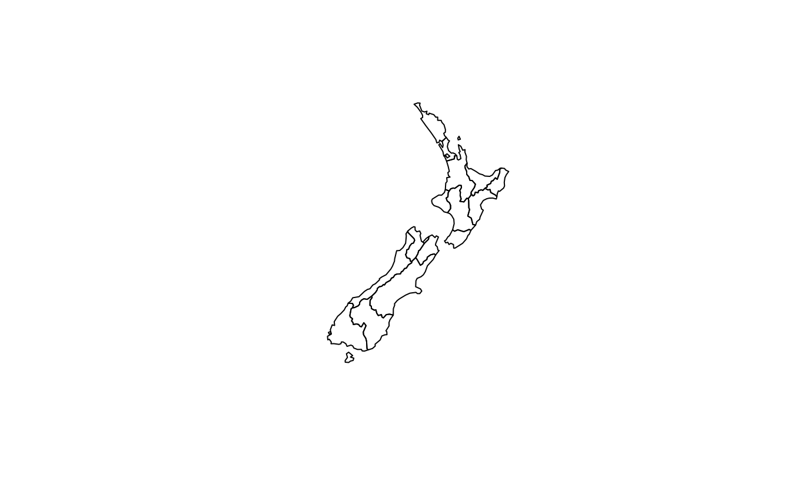
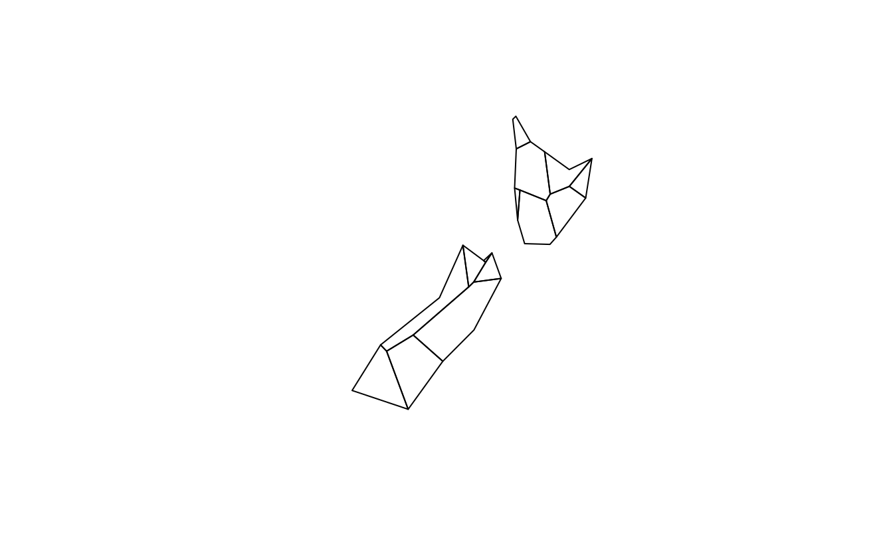
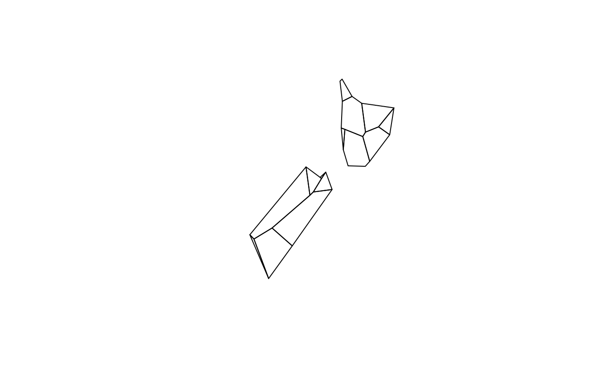
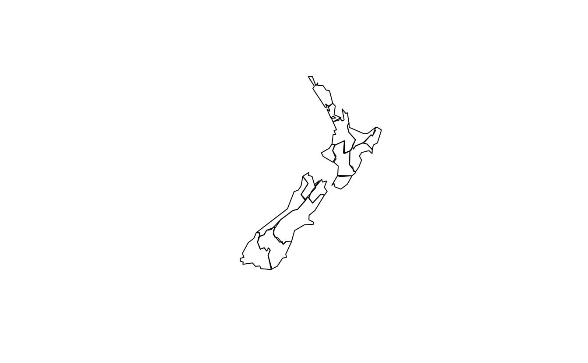
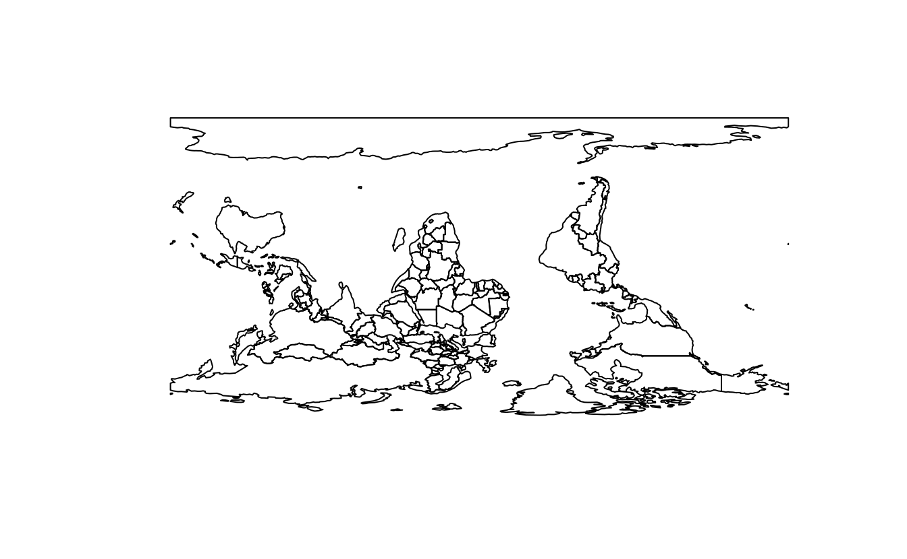

# Geometry operations {#geometric-operations}


```
#> Linking to GEOS 3.8.0, GDAL 3.0.4, PROJ 6.3.1; sf_use_s2() is TRUE
#> terra 1.5.24
#> 
#> Attaching package: 'dplyr'
#> The following objects are masked from 'package:terra':
#> 
#>     intersect, src, union
#> The following objects are masked from 'package:stats':
#> 
#>     filter, lag
#> The following objects are masked from 'package:base':
#> 
#>     intersect, setdiff, setequal, union
library(sf)
library(terra)
library(dplyr)
library(spData)
library(spDataLarge)
```

E1. Generate and plot simplified versions of the `nz` dataset.
Experiment with different values of `keep` (ranging from 0.5 to 0.00005) for `ms_simplify()` and `dTolerance` (from 100 to 100,000) `st_simplify()`.

- At what value does the form of the result start to break down for each method, making New Zealand unrecognizable?
- Advanced: What is different about the geometry type of the results from `st_simplify()` compared with the geometry type of `ms_simplify()`? What problems does this create and how can this be resolved?

```r
plot(rmapshaper::ms_simplify(st_geometry(nz), keep = 0.5))
#> Registered S3 method overwritten by 'geojsonlint':
#>   method         from 
#>   print.location dplyr
plot(rmapshaper::ms_simplify(st_geometry(nz), keep = 0.05))
# Starts to breakdown here at 0.5% of the points:
plot(rmapshaper::ms_simplify(st_geometry(nz), keep = 0.005))
# At this point no further simplification changes the result
plot(rmapshaper::ms_simplify(st_geometry(nz), keep = 0.0005))
plot(rmapshaper::ms_simplify(st_geometry(nz), keep = 0.00005))
plot(st_simplify(st_geometry(nz), dTolerance = 100))
plot(st_simplify(st_geometry(nz), dTolerance = 1000))
# Starts to breakdown at 10 km:
plot(st_simplify(st_geometry(nz), dTolerance = 10000))
plot(st_simplify(st_geometry(nz), dTolerance = 100000))
plot(st_simplify(st_geometry(nz), dTolerance = 100000, preserveTopology = TRUE))

# Problem: st_simplify returns POLYGON and MULTIPOLYGON results, affecting plotting
# Cast into a single geometry type to resolve this
nz_simple_poly = st_simplify(st_geometry(nz), dTolerance = 10000) %>% 
  st_sfc() %>% 
  st_cast("POLYGON")
#> Warning in st_cast.MULTIPOLYGON(X[[i]], ...): polygon from first part only

#> Warning in st_cast.MULTIPOLYGON(X[[i]], ...): polygon from first part only
nz_simple_multipoly = st_simplify(st_geometry(nz), dTolerance = 10000) %>% 
  st_sfc() %>% 
  st_cast("MULTIPOLYGON")
plot(nz_simple_poly)
length(nz_simple_poly)
#> [1] 16
nrow(nz)
#> [1] 16
```



E2. In the first exercise in Chapter Spatial data operations it was established that Canterbury region had 70 of the 101 highest points in New Zealand. 
Using `st_buffer()`, how many points in `nz_height` are within 100 km of Canterbury?

```r
canterbury = nz[nz$Name == "Canterbury", ]
cant_buff = st_buffer(canterbury, 100)
nz_height_near_cant = nz_height[cant_buff, ]
nrow(nz_height_near_cant) # 75 - 5 more
#> [1] 75
```

E3. Find the geographic centroid of New Zealand. 
How far is it from the geographic centroid of Canterbury?

```r
cant_cent = st_centroid(canterbury)
#> Warning in st_centroid.sf(canterbury): st_centroid assumes attributes are
#> constant over geometries of x
nz_centre = st_centroid(st_union(nz))
st_distance(cant_cent, nz_centre) # 234 km
#> Units: [m]
#>        [,1]
#> [1,] 234193
```

E4. Most world maps have a north-up orientation.
A world map with a south-up orientation could be created by a reflection (one of the affine transformations not mentioned in this chapter) of the `world` object's geometry.
Write code to do so.
Hint: you need to use a two-element vector for this transformation.
 Bonus: create an upside-down map of your country.
 

```r
world_sfc = st_geometry(world)
world_sfc_mirror = world_sfc * c(1, -1)
#> Warning in mapply(function(x, y) {: longer argument not a multiple of length of
#> shorter
plot(world_sfc)
plot(world_sfc_mirror)

us_states_sfc = st_geometry(us_states)
us_states_sfc_mirror = us_states_sfc * c(1, -1)
#> Warning in mapply(function(x, y) {: longer argument not a multiple of length of
#> shorter
plot(us_states_sfc)
plot(us_states_sfc_mirror)
## nicer plot
# library(ggrepel)
# us_states_sfc_mirror_labels = st_centroid(us_states_sfc_mirror) %>% 
#   st_coordinates() %>%
#   as_data_frame() %>% 
#   mutate(name = us_states$NAME)
# us_states_sfc_mirror_sf = st_set_geometry(us_states, us_states_sfc_mirror)
# ggplot(data = us_states_sfc_mirror_sf) +
#   geom_sf(color = "white") +
#   geom_text_repel(data = us_states_sfc_mirror_labels, mapping = aes(X, Y, label = name), size = 3, min.segment.length = 0) +
#   theme_void() 
```



E5. Subset the point in `p` that is contained within `x` *and* `y`.

- Using base subsetting operators.
- Using an intermediary object created with `st_intersection()`\index{vector!intersection}.

```r
p_in_y = p[y]
p_in_xy = p_in_y[x]
x_and_y = st_intersection(x, y)
p[x_and_y]
#> Geometry set for 1 feature 
#> Geometry type: POINT
#> Dimension:     XY
#> Bounding box:  xmin: 0.305 ymin: 1.43 xmax: 0.305 ymax: 1.43
#> CRS:           NA
#> POINT (0.305 1.43)
```

E6. Calculate the length of the boundary lines of US states in meters.
Which state has the longest border and which has the shortest?
Hint: The `st_length` function computes the length of a `LINESTRING` or `MULTILINESTRING` geometry.

```r
us_states2163 = st_transform(us_states, "EPSG:2163")
us_states_bor = st_cast(us_states2163, "MULTILINESTRING")
us_states_bor$borders = st_length(us_states_bor)
arrange(us_states_bor, borders)
#> Simple feature collection with 49 features and 7 fields
#> Geometry type: MULTILINESTRING
#> Dimension:     XY
#> Bounding box:  xmin: -2030000 ymin: -2120000 xmax: 2510000 ymax: 732000
#> Projected CRS: US National Atlas Equal Area
#> First 10 features:
#>    GEOID                 NAME   REGION         AREA total_pop_10 total_pop_15
#> 1     11 District of Columbia    South   178 [km^2]       584400       647484
#> 2     44         Rhode Island Norteast  2743 [km^2]      1056389      1053661
#> 3     10             Delaware    South  5182 [km^2]       881278       926454
#> 4     09          Connecticut Norteast 12977 [km^2]      3545837      3593222
#> 5     34           New Jersey Norteast 20274 [km^2]      8721577      8904413
#> 6     50              Vermont Norteast 24866 [km^2]       624258       626604
#> 7     33        New Hampshire Norteast 24026 [km^2]      1313939      1324201
#> 8     25        Massachusetts Norteast 20911 [km^2]      6477096      6705586
#> 9     45       South Carolina    South 80904 [km^2]      4511428      4777576
#> 10    18              Indiana  Midwest 93648 [km^2]      6417398      6568645
#>        borders                       geometry
#> 1    60323 [m] MULTILINESTRING ((1950825 -...
#> 2   304594 [m] MULTILINESTRING ((2332242 4...
#> 3   408049 [m] MULTILINESTRING ((2036308 -...
#> 4   514090 [m] MULTILINESTRING ((2142347 2...
#> 5   746942 [m] MULTILINESTRING ((2057740 -...
#> 6   778204 [m] MULTILINESTRING ((2048149 3...
#> 7   782644 [m] MULTILINESTRING ((2182313 3...
#> 8  1017375 [m] MULTILINESTRING ((2416684 3...
#> 9  1275280 [m] MULTILINESTRING ((1531823 -...
#> 10 1436288 [m] MULTILINESTRING ((1031129 -...
arrange(us_states_bor, -borders)
#> Simple feature collection with 49 features and 7 fields
#> Geometry type: MULTILINESTRING
#> Dimension:     XY
#> Bounding box:  xmin: -2030000 ymin: -2120000 xmax: 2510000 ymax: 732000
#> Projected CRS: US National Atlas Equal Area
#> First 10 features:
#>    GEOID       NAME  REGION          AREA total_pop_10 total_pop_15     borders
#> 1     48      Texas   South 687714 [km^2]     24311891     26538614 4961585 [m]
#> 2     06 California    West 409747 [km^2]     36637290     38421464 3810226 [m]
#> 3     26   Michigan Midwest 151119 [km^2]      9952687      9900571 3574933 [m]
#> 4     12    Florida   South 151052 [km^2]     18511620     19645772 2951059 [m]
#> 5     30    Montana    West 380829 [km^2]       973739      1014699 2821788 [m]
#> 6     16      Idaho    West 216513 [km^2]      1526797      1616547 2568711 [m]
#> 7     27  Minnesota Midwest 218566 [km^2]      5241914      5419171 2563963 [m]
#> 8     51   Virginia   South 105405 [km^2]      7841754      8256630 2405725 [m]
#> 9     35 New Mexico    West 314886 [km^2]      2013122      2084117 2378721 [m]
#> 10    53 Washington    West 175436 [km^2]      6561297      6985464 2340809 [m]
#>                          geometry
#> 1  MULTILINESTRING ((-269040 -...
#> 2  MULTILINESTRING ((-1717278 ...
#> 3  MULTILINESTRING ((1110644 1...
#> 4  MULTILINESTRING ((1853170 -...
#> 5  MULTILINESTRING ((-1161496 ...
#> 6  MULTILINESTRING ((-1294787 ...
#> 7  MULTILINESTRING ((202212 44...
#> 8  MULTILINESTRING ((2099962 -...
#> 9  MULTILINESTRING ((-803303 -...
#> 10 MULTILINESTRING ((-1658594 ...
```

E7. Read the srtm.tif file into R (`srtm = rast(system.file("raster/srtm.tif", package = "spDataLarge"))`).
This raster has a resolution of 0.00083 by 0.00083 degrees. 
Change its resolution to 0.01 by 0.01 degrees using all of the method available in the **terra** package.
Visualize the results.
Can you notice any differences between the results of these resampling methods?

```r
srtm = rast(system.file("raster/srtm.tif", package = "spDataLarge"))
rast_template = rast(ext(srtm), res = 0.01)
srtm_resampl1 = resample(srtm, y = rast_template, method = "bilinear")
srtm_resampl2 = resample(srtm, y = rast_template, method = "near")
srtm_resampl3 = resample(srtm, y = rast_template, method = "cubic")
srtm_resampl4 = resample(srtm, y = rast_template, method = "cubicspline")
srtm_resampl5 = resample(srtm, y = rast_template, method = "lanczos")

srtm_resampl_all = c(srtm_resampl1, srtm_resampl2, srtm_resampl3,
                     srtm_resampl4, srtm_resampl5)
plot(srtm_resampl_all)

# differences
plot(srtm_resampl_all - srtm_resampl1, range = c(-300, 300))
plot(srtm_resampl_all - srtm_resampl2, range = c(-300, 300))
plot(srtm_resampl_all - srtm_resampl3, range = c(-300, 300))
plot(srtm_resampl_all - srtm_resampl4, range = c(-300, 300))
plot(srtm_resampl_all - srtm_resampl5, range = c(-300, 300))
```


