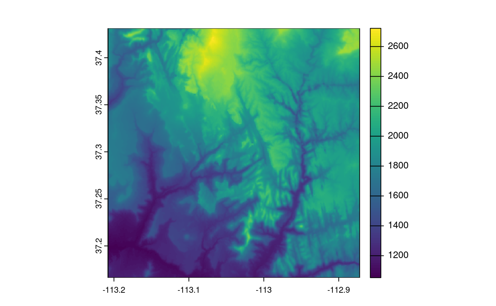
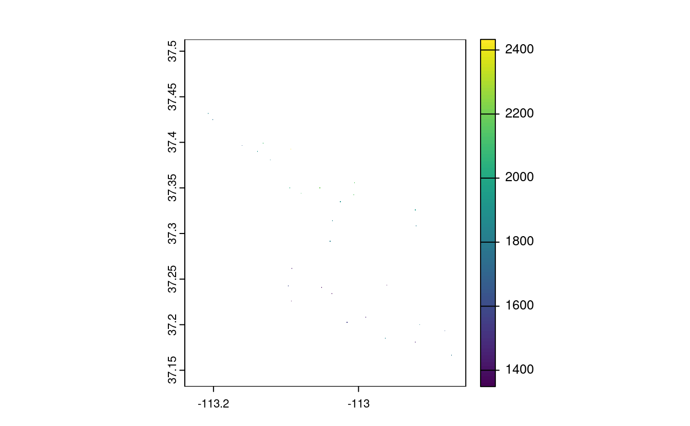
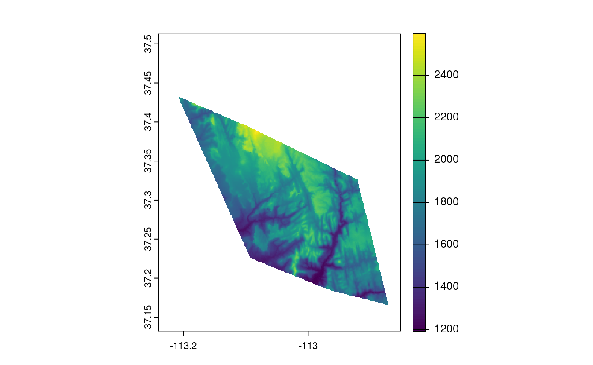
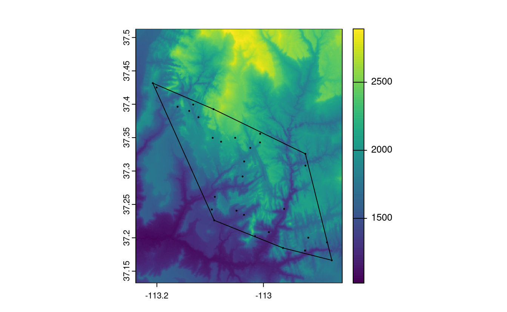
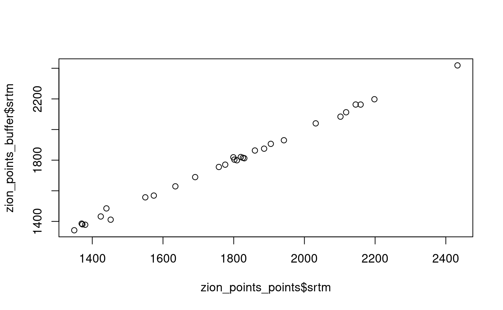
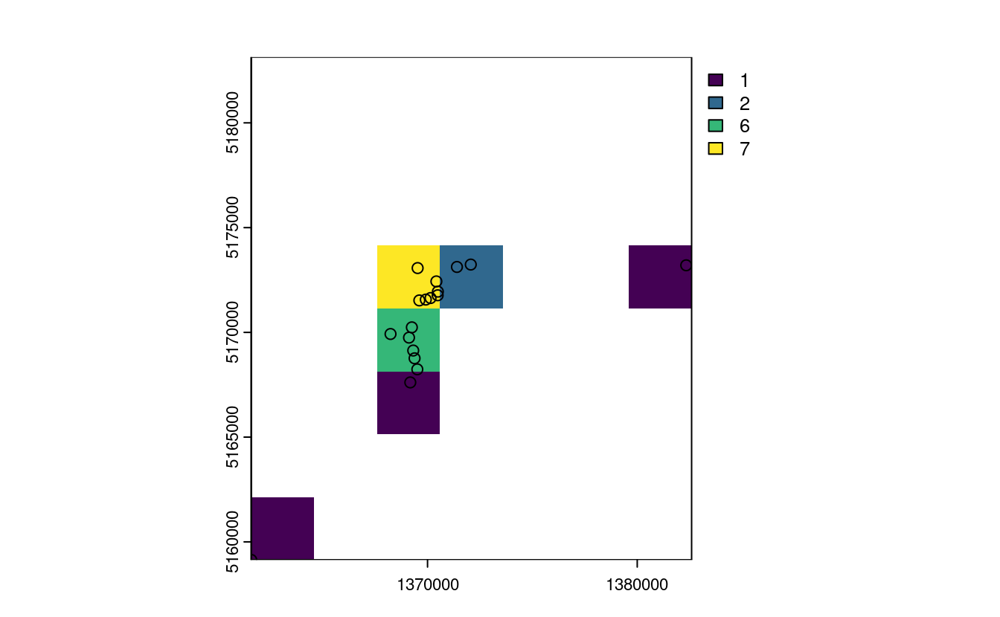
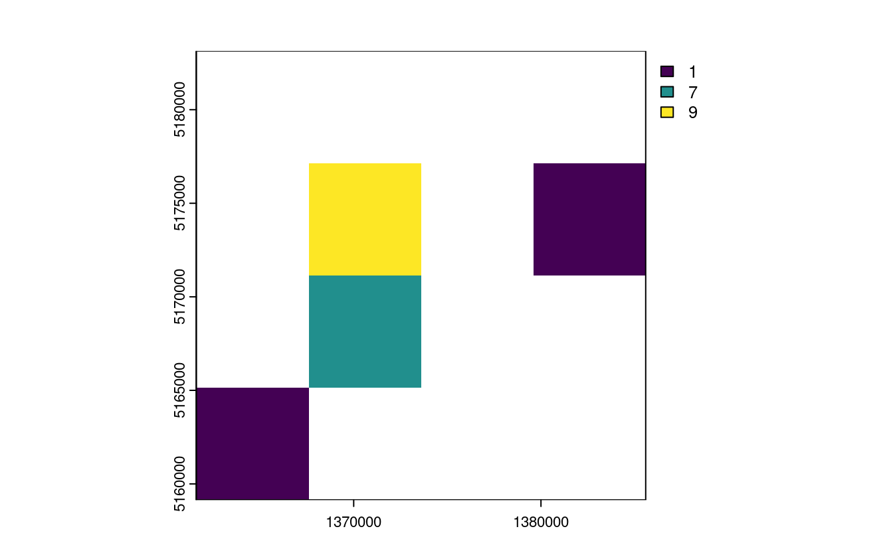
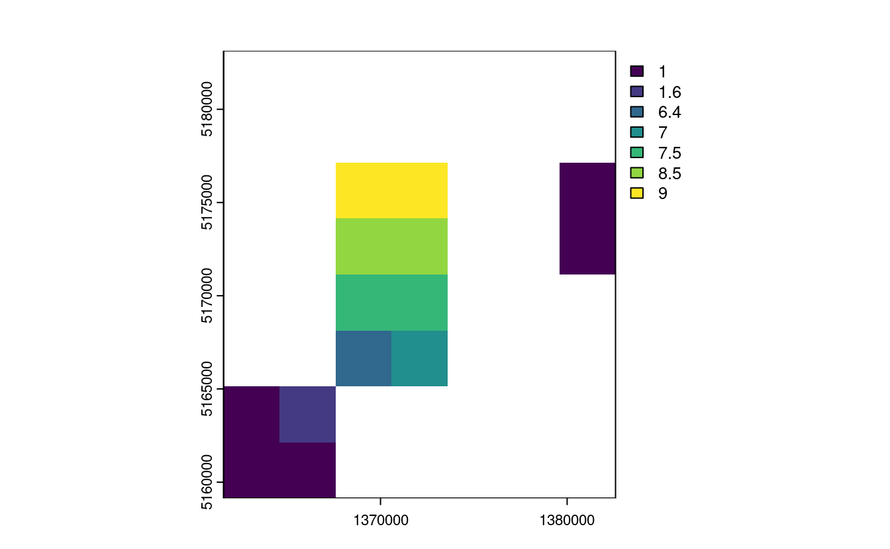
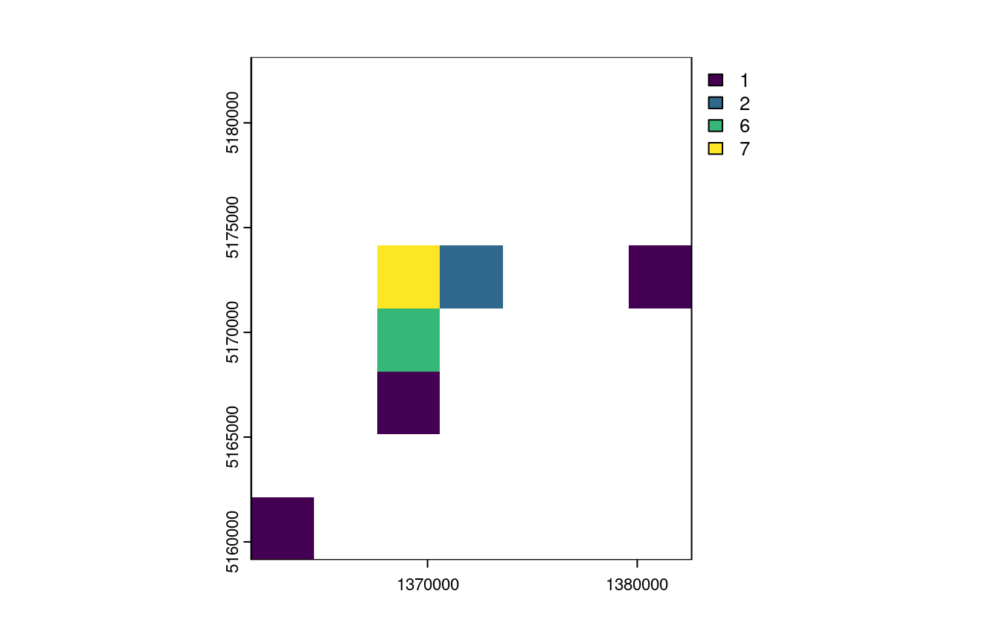

# Raster-vector interactions {#raster-vector}


```
#> Linking to GEOS 3.10.2, GDAL 3.4.1, PROJ 8.2.1; sf_use_s2() is TRUE
#> terra 1.6.41
```


Some of the exercises use a vector (`zion_points`) and raster dataset (`srtm`) from the **spDataLarge** package.
They also use a polygonal 'convex hull' derived from the vector dataset (`ch`) to represent the area of interest:

```r
library(sf)
library(terra)
library(spData)
zion_points_path = system.file("vector/zion_points.gpkg", package = "spDataLarge")
zion_points = read_sf(zion_points_path)
srtm = rast(system.file("raster/srtm.tif", package = "spDataLarge"))
ch = st_combine(zion_points) |>
  st_convex_hull() |> 
  st_as_sf()
```

E1. Crop the `srtm` raster using (1) the `zion_points` dataset and (2) the `ch` dataset.
Are there any differences in the output maps?
Next, mask `srtm` using these two datasets.
Can you see any difference now?
How can you explain that?

```r
plot(srtm)
plot(st_geometry(zion_points), add = TRUE)
plot(ch, add = TRUE)

srtm_crop1 = crop(srtm, zion_points)
srtm_crop2 = crop(srtm, ch)
plot(srtm_crop1)
plot(srtm_crop2)

srtm_mask1 = mask(srtm, zion_points)
srtm_mask2 = mask(srtm, ch)
plot(srtm_mask1)
plot(srtm_mask2)
```



E2. Firstly, extract values from `srtm` at the points represented in `zion_points`.
Next, extract average values of `srtm` using a 90 buffer around each point from `zion_points` and compare these two sets of values. 
When would extracting values by buffers be more suitable than by points alone?

- Bonus: Implement extraction using the **exactextractr** package and compare the results.

```r
zion_points_buf = st_buffer(zion_points, dist = 90)
plot(srtm)
plot(st_geometry(zion_points_buf), add = TRUE)
plot(ch, add = TRUE)

zion_points_points = extract(srtm, zion_points)
zion_points_buffer = extract(srtm, zion_points_buf, fun = "mean")
plot(zion_points_points$srtm, zion_points_buffer$srtm)

# Bonus
# remotes::install_github("isciences/exactextractr")
# zion_points_buf_2 = exactextractr::exact_extract(x = srtm, y = zion_points_buf,
#                                                  fun = "mean")
# 
# plot(zion_points_points$srtm, zion_points_buf_2)
# plot(zion_points_buffer$srtm, zion_points_buf_2)
```



E3. Subset points higher than 3100 meters in New Zealand (the `nz_height` object) and create a template raster with a resolution of 3 km for the extent of the new point dataset. 
Using these two new objects:

- Count numbers of the highest points in each grid cell.
- Find the maximum elevation in each grid cell.

```r
nz_height3100 = dplyr::filter(nz_height, elevation > 3100)
new_graticule = st_graticule(nz_height3100, datum = "EPSG:2193")
plot(st_geometry(nz_height3100), graticule = new_graticule, axes = TRUE)

nz_template = rast(ext(nz_height3100), resolution = 3000, crs = crs(nz_height3100))

nz_raster = rasterize(nz_height3100, nz_template, 
                       field = "elevation", fun = "length")
plot(nz_raster)
plot(st_geometry(nz_height3100), add = TRUE)

nz_raster2 = rasterize(nz_height3100, nz_template, 
                       field = "elevation", fun = max)
plot(nz_raster2)
plot(st_geometry(nz_height3100), add = TRUE)
```



E4. Aggregate the raster counting high points in New Zealand (created in the previous exercise), reduce its geographic resolution by half (so cells are 6 by 6 km) and plot the result.

- Resample the lower resolution raster back to the original resolution of 3 km. How have the results changed?
- Name two advantages and disadvantages of reducing raster resolution.

```r
nz_raster_low = raster::aggregate(nz_raster, fact = 2, fun = sum, na.rm = TRUE)
res(nz_raster_low)
#> [1] 6000 6000

nz_resample = resample(nz_raster_low, nz_raster)
plot(nz_raster_low)
plot(nz_resample) # the results are spread over a greater area and there are border issues
plot(nz_raster)
```



Advantages:

- lower memory use
- faster processing
- good for viz in some cases

Disadvantages:

- removes geographic detail
- adds another processing step

E5. Polygonize the `grain` dataset and filter all squares representing clay.

```r
grain = rast(system.file("raster/grain.tif", package = "spData"))
```

- Name two advantages and disadvantages of vector data over raster data.
- When would it be useful to convert rasters to vectors in your work?

```r
grain_poly = as.polygons(grain) |> 
  st_as_sf()
levels(grain)
#> [[1]]
#>   value grain
#> 1     0  clay
#> 2     1  silt
#> 3     2  sand
clay = dplyr::filter(grain_poly, grain == "clay")
plot(clay)
```


Advantages: 

- can be used to subset other vector objects
- can do affine transformations and use sf/dplyr verbs

Disadvantages: 

- better consistency
- fast processing on some operations
- functions developed for some domains
