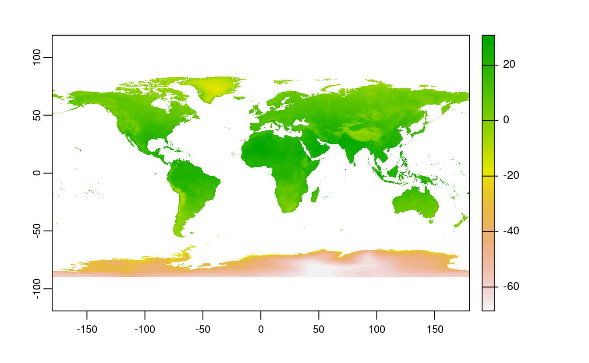

# Geographic data I/O {#read-write}


E1. List and describe three types of vector, raster, and geodatabase formats.

E2. Name at least two differences between `read_sf()` and the more well-known function `st_read()`.

E3. Read the `cycle_hire_xy.csv` file from the **spData** package as a spatial object (Hint: it is located in the `misc\` folder).
What is a geometry type of the loaded object? 

E4. Download the borders of Germany using **rnaturalearth**, and create a new object called `germany_borders`.
Write this new object to a file of the GeoPackage format.

E5. Download the global monthly minimum temperature with a spatial resolution of five minutes using the **geodata** package.
Extract the June values, and save them to a file named `tmin_june.tif` file (hint: use `terra::subset()`).

```r
library(geodata)
#> Loading required package: terra
#> terra version 1.5.0
gmmt = worldclim_global(var = "tmin", res = 5, path = tempdir())
names(gmmt)
#>  [1] "wc2.1_5m_tmin_01" "wc2.1_5m_tmin_02" "wc2.1_5m_tmin_03" "wc2.1_5m_tmin_04"
#>  [5] "wc2.1_5m_tmin_05" "wc2.1_5m_tmin_06" "wc2.1_5m_tmin_07" "wc2.1_5m_tmin_08"
#>  [9] "wc2.1_5m_tmin_09" "wc2.1_5m_tmin_10" "wc2.1_5m_tmin_11" "wc2.1_5m_tmin_12"
plot(gmmt)

gmmt_june = terra::subset(gmmt, "wc2.1_5m_tmin_06")
plot(gmmt_june)
writeRaster(gmmt_june, "tmin_june.tif")
```



E6. Create a static map of Germany's borders, and save it to a PNG file.

E7. Create an interactive map using data from the `cycle_hire_xy.csv` file. 
Export this map to a file called `cycle_hire.html`.
