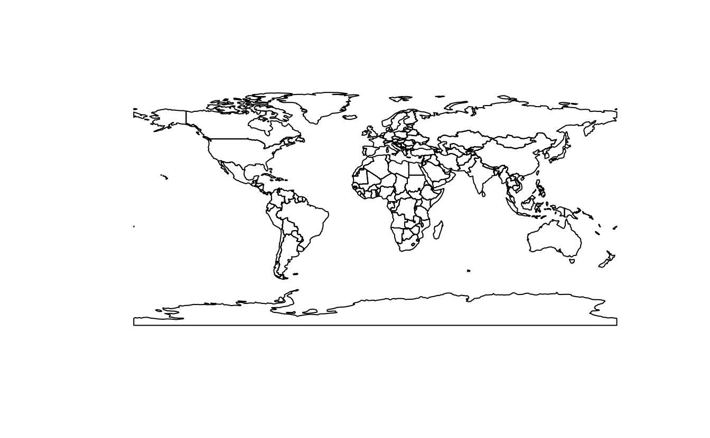
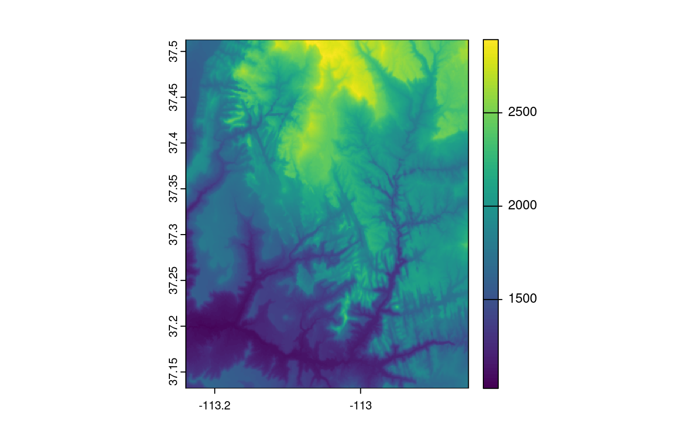
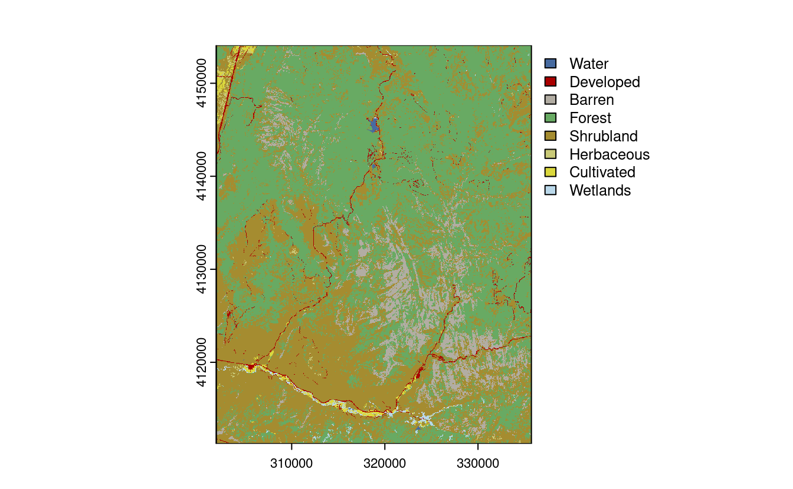

# Reprojecting geographic data {#reproj-geo-data}


```r
library(sf)
#> Linking to GEOS 3.8.0, GDAL 3.0.4, PROJ 6.3.1; sf_use_s2() is TRUE
library(terra)
#> terra 1.5.20
library(spData)
```

E1. Create a new object called `nz_wgs` by transforming `nz` object into the WGS84 CRS.

- Create an object of class `crs` for both and use this to query their CRSs.
- With reference to the bounding box of each object, what units does each CRS use?
- Remove the CRS from `nz_wgs` and plot the result: what is wrong with this map of New Zealand and why?

```r
st_crs(nz)
#> Coordinate Reference System:
#>   User input: EPSG:2193 
#>   wkt:
#> PROJCS["NZGD2000 / New Zealand Transverse Mercator 2000",
#>     GEOGCS["NZGD2000",
#>         DATUM["New_Zealand_Geodetic_Datum_2000",
#>             SPHEROID["GRS 1980",6378137,298.257222101,
#>                 AUTHORITY["EPSG","7019"]],
#>             TOWGS84[0,0,0,0,0,0,0],
#>             AUTHORITY["EPSG","6167"]],
#>         PRIMEM["Greenwich",0,
#>             AUTHORITY["EPSG","8901"]],
#>         UNIT["degree",0.0174532925199433,
#>             AUTHORITY["EPSG","9122"]],
#>         AUTHORITY["EPSG","4167"]],
#>     PROJECTION["Transverse_Mercator"],
#>     PARAMETER["latitude_of_origin",0],
#>     PARAMETER["central_meridian",173],
#>     PARAMETER["scale_factor",0.9996],
#>     PARAMETER["false_easting",1600000],
#>     PARAMETER["false_northing",10000000],
#>     UNIT["metre",1,
#>         AUTHORITY["EPSG","9001"]],
#>     AUTHORITY["EPSG","2193"]]
nz_wgs = st_transform(nz, "EPSG:4326")
nz_crs = st_crs(nz)
nz_wgs_crs = st_crs(nz_wgs)
nz_crs$epsg
#> [1] 2193
nz_wgs_crs$epsg
#> [1] 4326
st_bbox(nz)
#>    xmin    ymin    xmax    ymax 
#> 1090144 4748537 2089533 6191874
st_bbox(nz_wgs)
#>  xmin  ymin  xmax  ymax 
#> 166.4 -47.3 178.6 -34.4
nz_wgs_NULL_crs = st_set_crs(nz_wgs, NA)
nz_27700 = st_transform(nz_wgs, "EPSG:27700")
par(mfrow = c(1, 3))
plot(st_geometry(nz))
plot(st_geometry(nz_wgs))
plot(st_geometry(nz_wgs_NULL_crs))
# answer: it is fatter in the East-West direction
# because New Zealand is close to the South Pole and meridians converge there
plot(st_geometry(nz_27700))
par(mfrow = c(1, 1))
```


E2. Transform the `world` dataset to the transverse Mercator projection (`"+proj=tmerc"`) and plot the result.
What has changed and why?
Try to transform it back into WGS 84 and plot the new object.
Why does the new object differ from the original one?

```r
# see https://github.com/r-spatial/sf/issues/509
world_tmerc = st_transform(world, "+proj=tmerc")
plot(st_geometry(world_tmerc))
world_4326 = st_transform(world_tmerc, "EPSG:4326")
plot(st_geometry(world_4326))
```



E3. Transform the continuous raster (`con_raster`) into NAD83 / UTM zone 12N using the nearest neighbor interpolation method.
What has changed?
How does it influence the results?

```r
con_raster = rast(system.file("raster/srtm.tif", package = "spDataLarge"))
con_raster_utm12n = project(con_raster, "EPSG:32612", method = "near")
con_raster_utm12n
#> class       : SpatRaster 
#> dimensions  : 515, 422, 1  (nrow, ncol, nlyr)
#> resolution  : 83.5, 83.5  (x, y)
#> extent      : 301062, 336313, 4111111, 4154131  (xmin, xmax, ymin, ymax)
#> coord. ref. : WGS 84 / UTM zone 12N (EPSG:32612) 
#> source      : memory 
#> name        : srtm 
#> min value   : 1024 
#> max value   : 2892

plot(con_raster)
plot(con_raster_utm12n)
```



E4. Transform the categorical raster (`cat_raster`) into WGS 84 using the bilinear interpolation method.
What has changed?
How does it influence the results?

```r
cat_raster = rast(system.file("raster/nlcd.tif", package = "spDataLarge"))
cat_raster_wgs84 = project(cat_raster, "EPSG:4326", method = "bilinear")
cat_raster_wgs84
#> class       : SpatRaster 
#> dimensions  : 1246, 1244, 1  (nrow, ncol, nlyr)
#> resolution  : 0.000315, 0.000315  (x, y)
#> extent      : -113, -113, 37.1, 37.5  (xmin, xmax, ymin, ymax)
#> coord. ref. : lon/lat WGS 84 (EPSG:4326) 
#> source      : memory 
#> name        : levels 
#> min value   :      1 
#> max value   :      8

plot(cat_raster)
plot(cat_raster_wgs84)
```



<!--toDo:jn-->
<!--improve/replace/modify the following q-->
<!-- E5. Create your own `proj4string`.  -->
<!-- It should have the Lambert Azimuthal Equal Area (`laea`) projection, the WGS84 ellipsoid, the longitude of projection center of 95 degrees west, the latitude of projection center of 60 degrees north, and its units should be in meters. -->
<!-- Next, subset Canada from the `world` object and transform it into the new projection.  -->
<!-- Plot and compare a map before and after the transformation. -->

<!-- ```{r 06-reproj-40} -->
<!-- new_p4s = "+proj=laea +ellps=WGS84 +lon_0=-95 +lat_0=60 +units=m" -->
<!-- canada = dplyr::filter(world, name_long == "Canada") -->
<!-- new_canada = st_transform(canada, new_p4s) -->
<!-- par(mfrow = c(1, 2)) -->
<!-- plot(st_geometry(canada), graticule = TRUE, axes = TRUE) -->
<!-- plot(st_geometry(new_canada), graticule = TRUE, axes = TRUE) -->
<!-- ``` -->
