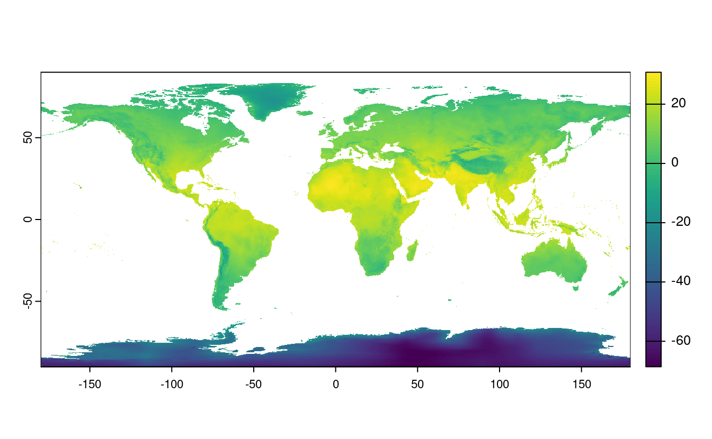

# Geographic data I/O {#read-write}


```r
library(sf)
library(terra)
```

E1. List and describe three types of vector, raster, and geodatabase formats.

Vector formats: Shapefile (old format supported by many programs), GeoPackage (more recent format with better support of attribute data) and GeoJSON (common format for web mapping).

Raster formats: GeoTiff, Arc ASCII, ERDAS Imagine (IMG).

Database formats: PostGIS, SQLite, FileGDB.

E2. Name at least two differences between the **sf** functions `read_sf()` and `st_read()`.

`st_read()` prints outputs and keeps strings as text strings (`st_read()` creates factors). This can be seen from the source code of `read_sf()`, which show's it wraps `st_read()`:

```r
read_sf
#> function (..., quiet = TRUE, stringsAsFactors = FALSE, as_tibble = TRUE) 
#> {
#>     st_read(..., quiet = quiet, stringsAsFactors = stringsAsFactors, 
#>         as_tibble = as_tibble)
#> }
#> <bytecode: 0x565380236698>
#> <environment: namespace:sf>
```

E3. Read the `cycle_hire_xy.csv` file from the **spData** package as a spatial object (Hint: it is located in the `misc` folder).
What is a geometry type of the loaded object? 

```r
c_h = read.csv(system.file("misc/cycle_hire_xy.csv", package = "spData")) |> 
  st_as_sf(coords = c("X", "Y"))
c_h
#> Simple feature collection with 742 features and 5 fields
#> Geometry type: POINT
#> Dimension:     XY
#> Bounding box:  xmin: -0.237 ymin: 51.5 xmax: -0.00228 ymax: 51.5
#> CRS:           NA
#> First 10 features:
#>    id               name             area nbikes nempty             geometry
#> 1   1       River Street      Clerkenwell      4     14   POINT (-0.11 51.5)
#> 2   2 Phillimore Gardens       Kensington      2     34  POINT (-0.198 51.5)
#> 3   3 Christopher Street Liverpool Street      0     32 POINT (-0.0846 51.5)
#> 4   4  St. Chad's Street     King's Cross      4     19  POINT (-0.121 51.5)
#> 5   5     Sedding Street    Sloane Square     15     12  POINT (-0.157 51.5)
#> 6   6 Broadcasting House       Marylebone      0     18  POINT (-0.144 51.5)
#> 7   7   Charlbert Street  St. John's Wood     15      0  POINT (-0.168 51.5)
#> 8   8         Lodge Road  St. John's Wood      5     13   POINT (-0.17 51.5)
#> 9   9     New Globe Walk         Bankside      3     16 POINT (-0.0964 51.5)
#> 10 10        Park Street         Bankside      1     17 POINT (-0.0928 51.5)
```

E4. Download the borders of Germany using **rnaturalearth**, and create a new object called `germany_borders`.
Write this new object to a file of the GeoPackage format.

```r
library(rnaturalearth)
germany_borders = ne_countries(country = "Germany", returnclass = "sf")
plot(germany_borders)
#> Warning: plotting the first 10 out of 94 attributes; use max.plot = 94 to plot
#> all
st_write(germany_borders, "germany_borders.gpkg")
#> Writing layer `germany_borders' to data source 
#>   `germany_borders.gpkg' using driver `GPKG'
#> Writing 1 features with 94 fields and geometry type Polygon.
```


E5. Download the global monthly minimum temperature with a spatial resolution of five minutes using the **geodata** package.
Extract the June values, and save them to a file named `tmin_june.tif` file (hint: use `terra::subset()`).

```r
library(geodata)
gmmt = worldclim_global(var = "tmin", res = 5, path = tempdir())
names(gmmt)
#>  [1] "wc2.1_5m_tmin_01" "wc2.1_5m_tmin_02" "wc2.1_5m_tmin_03" "wc2.1_5m_tmin_04"
#>  [5] "wc2.1_5m_tmin_05" "wc2.1_5m_tmin_06" "wc2.1_5m_tmin_07" "wc2.1_5m_tmin_08"
#>  [9] "wc2.1_5m_tmin_09" "wc2.1_5m_tmin_10" "wc2.1_5m_tmin_11" "wc2.1_5m_tmin_12"
plot(gmmt)

gmmt_june = terra::subset(gmmt, "wc2.1_5m_tmin_06")
plot(gmmt_june)
writeRaster(gmmt_june, "tmin_june.tif")
```



E6. Create a static map of Germany's borders, and save it to a PNG file.

```r
png(filename = "germany.png", width = 350, height = 500)
plot(st_geometry(germany_borders), axes = TRUE, graticule = TRUE)
dev.off()
#> png 
#>   2
```

E7. Create an interactive map using data from the `cycle_hire_xy.csv` file. 
Export this map to a file called `cycle_hire.html`.

```r
library(mapview)
mapview_obj = mapview(c_h, zcol = "nbikes", legend = TRUE)
mapshot(mapview_obj, file = "cycle_hire.html")
```
