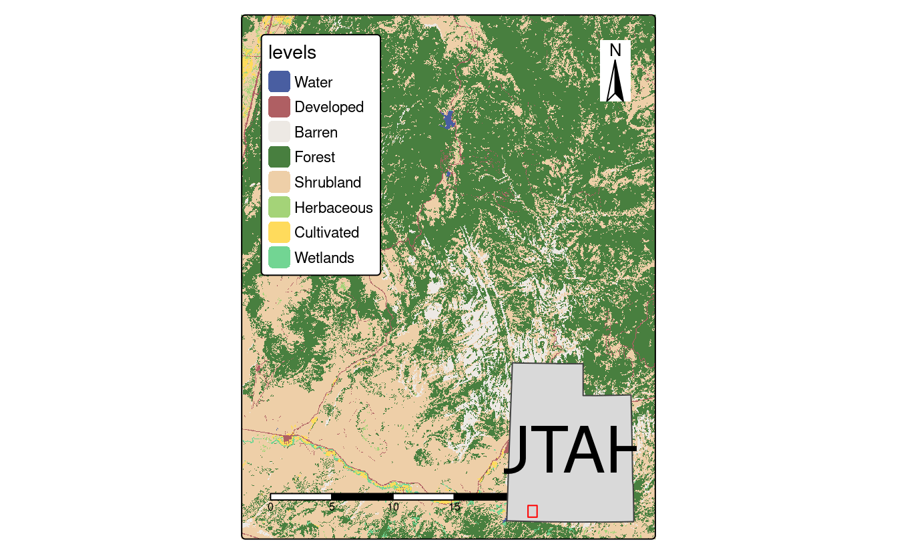
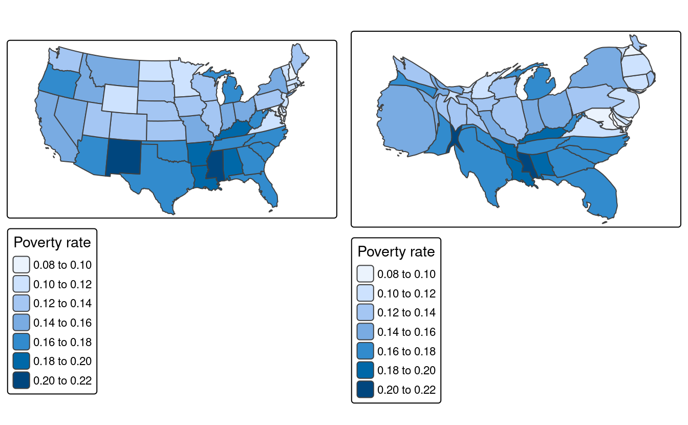

# (PART) Extensions {-}

# Making maps with R {#adv-map}


```r
library(sf)
library(terra)
library(dplyr)
library(spData)
```

These exercises rely on a new object, `africa`.
Create it using the `world` and `worldbank_df` datasets from the **spData** package as follows:

```r
library(spData)
africa = world |> 
  filter(continent == "Africa", !is.na(iso_a2)) |> 
  left_join(worldbank_df, by = "iso_a2") |> 
  select(name, subregion, gdpPercap, HDI, pop_growth) |> 
  st_transform("ESRI:102022") |> 
  st_make_valid() |> 
  st_collection_extract("POLYGON")
```

We will also use `zion` and `nlcd` datasets from **spDataLarge**:

```r
zion = read_sf((system.file("vector/zion.gpkg", package = "spDataLarge")))
nlcd = rast(system.file("raster/nlcd.tif", package = "spDataLarge"))
```

E1. Create a map showing the geographic distribution of the Human Development Index (`HDI`) across Africa with base **graphics** (hint: use `plot()`) and **tmap** packages (hint: use `tm_shape(africa) + ...`).
    - Name two advantages of each based on the experience.
    - Name three other mapping packages and an advantage of each.
    - Bonus: create three more maps of Africa using these three other packages.

```r
# graphics
plot(africa["HDI"])
# tmap
remotes::install_github("r-tmap/tmap")
#> Using github PAT from envvar GITHUB_PAT
#> Skipping install of 'tmap' from a github remote, the SHA1 (afbf4e8f) has not changed since last install.
#>   Use `force = TRUE` to force installation
library(tmap)
#> 
#> Attaching package: 'tmap'
#> The following object is masked from 'package:datasets':
#> 
#>     rivers
tm_shape(africa) + 
  tm_polygons("HDI")
# ggplot
library(ggplot2)
ggplot() +
  geom_sf(data = africa, aes(fill = HDI))
# ggplotly
library(plotly)
#> 
#> Attaching package: 'plotly'
#> The following object is masked from 'package:ggplot2':
#> 
#>     last_plot
#> The following object is masked from 'package:stats':
#> 
#>     filter
#> The following object is masked from 'package:graphics':
#> 
#>     layout
g = ggplot() +
  geom_sf(data = africa, aes(fill = HDI))
ggplotly(g)
```

```{=html}
<div class="plotly html-widget html-fill-item" id="htmlwidget-9b841de324d41155df19" style="width:100%;height:415.296px;"></div>
<script type="application/json" data-for="htmlwidget-9b841de324d41155df19">{"x":{"data":[{"x":[-4582500.8643601164,-4583068.6062774118,-4584740.7686512666,-4586432.2778722653,-4588142.6820717547,-4589871.5255475249,-4591618.348907996,-4593382.689215418,-4595164.0801280178,-4596962.0520410482,-4598776.1322266413,-4600605.8449724615,-4602450.7117190808,-4604310.2511960231,-4606183.9795564748,-4608071.4105105987,-4609972.0554574113,-4611885.4236152396,-4613811.0221506832,-4615748.3563061059,-4617696.9295256194,-4619656.2435795544,-4621625.7986874161,-4623605.0936393291,-4625593.6259159502,-4627590.8918068828,-4629596.3865275867,-4631609.6043347903,-4633630.0386404404,-4635657.1821241919,-4637690.5268444531,-4639729.5643480495,-4641773.7857784787,-4643822.6819828274,-4645875.7436173754,-4647932.4612519089,-4649992.3254727852,-4652054.8269847976,-4654119.4567118734,-4656185.7058966393,-4658253.0661989218,-4660321.0297931954,-4662389.0894650649,-4664456.7387067834,-4666523.471811899,-4668588.7839690419,-4670652.1713549383,-4672713.1312266607,-4674771.1620131982,-4676825.7634063819,-4678876.4364512181,-4680922.6836356763,-4682964.0089799901,-4684999.9181255139,-4687029.9184231786,-4689053.5190216061,-4691070.2309549218,-4693079.5672303122,-4695081.0429153657,-4697074.1752252532,-4699058.4836097723,-4701033.4898403175,-4702998.7180967834,-4704953.6950544696,-4706897.9499709941,-4708831.0147732738,-4710752.4241445661,-4712661.7156116487,-4714558.4296321031,-4716442.1096817823,-4718312.3023424409,-4720168.5573895676,-4722010.4278804306,-4723837.4702423317,-4725649.2443611147,-4727445.3136698967,-4729225.2452380434,-4730988.6098603969,-4732734.9821467362,-4734463.9406114807,-4736175.0677636117,-4737867.9501968278,-4739542.1786798835,-4741197.3482471369,-4742833.0582892373,-4744448.912643983,-4746044.5196872735,-4747619.4924241621,-4749173.4485799707,-4750706.010691409,-4751416.0155808311,null,-3563995.1656978792,-3564695.0062658335,-3565995.6084116502,-3567311.2584686633,-3568641.6049749902,-3569986.293487017,-3571344.9666915531,-3572717.2645172076,-3574102.8242449532,-3575501.2806178303,-3576912.2659497312,-3578335.4102332345,-3579770.341246462,-3581216.6846588938,-3582674.06413614,-3584142.1014436376,-3585620.4165492216,-3587108.6277245935,-3588606.3516456289,-3590113.2034915402,-3591628.7970428625,-3593152.7447782732,-3594684.6579702217,-3596224.1467793891,-3597770.8203479582,-3599324.2868917147,-3600884.1537909778,-3602450.0276803705,-3604021.5145374462,-3605598.2197701833,-3607179.7483033608,-3608765.7046638443,-3610355.6930647967,-3611949.3174888324,-3613546.1817701589,-3615145.8896757048,-3616748.0449852897,-3618352.2515708553,-3619958.1134747798,-3621565.2349873292,-3623173.2207232625,-3624781.6756976331,-3626390.2054008269,-3627998.4158728602,-3629605.9137769928,-3631212.3064726787,-3632817.2020879053,-3634420.2095909524,-3636020.9388616127,-3637619.0007619113,-3639214.0072063706,-3640805.571231843,-3642393.3070669719,-3643976.8302013017,-3645555.7574540796,-3647129.7070427914,-3648698.2986514624,-3650261.1534987548,-3651817.8944059056,-3653368.1458645356,-3654911.5341043496,-3656447.6871607807,-3657976.2349425876,-3659496.8092994462,-3661009.0440895497,-3662512.5752472626,-3664007.0408508233,-3665492.0811901479,-3666967.3388347235,-3668432.4587016394,-3669887.0881237416,-3671330.8769179541,-3672763.4774537561,-3674184.5447218269,-3675593.7364028897,-3676990.7129367236,-3678375.1375913708,-3679746.676532533,-3681104.9988931608,-3682449.7768432163,-3683780.6856596218,-3685097.4037963776,-3686399.6129548275,-3687686.9981540865,-3688959.2478015795,-3690216.0537637081,-3691457.1114365938,-3692682.1198168974,-3693890.7815726865,-3695082.8031143127,-3695367.270184719,null,-2545618.6063284627,-2546256.8391348012,-2547185.8574948451,-2548125.6245575789,-2549075.8892742516,-2550036.3984662681,-2551006.8969052983,-2551987.1273928327,-2552976.830839158,-2553975.7463417221,-2554983.6112628314,-2556000.1613066858,-2557025.130595698,-2558058.2517460822,-2559099.2559426911,-2560147.8730130857,-2561203.8315008031,-2562266.8587378329,-2563336.6809162721,-2564413.0231591482,-2565495.6095904191,-2566584.1634041262,-2567678.4069327046,-2568778.0617144522,-2569882.8485601586,-2570992.4876188873,-2572106.698442929,-2573225.2000519251,-2574347.7109961733,-2575473.9494191241,-2576603.6331190788,-2577736.4796101116,-2578872.2061822172,-2580010.5299607129,-2581151.1679649032,-2582293.8371660425,-2583438.2545445887,-2584584.1371468031,-2585731.2021406912,-2586879.1668713219,-2588027.7489155508,-2589176.6661361642,-2590325.6367354752,-2591474.3793083979,-2592622.6128950296,-2593770.0570327565,-2594916.4318079296,-2596061.4579071174,-2597204.856667981,-2598346.3501297901,-2599485.6610836112,-2600622.5131221884,-2601756.6306895628,-2602887.7391304323,-2604015.5647393041,-2605139.8348094411,-2606260.2776816553,-2607376.6227929476,-2608488.6007250356,-2609595.9432527912,-2610698.3833925952,-2611795.6554506584,-2612887.4950713082,-2613973.6392852617,-2615053.8265579208,-2616127.7968376917,-2617195.2916043485,-2618256.0539174643,-2619309.8284649039,-2620356.3616114222,-2621395.4014473478,-2622426.6978373802,-2623450.0024695075,-2624465.0689040376,-2625471.652622771,-2626469.5110783004,-2627458.4037434417,-2628438.0921608056,-2629408.339992505,-2630368.9130699844,-2631319.5794439889,-2632260.1094346424,-2633190.2756816451,-2634109.8531945744,-2635018.6194032752,-2635916.3542083316,-2636802.8400316038,-2637677.8618668136,-2638541.2073301617,-2639392.6667109579,-2639452.4242732585,null,-1527334.2759447624,-1527772.5517973541,-1528329.9695443683,-1528893.8365908745,-1529464.002305802,-1530040.3147801599,-1530622.6208751006,-1531210.766269654,-1531804.5955081177,-1532403.9520470677,-1533008.6783019863,-1533618.6156934779,-1534233.6046930635,-1534853.4848685348,-1535478.094928856,-1536107.2727686055,-1536740.8555119401,-1537378.6795560764,-1538020.5806142902,-1538666.393758405,-1539315.9534607977,-1539969.0936358878,-1540625.6476811236,-1541285.4485174669,-1541948.3286293689,-1542614.1201042403,-1543282.6546714227,-1543953.7637406653,-1544627.2784401081,-1545303.0296537792,-1545980.8480586149,-1546660.5641610129,-1547342.0083329212,-1548025.010847481,-1548709.4019142245,-1549395.011713854,-1550081.6704325941,-1550769.2082961504,-1551457.4556032782,-1552146.2427589702,-1552835.4003072935,-1553524.7589638759,-1554214.1496480638,-1554903.4035147671,-1555592.3519860078,-1556280.8267821856,-1556968.6599530838,-1557655.6839086185,-1558341.7314493689,-1559026.6357968817,-1559710.2306237887,-1560392.3500837344,-1561072.8288411456,-1561751.5021008532,-1562428.2056375765,-1563102.7758252984,-1563775.049666537,-1564444.8648215332,-1565112.0596373654,-1565776.4731770139,-1566437.9452483719,-1567096.3164332421,-1567751.4281163039,-1568403.1225140831,-1569051.2427039258,-1569695.6326529924,-1570336.1372472737,-1570972.6023206515,-1571604.8746839957,-1572232.8021543212,-1572856.2335839998,-1573475.0188900395,-1574089.0090834335,-1574698.056298581,-1575302.0138227912,-1575900.7361258622,-1576494.0788897406,-1577081.899038265,-1577664.0547669921,-1578240.4055730905,-1578810.8122853264,-1579375.1370941121,-1579933.2435816177,-1580484.9967519627,-1581030.2630614382,-1581568.9104488031,-1582100.8083655951,-1582625.8278064891,-1583143.8413396687,-1583633.2069918406,null,-509105.27760679461,-509260.59200190473,-509446.39903941378,-509634.35585639905,-509824.41224220209,-510016.51756018586,-510210.62076375913,-510406.67041228898,-510604.61468689516,-510804.40140612051,-511005.97804147378,-511209.2917328421,-511414.28930373956,-511620.91727644484,-511829.12188694999,-512038.84909979347,-512250.04462269507,-512462.65392106771,-512676.62223233748,-512891.89458011463,-513108.41578819044,-513326.13049437199,-513544.98316413909,-513764.91810414381,-513985.87947553117,-514207.81130710058,-514430.65750829596,-514654.36188202351,-514878.86813732889,-515104.11990187597,-515330.06073430646,-515556.63413640857,-515783.78356516082,-516011.45244459808,-516239.58417755831,-516468.12215726729,-516697.00977878924,-516926.19045035448,-517155.6076045353,-517385.20470932685,-517614.92527907342,-517844.71288530994,-518074.51116748154,-518304.26384354848,-518533.91472051293,-518763.40770483669,-518992.68681277614,-519221.69618063234,-519450.38007492851,-519678.68290251121,-519906.54922058992,-520133.92374671251,-520360.75136868842,-520586.9771544626,-520812.54636194371,-521037.40444879886,-521261.49708220456,-521484.77014858089,-521707.16976329498,-521928.64228035044,-522149.13430205733,-522368.59268869273,-522586.96456816606,-522804.19734566752,-523020.23871332966,-523235.03665989358,-523448.53948037419,-523660.69578575902,-523871.45451269392,-524080.76493321266,-524288.57666446548,-524494.8396784896,-524699.50431197882,-524902.52127610706,-525103.84166634642,-525303.41697233357,-525501.199087766,-525697.14032029919,-525891.19340149872,-526083.3114968054,-526273.44821553025,-526461.55762086343,-526647.59423992317,-526831.51307380758,-527013.26960768178,-527192.81982086413,-527370.12019693945,-527545.12773387134,-527717.79995413125,-527871.36134570558,null,509105.27760679554,509260.59200190566,509446.39903941285,509634.35585639905,509824.41224220116,510016.51756018493,510210.62076376006,510406.67041228898,510604.61468689423,510804.40140612051,511005.97804147471,511209.29173284117,511414.28930374049,511620.91727644391,511829.12188695092,512038.84909979254,512250.044622696,512462.65392106771,512676.62223233748,512891.89458011463,513108.41578819044,513326.13049437199,513544.98316413909,513764.91810414381,513985.87947553117,514207.81130710058,514430.65750829596,514654.36188202444,514878.86813732982,515104.1199018769,515330.06073430646,515556.6341364095,515783.78356516082,516011.45244459808,516239.58417755831,516468.12215726636,516697.00977878924,516926.19045035448,517155.60760453623,517385.20470932685,517614.92527907342,517844.71288531087,518074.51116748247,518304.26384354755,518533.914720512,518763.40770483669,518992.68681277521,519221.69618063141,519450.38007492758,519678.68290251121,519906.54922058992,520133.92374671251,520360.75136868935,520586.97715446353,520812.54636194464,521037.40444879979,521261.49708220363,521484.77014857996,521707.16976329498,521928.64228035044,522149.13430205733,522368.59268869273,522586.96456816513,522804.19734566659,523020.23871333059,523235.03665989265,523448.53948037513,523660.69578575902,523871.45451269485,524080.76493321173,524288.57666446548,524494.83967848867,524699.50431197975,524902.52127610706,525103.84166634548,525303.4169723345,525501.19908776693,525697.14032029826,525891.19340149779,526083.31149680633,526273.44821553119,526461.55762086436,526647.59423992224,526831.51307380758,527013.26960768178,527192.81982086506,527370.12019693851,527545.12773387134,527717.79995413125,527871.36134570558,null,1527334.2759447619,1527772.5517973546,1528329.9695443697,1528893.836590874,1529464.002305801,1530040.3147801599,1530622.6208750997,1531210.766269654,1531804.5955081191,1532403.9520470686,1533008.6783019863,1533618.6156934779,1534233.6046930635,1534853.4848685358,1535478.094928856,1536107.2727686064,1536740.8555119401,1537378.6795560773,1538020.5806142893,1538666.3937584041,1539315.9534607977,1539969.0936358869,1540625.6476811236,1541285.4485174669,1541948.3286293698,1542614.1201042393,1543282.6546714222,1543953.7637406662,1544627.2784401095,1545303.0296537792,1545980.8480586149,1546660.5641610138,1547342.0083329203,1548025.01084748,1548709.401914224,1549395.011713855,1550081.6704325946,1550769.2082961509,1551457.4556032773,1552146.2427589698,1552835.400307293,1553524.7589638773,1554214.1496480647,1554903.403514768,1555592.3519860078,1556280.8267821865,1556968.6599530829,1557655.6839086181,1558341.7314493684,1559026.6357968813,1559710.2306237882,1560392.3500837339,1561072.828841147,1561751.5021008542,1562428.205637577,1563102.7758252984,1563775.049666536,1564444.8648215327,1565112.0596373659,1565776.473177013,1566437.9452483719,1567096.3164332416,1567751.4281163039,1568403.1225140831,1569051.2427039249,1569695.6326529924,1570336.1372472737,1570972.6023206525,1571604.8746839948,1572232.8021543203,1572856.2335839998,1573475.0188900391,1574089.0090834331,1574698.056298581,1575302.0138227912,1575900.7361258613,1576494.0788897397,1577081.8990382664,1577664.0547669912,1578240.4055730896,1578810.8122853264,1579375.1370941112,1579933.2435816182,1580484.9967519632,1581030.2630614387,1581568.9104488036,1582100.8083655955,1582625.8278064895,1583143.8413396683,1583633.206991842,null,2545618.6063284632,2546256.839134803,2547185.857494846,2548125.6245575789,2549075.8892742516,2550036.3984662686,2551006.8969052993,2551987.1273928331,2552976.830839159,2553975.7463417221,2554983.6112628318,2556000.1613066867,2557025.130595698,2558058.2517460817,2559099.2559426911,2560147.8730130857,2561203.8315008031,2562266.8587378329,2563336.6809162721,2564413.0231591491,2565495.6095904205,2566584.1634041267,2567678.406932706,2568778.0617144527,2569882.8485601591,2570992.4876188869,2572106.6984429304,2573225.2000519251,2574347.7109961733,2575473.949419125,2576603.6331190793,2577736.4796101116,2578872.2061822191,2580010.5299607143,2581151.1679649036,2582293.837166043,2583438.2545445887,2584584.1371468045,2585731.2021406917,2586879.1668713214,2588027.7489155522,2589176.6661361651,2590325.6367354756,2591474.3793083988,2592622.6128950296,2593770.0570327574,2594916.4318079296,2596061.457907117,2597204.8566679824,2598346.3501297915,2599485.6610836126,2600622.5131221898,2601756.6306895623,2602887.7391304336,2604015.5647393046,2605139.8348094411,2606260.2776816562,2607376.6227929471,2608488.6007250361,2609595.9432527926,2610698.3833925966,2611795.6554506589,2612887.4950713078,2613973.6392852617,2615053.8265579203,2616127.7968376921,2617195.2916043485,2618256.0539174648,2619309.8284649039,2620356.3616114231,2621395.4014473483,2622426.6978373807,2623450.002469507,2624465.0689040385,2625471.6526227714,2626469.5110783018,2627458.4037434421,2628438.0921608051,2629408.3399925055,2630368.9130699849,2631319.5794439884,2632260.1094346428,2633190.2756816465,2634109.8531945748,2635018.6194032766,2635916.3542083316,2636802.8400316052,2637677.861866815,2638541.2073301617,2639392.6667109588,2639452.424273259,null,-4808284.6729033617,-4784561.1554683968,-4691668.9950048048,-4598776.1322266413,-4505882.5810394101,-4412988.3553487156,-4320093.4690602636,-4227197.9360798597,-4134301.7703134031,-4041404.9856668916,-3948507.5960464128,-3855609.6153581468,-3762711.0575083611,-3669811.93640341,-3576912.2659497312,-3484012.0600538459,-3391111.3326223558,-3298210.0975619382,-3205308.3687793501,-3112406.1601814181,-3019503.4856750439,-2926600.3591671987,-2833696.7945649191,-2740792.8057753108,-2647888.4067055383,-2554983.6112628314,-2462078.4333544788,-2369172.8868878242,-2276266.9857702688,-2183360.7439092663,-2090454.1752123195,-1997547.2935869843,-1904640.1129408586,-1811732.6471815878,-1718824.9102168609,-1625916.915954405,-1533008.6783019863,-1440100.2111674091,-1347191.5284585101,-1254282.64408316,-1161373.571949258,-1068464.325964733,-975554.92003753735,-882645.36807565158,-789735.6839870736,-696825.88167982362,-603915.97506194096,-511005.97804147378,-418095.90452649537,-325185.76842507813,-232275.58364531212,-139365.36409529019,-46455.123683112673,46455.123683113605,139365.36409529019,232275.58364531305,325185.76842507906,418095.90452649444,511005.97804147471,603915.97506194003,696825.88167982455,789735.68398707453,882645.36807565205,975554.92003753874,1068464.3259647321,1161373.5719492575,1254282.64408316,1347191.5284585096,1440100.21116741,1533008.6783019863,1625916.9159544045,1718824.9102168605,1811732.6471815892,1904640.11294086,1997547.2935869852,2090454.175212319,2183360.7439092649,2276266.9857702684,2369172.8868878242,2462078.4333544793,2554983.6112628318,2647888.4067055378,2740792.8057753099,2833696.7945649186,2926600.3591671996,3019503.4856750462,3083069.7728301631,null,-4808284.6729033617,-4806284.7982004117,-4712970.8736416493,-4619656.2435795544,-4526340.9219827652,-4433024.9228200223,-4339708.2600601688,-4246390.9476721454,-4153072.9996249927,-4059754.4298878447,-3966435.2524299286,-3873115.4812205634,-3779795.1302291551,-3686474.2134251995,-3593152.7447782732,-3499830.7382580396,-3406508.2078342391,-3313185.1674766927,-3219861.6311552972,-3126537.6128400229,-3033213.126500912,-2939888.1861080811,-2846562.8056317074,-2753236.9990420407,-2659910.7803093889,-2566584.1634041262,-2473257.1622966845,-2379929.7909575533,-2286602.0633572768,-2193273.993466455,-2099945.5952557349,-2006616.8826958183,-1913287.8697574479,-1819958.5704114158,-1726628.9986285558,-1633299.1683797427,-1539969.0936358878,-1446638.788367942,-1353308.2665468883,-1259977.5421437453,-1166646.6291295588,-1073315.5414754031,-979984.29315238073,-886652.89813161641,-793321.37038425775,-699989.72388147097,-606657.97259444278,-513326.13049437199,-419994.21155247465,-326662.22973997425,-233330.19902810641,-139998.13338811602,-46666.046791247092,46666.046791247092,139998.13338811509,233330.19902810641,326662.22973997332,419994.21155247372,513326.13049437199,606657.97259444278,699989.7238814719,793321.37038425822,886652.89813161641,979984.29315238073,1073315.5414754031,1166646.6291295579,1259977.5421437453,1353308.2665468883,1446638.788367942,1539969.0936358869,1633299.1683797427,1726628.9986285549,1819958.5704114148,1913287.8697574483,2006616.8826958193,2099945.5952557363,2193273.9934664555,2286602.0633572759,2379929.7909575524,2473257.1622966845,2566584.1634041267,2659910.7803093884,2753236.9990420397,2846562.8056317074,2939888.1861080816,3033213.1265009139,3083069.7728301631,null,-4808284.6729033617,-4735535.1785777463,-4641773.7857784787,-4548011.698133654,-4454248.9296788918,-4360485.4944499126,-4266721.4064825382,-4172956.6798126861,-4079191.3284763722,-3985425.3665097035,-3891658.8079488799,-3797891.6668301895,-3704123.9571900079,-3610355.6930647967,-3516586.8884911002,-3422817.5575055415,-3329047.7141448259,-3235277.3724457342,-3141506.5464451197,-3047735.2501799101,-2953963.4976871042,-2860191.303003768,-2766418.6801670347,-2672645.6432140972,-2578872.2061822172,-2485098.3831087123,-2391324.1880309582,-2297549.6349863866,-2203774.7380124843,-2109999.5111467843,-2016223.9684268786,-1922448.1238903962,-1828671.9915750162,-1734895.5855184635,-1641118.9197584977,-1547342.0083329212,-1453564.865279573,-1359787.5046363249,-1266009.9404410846,-1172232.1867317865,-1078454.2575463955,-984676.16692290222,-890897.92889932357,-797119.55751369335,-703341.06680407049,-609562.47080853023,-515783.78356516082,-422005.01911206823,-328226.19148736726,-234447.31472918484,-140668.40287565254,-46889.469964907505,46889.469964907505,140668.40287565161,234447.31472918577,328226.19148736726,422005.0191120673,515783.78356516082,609562.47080853023,703341.06680407003,797119.55751369335,890897.92889932264,984676.16692290362,1078454.257546396,1172232.1867317865,1266009.9404410841,1359787.504636324,1453564.865279573,1547342.0083329203,1641118.9197584968,1734895.5855184626,1828671.9915750166,1922448.1238903971,2016223.9684268795,2109999.5111467857,2203774.7380124833,2297549.6349863866,2391324.1880309572,2485098.3831087118,2578872.2061822191,2672645.6432140972,2766418.6801670333,2860191.3030037675,2953963.497687107,3047735.250179912,3083069.7728301631,null,-4808284.6729033617,-4758676.3152430253,-4664456.7387067834,-4570236.4639294837,-4476015.5050153323,-4381793.8760686396,-4287571.5911938138,-4193348.6644953638,-4099125.1100778952,-4004900.942046104,-3910676.1745047825,-3816450.8215588089,-3722224.8973131506,-3627998.4158728602,-3533771.3913430762,-3439543.8378290143,-3345315.7694359706,-3251087.200269321,-3156858.1444345126,-3062628.6160370689,-2968398.6291825809,-2874168.1979767103,-2779937.3365251855,-2685706.0589337964,-2591474.3793083979,-2497242.3117549056,-2403009.8703792905,-2308777.0692875828,-2214543.9225858641,-2120310.4443802671,-2026076.6487769783,-1931842.5498822271,-1837608.1618022891,-1743373.4986434863,-1649138.574512179,-1554903.4035147671,-1460667.9997576876,-1366432.3773474125,-1272196.550390448,-1177960.5329933278,-1083724.3392626145,-989487.98330490058,-895251.47922680061,-801014.84113494819,-706778.08313600393,-612541.21933664009,-518304.26384354848,-424067.23076343257,-329830.13420300744,-235592.98826899938,-141355.80706814118,-47118.604707170278,47118.604707171209,141355.80706814025,235592.98826900031,329830.13420300651,424067.23076343257,518304.26384354755,612541.21933664009,706778.08313600346,801014.84113494866,895251.47922679968,989487.98330490105,1083724.339262614,1177960.5329933269,1272196.5503904475,1366432.3773474135,1460667.9997576876,1554903.403514768,1649138.5745121799,1743373.4986434849,1837608.16180229,1931842.5498822276,2026076.6487769792,2120310.4443802675,2214543.9225858636,2308777.0692875832,2403009.8703792905,2497242.3117549056,2591474.3793083988,2685706.0589337964,2779937.336525185,2874168.1979767093,2968398.6291825827,3062628.6160370698,3083069.7728301631,null,-4808284.6729033617,-4781705.4613351626,-4687029.9184231786,-4592353.6738910675,-4497676.7419112921,-4402999.1366564175,-4308320.8722991114,-4213641.9630121393,-4118962.4229683625,-4024282.2663407382,-3929601.5073023154,-3834920.1600262322,-3740238.2386857159,-3645555.7574540796,-3550872.7305047205,-3456189.1720111156,-3361505.0961468238,-3266820.5170854824,-3172135.4490007986,-3077449.9060665579,-2982763.902456617,-2888077.4523448972,-2793390.5699053919,-2698703.269312154,-2604015.5647393041,-2509327.4703610195,-2414639.0003515375,-2319950.1688851509,-2225260.9901362089,-2130571.4782791077,-2035881.6474882998,-1941191.51193828,-1846501.0858035907,-1751810.3832588186,-1657119.4184785923,-1562428.2056375765,-1467736.7589104762,-1373045.0924720289,-1278353.2204970079,-1183661.1571602155,-1088968.9166364823,-994276.51310066506,-899583.96072764834,-804891.27369233361,-710198.46616964787,-615505.55233453214,-520812.54636194371,-426119.46242685895,-331426.31470425706,-236733.11736913398,-142039.8845964903,-47346.630561330356,47346.630561331287,142039.88459648937,236733.11736913398,331426.31470425706,426119.46242685895,520812.54636194464,615505.55233453307,710198.46616964787,804891.27369233407,899583.96072764788,994276.51310066599,1088968.9166364819,1183661.1571602169,1278353.2204970093,1373045.0924720289,1467736.7589104762,1562428.205637577,1657119.4184785923,1751810.3832588177,1846501.0858035898,1941191.5119382804,2035881.6474883007,2130571.4782791082,2225260.990136208,2319950.16888515,2414639.000351537,2509327.4703610195,2604015.5647393046,2698703.2693121536,2793390.56990539,2888077.4523448963,2982763.9024566188,3077449.9060665602,3083069.7728301631,null,-4808284.6729033617,-4803946.9283824684,-4708831.0147732738,-4613714.3962804591,-4518597.0871424088,-4423479.1015976109,-4328360.4538846528,-4233241.1582422247,-4138121.2289091116,-4043000.6801241916,-3947879.5261264397,-3852757.781154919,-3757635.4594487804,-3662512.5752472626,-3567389.1427896889,-3472265.1763154622,-3377140.6900640675,-3282015.6982750674,-3186890.2151880991,-3091764.2550428747,-2996637.8320791777,-2901510.960536859,-2806383.6546558393,-2711255.9286761004,-2616127.7968376917,-2520999.2733807205,-2425870.3725453531,-2330741.108571813,-2235611.4957003784,-2140481.5481713759,-2045351.2802251889,-1950220.7061022446,-1855089.840043013,-1759958.6962880157,-1664827.2890778091,-1569695.6326529924,-1474563.7412542002,-1379431.629122104,-1284299.3104974078,-1189166.7996208458,-1094034.1107331817,-998901.25807520514,-903768.25588773144,-808635.11841159733,-713501.85988765955,-618368.49455679441,-523235.03665989358,-428101.50043786038,-332967.90013161395,-237834.24998207856,-142700.56423018966,-47566.857116887346,47566.857116887346,142700.56423018966,237834.24998207949,332967.90013161395,428101.50043786038,523235.03665989265,618368.49455679487,713501.85988766048,808635.1184115978,903768.25588773098,998901.25807520561,1094034.1107331812,1189166.7996208454,1284299.3104974078,1379431.6291221036,1474563.7412542002,1569695.6326529924,1664827.2890778081,1759958.6962880148,1855089.840043013,1950220.7061022446,2045351.2802251894,2140481.5481713759,2235611.495700378,2330741.1085718125,2425870.3725453531,2520999.2733807201,2616127.7968376921,2711255.9286760995,2806383.6546558384,2901510.9605368581,2996637.8320791796,3083069.7728301631,null,-4808284.6729033617,-4729225.2452380434,-4633696.6709471792,-4538167.4030198539,-4442637.455756221,-4347106.8434565393,-4251575.5804211656,-4156043.6809505532,-4060511.1593452529,-3964978.0299059069,-3869444.3069332479,-3773910.0047280998,-3678375.1375913708,-3582839.7198240557,-3487303.7657272299,-3391767.2896020492,-3296230.3057497502,-3200692.828471642,-3105154.8720691088,-3009616.4508436089,-2914077.5790966661,-2818538.2711298745,-2722998.5412448924,-2627458.4037434417,-2531917.8729273044,-2436376.9630983225,-2340835.6885583946,-2245294.0636094743,-2149752.1025535655,-2054209.8196927253,-1958667.2293290561,-1863124.3457647078,-1767581.1833018763,-1672037.7562427954,-1576494.0788897406,-1480950.1655450235,-1385406.0305109937,-1289861.6880900324,-1194317.1525845509,-1098772.4382969895,-1003227.5595298167,-907682.53058552602,-812137.36576663097,-716592.07937566843,-621046.68571519013,-525501.199087766,-429955.6337959813,-334410.00414242875,-238864.32442971412,-143318.6089604497,-47772.872037252411,47772.872037253343,143318.60896044876,238864.32442971412,334410.00414242782,429955.63379598036,525501.19908776693,621046.68571519107,716592.07937566843,812137.36576663144,907682.53058552649,1003227.5595298177,1098772.4382969886,1194317.15258455,1289861.688090032,1385406.0305109927,1480950.165545024,1576494.0788897397,1672037.7562427949,1767581.1833018754,1863124.3457647087,1958667.2293290561,2054209.8196927253,2149752.102553566,2245294.0636094743,2340835.688558395,2436376.963098322,2531917.8729273044,2627458.4037434421,2722998.5412448915,2818538.2711298736,2914077.5790966656,3009616.4508436099,3083069.7728301631,null,-4808284.6729033617,-4747619.4924241621,-4651719.3612465523,-4555818.5337345917,-4459917.024244057,-4364014.8471308257,-4268112.0167508749,-4172208.5474602822,-4076304.4536152175,-3980399.7495719469,-3884494.4496868253,-3788588.5683162981,-3692682.1198168974,-3596775.1185452421,-3500867.57885803,-3404959.5151120424,-3309050.9416641402,-3213141.8728712564,-3117232.3230904015,-3021322.3066786574,-2925411.8379931748,-2829500.931391173,-2733589.6012299368,-2637677.8618668136,-2541765.7276592129,-2445853.2129646032,-2349940.33214051,-2254027.099544514,-2158113.5295342458,-2062199.6364673926,-1966285.4347016821,-1870370.9385948936,-1774456.16250485,-1678541.1207894143,-1582625.8278064891,-1486710.2979140179,-1390794.545469976,-1294878.5848323735,-1198962.4303592518,-1103046.096408681,-1007129.5973387579,-911212.94750760542,-815296.16127336631,-719379.25299420627,-623462.23702830868,-527545.12773387134,-431627.93946910836,-335710.68659224361,-239793.38346151263,-143876.04443516023,-47958.683871428482,47958.683871428482,143876.0444351593,239793.38346151356,335710.68659224361,431627.93946910836,527545.12773387134,623462.23702830821,719379.2529942058,815296.16127336677,911212.94750760589,1007129.5973387584,1103046.096408681,1198962.4303592518,1294878.5848323731,1390794.5454699751,1486710.2979140189,1582625.8278064895,1678541.1207894133,1774456.162504849,1870370.9385948926,1966285.4347016821,2062199.6364673926,2158113.5295342468,2254027.099544513,2349940.332140509,2445853.2129646037,2541765.7276592134,2637677.861866815,2733589.6012299377,2829500.9313911721,2925411.8379931739,3021322.3066786584,3083069.7728301631],"y":[-4323444.2532578623,-4293803.413801536,-4206502.6615434634,-4118191.8433157685,-4028894.5504119308,-3938634.574268993,-3847435.8989396058,-3755322.6936160945,-3662319.3052087743,-3568450.2509825472,-3473740.2112549525,-3378214.0221575694,-3281896.6684639105,-3184813.2764865565,-3086989.1070444025,-2988449.5485024187,-2889220.1098864535,-2789326.4140727273,-2688794.1910543246,-2587649.2712856308,-2485917.5791047262,-2383625.1262348052,-2280798.0053650988,-2177462.3838104191,-2073644.4972505993,-1969370.643548253,-1864667.1766454303,-1759560.5005377224,-1654077.0633253255,-1548243.3513404145,-1442085.8833490298,-1335631.2048263727,-1228905.8823045297,-1121936.4977907073,-1014749.6432538587,-907371.91517874133,-799829.90918473992,-692150.2147080428,-584359.40974418353,-476484.05564982072,-368550.69200065918,-260585.83150308114,-152615.9549577618,-44667.506272261031,63233.112480049022,171059.54595656879,278785.49040144309,386384.69846178405,493830.98396864906,601098.22668382991,708160.37701610755,814991.46070886962,921565.58350251429,1027856.9357733512,1133839.7971516419,1239488.5411222456,1344777.6396088079,1449681.6675452255,1554175.3074353561,1658233.3539048629,1761830.7182452884,1864942.4329548385,1967543.6562755313,2069609.6767301206,2171115.9176598797,2272037.9417654695,2372351.4556516139,2472032.314378296,2571056.5260177581,2669400.2562210727,2767039.8327932591,2863951.7502785735,2960112.6745575191,3055499.4474542905,3150089.0913576307,3243858.8138534203,3336786.012370009,3428848.2788363229,3520023.4043528419,3610289.383874408,3699624.4209054494,3788006.9322064463,3875415.5525103621,3961829.1392500028,4047226.7772929817,4131587.7836847147,4214891.7123973509,4297118.3590832734,4378247.765831911,4458260.2259271024,4495328.3730894858,null,-4323444.2532578623,-4276465.2171254056,-4189158.1389135416,-4100840.9215410603,-4011537.1580109335,-3921270.6414840641,-3830065.3577511003,-3737945.4777556905,-3644935.3501723427,-3551059.4940425702,-3456342.5914722597,-3360809.4803926246,-3264485.1473876862,-3167394.7205906864,-3069563.4626509259,-2971016.7637730693,-2871780.1348314518,-2771879.2005588496,-2671339.6928128758,-2570187.4439196535,-2468448.3800957496,-2366148.5149491942,-2263313.9430598966,-2159970.8336388771,-2056145.4242670271,-1951864.0147125507,-1847152.960827074,-1742038.6685195295,-1636547.5878066234,-1530706.2069396726,-1424541.0466063935,-1318078.6542054787,-1211345.5981940473,-1104368.4625055599,-997173.84103581589,-889788.33219673345,-782238.53353504092,-674551.03641340602,-566752.42075339472,-458869.2498363764,-350928.06516100606,-242955.38135493547,-134977.68113765959,-27021.41033289209,80887.027072793804,188721.27382717654,296455.02426826488,404062.02914134786,511516.10037995223,618791.11585306469,725861.02408196125,832699.84892791044,939281.69425500091,1045580.7485691626,1151571.2896370813,1257227.6890866049,1362524.4169916743,1467436.0464436756,1571937.258112031,1676002.8447959414,1779607.7159690056,1882726.9023202825,1985335.5602916116,2087408.9766151775,2188922.5728513831,2289851.9099301258,2390172.6926958309,2489860.7744588386,2588892.1615528939,2687243.0179020362,2784889.6695959037,2881808.6094756015,2977976.5017306767,3073370.1865073284,3167966.6845293567,3261743.2017309759,3354677.1339027388,3446746.071349822,3537927.8035634616,3628200.3239039797,3717541.8342963364,3805930.7499371264,3893345.7040110696,3979765.5524190376,4065169.3785130316,4149536.4978398001,4232846.462889907,4315079.0678516952,4396214.3533684062,4476232.6112959562,4495328.3730894858,null,-4323444.2532578623,-4263461.2948207594,-4176149.4720433275,-4087827.4552108087,-3998518.8386083511,-3908247.4166899095,-3817037.1765495194,-3724912.2904444099,-3631897.1083722352,-3538016.1507069888,-3443294.1008958751,-3347755.7982198554,-3251426.2306208555,-3154330.5275975903,-3056493.9531722665,-2957941.8989293426,-2858699.8771295198,-2758793.5138980565,-2658248.5424909876,-2557090.7966381586,-2455346.203965161,-2353040.7794936271,-2250200.6192216016,-2146851.893782136,-2043020.8421820053,-1938733.7656186521,-1834017.021375976,-1728897.0167978564,-1623400.2033383967,-1517553.0706883906,-1411382.1409767591,-1304913.9630448916,-1198175.1067937361,-1091192.1576013565,-983991.71080887597,-876600.36627353868,-769044.72298744554,-661351.37375850044,-553546.89995259512,-445657.86629466061,-337710.81572568463,-229732.26431429526,-121748.69621905964,-13786.558700858615,94127.742818831466,201967.84965542331,309707.45471741725,417320.30732362811,524780.21798437648,632061.0631491961,739136.78992353939,845981.42075707112,952569.0581065733,1058873.8890753416,1164870.190032186,1270532.3312122449,1375834.7813020488,1480752.112011197,1585259.0026332615,1689330.2445974806,1792940.7460140232,1896065.5362149915,1998679.7702921629,2100758.7336346796,2202277.8464672929,2303212.6683918154,2403538.9029323822,2503232.4020871101,2602269.1708858181,2700625.3719573123,2798277.3301045699,2895201.5368913254,2991374.6552389981,3086773.5240351316,3181375.1627547033,3275156.7760933964,3368095.7586132456,3460169.6994016478,3551356.386742848,3641633.8128012381,3730980.1783172162,3819373.8973143334,3906793.6018162249,3993218.1465746462,4078626.6138050267,4162998.3179299301,4246312.8103288217,4328549.8840919537,4409689.5787778972,4489712.1851715771,4495328.3730894858,null,-4323444.2532578623,-4254791.8824269641,-4167476.8965580235,-4079151.680037275,-3989839.8280044091,-3899565.1357755368,-3808351.5913136923,-3716223.3677516761,-3623204.8159694653,-3529320.4572292226,-3434594.9758724403,-3339053.2120799413,-3242720.1546988147,-3145620.9341382887,-3047780.8153357944,-2949225.1907955925,-2849979.573702673,-2750069.5911107082,-2649520.9772079065,-2548359.566660095,-2446611.2880320186,-2344302.1572879087,-2241458.2713711271,-2138105.8018628503,-2034270.9887204296,-1929980.1340941465,-1825259.596222735,-1720135.7834067224,-1614635.1480585346,-1508784.1808286505,-1402609.404806714,-1296137.3697959748,-1189394.6466600122,-1082407.8217398776,-975203.49134023208,-867808.25628199289,-760248.71652088268,-652551.46582816355,-544743.08653271711,-436850.14432178764,-328899.183098129,-220916.71989073372,-112929.23981780745,-4963.1910982811823,102955.01988971978,210799.03350677621,318542.54170827381,426159.29286204651,533623.09652969893,640907.82821427006,747987.43407748081,854835.93562780228,961427.43438385893,1067736.1165138287,1173736.257454616,1279402.2265128139,1384708.4914500266,1489629.6230546935,1594140.2997029843,1698215.3119109971,1801829.5668798396,1904958.0930369953,2007576.0445741517,2109658.7059851661,2211181.4966042181,2312119.975147808,2412449.8442597864,2512146.9550634697,2611187.311719493,2709547.0759929279,2807202.5718292566,2904130.289940347,3000306.892402322,3095709.2172635896,3190314.2831667038,3284099.2939813538,3377041.6434507445,3469118.9198504211,3560308.9106598031,3650589.6072461559,3739939.2095600553,3828336.1308430657,3915759.0023446726,4002186.6780507369,4087598.2394186789,4171973.0001218366,4255290.5107987979,4337530.5638077678,4418673.1979842475,4495328.3730894858,null,-4323444.2532578623,-4250457.1369725764,-4163140.5695436057,-4074813.7531641717,-3985500.2834015088,-3895223.9560025795,-3804008.7593650296,-3711878.8670594916,-3618858.6304069902,-3524972.5711138635,-3430245.3739686795,-3334701.8796022371,-3238367.0773143219,-3141266.097969213,-3043424.2069620676,-2944866.7972570928,-2845619.3825013558,-2745707.5902126888,-2645157.1550455475,-2543993.9121335894,-2442243.7905113427,-2339932.8066141764,-2237087.0578581342,-2133732.7162985257,-2029896.0223679198,-1925603.2786930408,-1820880.8439900633,-1715755.1270379052,-1610252.5807280638,-1504399.6961908145,-1398222.9969963236,-1291749.0334287244,-1185004.3768327953,-1078015.6140312459,-970809.34181043366,-863412.16147311358,-755850.67345688958,-648151.47201458504,-540341.13995664939,-432446.2434515697,-324493.32688280428,-216508.90775977634,-108519.47168026213,-551.46734239999205,107368.69839752279,215214.66542246193,322960.12521141022,430578.8256566152,538044.57584532723,645331.25080740172,752412.79623260815,859263.23315886222,965856.6626356896,1072167.270363708,1178169.3313138485,1283837.2143284502,1389145.3867066335,1494068.4187762579,1598580.9884548159,1702657.8858018098,1806274.0175637985,1909404.4117159285,2012024.2219999582,2114108.7324618986,2215633.3619908942,2316573.668860537,2416905.3552747183,2516604.2719192365,2615646.4225201225,2714007.9684107276,2811665.2331075436,2908594.7068967093,3004773.0514316065,3100177.1043411233,3194783.8838514611,3288570.5934194978,3381514.6263789311,3473593.5705992933,3564785.2131577879,3655067.5450229198,3744418.7657504417,3832817.2881908519,3920241.7432067543,4006670.9844007334,4092084.092851528,4176460.3818576345,4259779.4016872915,4342020.9443327105,4423165.048267738,4495328.3730894858,null,-4323444.2532578623,-4250457.1369725764,-4163140.5695436057,-4074813.7531641717,-3985500.2834015088,-3895223.9560025795,-3804008.7593650296,-3711878.8670594916,-3618858.6304069902,-3524972.5711138635,-3430245.3739686795,-3334701.8796022371,-3238367.0773143219,-3141266.097969213,-3043424.2069620676,-2944866.7972570928,-2845619.3825013558,-2745707.5902126888,-2645157.1550455475,-2543993.9121335894,-2442243.7905113427,-2339932.8066141764,-2237087.0578581342,-2133732.7162985257,-2029896.0223679198,-1925603.2786930408,-1820880.8439900633,-1715755.1270379052,-1610252.5807280638,-1504399.6961908145,-1398222.9969963236,-1291749.0334287244,-1185004.3768327953,-1078015.6140312459,-970809.34181043366,-863412.16147311358,-755850.67345688958,-648151.47201458504,-540341.13995664939,-432446.2434515697,-324493.32688280428,-216508.90775977634,-108519.47168026213,-551.46734239999205,107368.69839752279,215214.66542246193,322960.12521141022,430578.8256566152,538044.57584532723,645331.25080740172,752412.79623260815,859263.23315886222,965856.6626356896,1072167.270363708,1178169.3313138485,1283837.2143284502,1389145.3867066335,1494068.4187762579,1598580.9884548159,1702657.8858018098,1806274.0175637985,1909404.4117159285,2012024.2219999582,2114108.7324618986,2215633.3619908942,2316573.668860537,2416905.3552747183,2516604.2719192365,2615646.4225201225,2714007.9684107276,2811665.2331075436,2908594.7068967093,3004773.0514316065,3100177.1043411233,3194783.8838514611,3288570.5934194978,3381514.6263789311,3473593.5705992933,3564785.2131577879,3655067.5450229198,3744418.7657504417,3832817.2881908519,3920241.7432067543,4006670.9844007334,4092084.092851528,4176460.3818576345,4259779.4016872915,4342020.9443327105,4423165.048267738,4495328.3730894858,null,-4323444.2532578623,-4254791.8824269641,-4167476.8965580235,-4079151.680037275,-3989839.8280044091,-3899565.1357755368,-3808351.5913136923,-3716223.3677516761,-3623204.8159694653,-3529320.4572292226,-3434594.9758724403,-3339053.2120799413,-3242720.1546988147,-3145620.9341382887,-3047780.8153357944,-2949225.1907955925,-2849979.573702673,-2750069.5911107082,-2649520.9772079065,-2548359.566660095,-2446611.2880320186,-2344302.1572879087,-2241458.2713711271,-2138105.8018628503,-2034270.9887204296,-1929980.1340941465,-1825259.596222735,-1720135.7834067224,-1614635.1480585346,-1508784.1808286505,-1402609.404806714,-1296137.3697959748,-1189394.6466600122,-1082407.8217398776,-975203.49134023208,-867808.25628199289,-760248.71652088268,-652551.46582816355,-544743.08653271711,-436850.14432178764,-328899.183098129,-220916.71989073372,-112929.23981780745,-4963.1910982811823,102955.01988971978,210799.03350677621,318542.54170827381,426159.29286204651,533623.09652969893,640907.82821427006,747987.43407748081,854835.93562780228,961427.43438385893,1067736.1165138287,1173736.257454616,1279402.2265128139,1384708.4914500266,1489629.6230546935,1594140.2997029843,1698215.3119109971,1801829.5668798396,1904958.0930369953,2007576.0445741517,2109658.7059851661,2211181.4966042181,2312119.975147808,2412449.8442597864,2512146.9550634697,2611187.311719493,2709547.0759929279,2807202.5718292566,2904130.289940347,3000306.892402322,3095709.2172635896,3190314.2831667038,3284099.2939813538,3377041.6434507445,3469118.9198504211,3560308.9106598031,3650589.6072461559,3739939.2095600553,3828336.1308430657,3915759.0023446726,4002186.6780507369,4087598.2394186789,4171973.0001218366,4255290.5107987979,4337530.5638077678,4418673.1979842475,4495328.3730894858,null,-4323444.2532578623,-4263461.2948207594,-4176149.4720433275,-4087827.4552108087,-3998518.8386083511,-3908247.4166899095,-3817037.1765495194,-3724912.2904444099,-3631897.1083722352,-3538016.1507069888,-3443294.1008958751,-3347755.7982198554,-3251426.2306208555,-3154330.5275975903,-3056493.9531722665,-2957941.8989293426,-2858699.8771295198,-2758793.5138980565,-2658248.5424909876,-2557090.7966381586,-2455346.203965161,-2353040.7794936271,-2250200.6192216016,-2146851.893782136,-2043020.8421820053,-1938733.7656186521,-1834017.021375976,-1728897.0167978564,-1623400.2033383967,-1517553.0706883906,-1411382.1409767591,-1304913.9630448916,-1198175.1067937361,-1091192.1576013565,-983991.71080887597,-876600.36627353868,-769044.72298744554,-661351.37375850044,-553546.89995259512,-445657.86629466061,-337710.81572568463,-229732.26431429526,-121748.69621905964,-13786.558700858615,94127.742818831466,201967.84965542331,309707.45471741725,417320.30732362811,524780.21798437648,632061.0631491961,739136.78992353939,845981.42075707112,952569.0581065733,1058873.8890753416,1164870.190032186,1270532.3312122449,1375834.7813020488,1480752.112011197,1585259.0026332615,1689330.2445974806,1792940.7460140232,1896065.5362149915,1998679.7702921629,2100758.7336346796,2202277.8464672929,2303212.6683918154,2403538.9029323822,2503232.4020871101,2602269.1708858181,2700625.3719573123,2798277.3301045699,2895201.5368913254,2991374.6552389981,3086773.5240351316,3181375.1627547033,3275156.7760933964,3368095.7586132456,3460169.6994016478,3551356.386742848,3641633.8128012381,3730980.1783172162,3819373.8973143334,3906793.6018162249,3993218.1465746462,4078626.6138050267,4162998.3179299301,4246312.8103288217,4328549.8840919537,4409689.5787778972,4489712.1851715771,4495328.3730894858,null,-3477848.0101843961,-3477370.6533037503,-3475537.4620808382,-3473740.2112549525,-3471978.9010951542,-3470253.5318650664,-3468564.1038230094,-3466910.6172218202,-3465293.0723090782,-3463711.4693268351,-3462165.8085119296,-3460656.090095717,-3459182.31430416,-3457744.4813579638,-3456342.5914722597,-3454976.6448569219,-3453646.641716477,-3452352.5822499669,-3451094.4666511328,-3449872.2951082764,-3448686.0678043975,-3447535.7849170123,-3446421.4466183796,-3445343.0530752293,-3444300.6044490798,-3443294.1008958751,-3442323.5425663479,-3441388.9296057918,-3440490.2621541079,-3439627.5403458038,-3438800.7643099944,-3438009.9341704929,-3437255.0500456281,-3436536.1120485165,-3435853.1202866565,-3435206.0748623335,-3434594.9758724403,-3434019.8234083867,-3433480.6175563242,-3432977.3583969213,-3432510.0460055447,-3432078.6804521219,-3431683.2618012782,-3431323.7901122011,-3431000.2654386391,-3430712.6878290391,-3430461.0573264989,-3430245.3739686795,-3430065.6377877579,-3429921.8488107892,-3429814.0070592551,-3429742.1125491988,-3429706.165291497,-3429706.165291497,-3429742.1125491988,-3429814.0070592551,-3429921.8488107892,-3430065.6377877579,-3430245.3739686795,-3430461.0573264989,-3430712.6878290391,-3431000.2654386391,-3431323.7901122011,-3431683.2618012782,-3432078.6804521219,-3432510.0460055447,-3432977.3583969213,-3433480.6175563242,-3434019.8234083867,-3434594.9758724403,-3435206.0748623335,-3435853.1202866565,-3436536.1120485165,-3437255.0500456281,-3438009.9341704929,-3438800.7643099944,-3439627.5403458038,-3440490.2621541079,-3441388.9296057918,-3442323.5425663479,-3443294.1008958751,-3444300.6044490798,-3445343.0530752293,-3446421.4466183796,-3447535.7849170123,-3448686.0678043975,-3449497.713602866,null,-2387312.2926335772,-2387272.0518070417,-2385430.5372311953,-2383625.1262348052,-2381855.8190881573,-2380122.6160560981,-2378425.5173980352,-2376764.523368075,-2375139.6342147938,-2373550.8501815121,-2371998.1715059746,-2370481.5984206703,-2369001.1311525586,-2367556.7699233415,-2366148.5149491942,-2364776.366440895,-2363440.3246038323,-2362140.3896380914,-2360876.5617381823,-2359648.8410933148,-2358457.2278873031,-2357301.7222984796,-2356182.3244998283,-2355099.0346589405,-2354051.8529379684,-2353040.7794936271,-2352065.8144773282,-2351126.9580349997,-2350224.210307179,-2349357.5714290063,-2348527.0415301863,-2347732.6207350767,-2346974.3091625487,-2346252.106926173,-2345566.0141340368,-2344916.0308888787,-2344302.1572879087,-2343724.3934230809,-2343182.7393809543,-2342677.1952424697,-2342207.7610833552,-2341774.4369739019,-2341377.2229790073,-2341016.1191580389,-2340691.125565154,-2340402.2422489352,-2340149.4692526618,-2339932.8066141764,-2339752.2543658363,-2339607.8125347425,-2339499.4811425125,-2339427.2602053713,-2339391.1497340584,-2339391.1497340584,-2339427.2602053713,-2339499.4811425125,-2339607.8125347425,-2339752.2543658363,-2339932.8066141764,-2340149.4692526618,-2340402.2422489352,-2340691.125565154,-2341016.1191580389,-2341377.2229790073,-2341774.4369739019,-2342207.7610833552,-2342677.1952424697,-2343182.7393809543,-2343724.3934230809,-2344302.1572879087,-2344916.0308888787,-2345566.0141340368,-2346252.106926173,-2346974.3091625487,-2347732.6207350767,-2348527.0415301863,-2349357.5714290063,-2350224.210307179,-2351126.9580349997,-2352065.8144773282,-2353040.7794936271,-2354051.8529379684,-2355099.0346589405,-2356182.3244998283,-2357301.7222984796,-2358457.2278873031,-2359093.8222100139,null,-1232155.6204909086,-1230719.9370725853,-1228905.8823045297,-1227128.1042406647,-1225386.6031471984,-1223681.3792847609,-1222012.4329086365,-1220379.7642686265,-1218783.3736091838,-1217223.2611692757,-1215699.4271823904,-1214211.8718767092,-1212760.5954748406,-1211345.5981940473,-1209966.8802461964,-1208624.4418375818,-1207318.2831692407,-1206048.4044366805,-1204814.8058299711,-1203617.4875337891,-1202456.4497273723,-1201331.6925844755,-1200243.2162735509,-1199191.0209574765,-1198175.1067937361,-1197195.4739344683,-1196252.1225263262,-1195345.0527104791,-1194474.2646227046,-1193639.7583933407,-1192841.5341473785,-1192079.592004281,-1191353.9320780705,-1190664.5544773778,-1190011.4593054401,-1189394.6466600122,-1188814.1166333631,-1188269.869312508,-1187761.9047788386,-1187290.2231084015,-1186854.8243717598,-1186455.7086342177,-1186092.8759554154,-1185766.3263897374,-1185476.0599859916,-1185222.076787685,-1185004.3768327953,-1184822.9601539066,-1184677.8267782116,-1184568.9767274624,-1184496.4100179295,-1184460.1266603982,-1184460.1266603982,-1184496.4100179295,-1184568.9767274624,-1184677.8267782116,-1184822.9601539066,-1185004.3768327953,-1185222.076787685,-1185476.0599859916,-1185766.3263897374,-1186092.8759554154,-1186455.7086342177,-1186854.8243717598,-1187290.2231084015,-1187761.9047788386,-1188269.869312508,-1188814.1166333631,-1189394.6466600122,-1190011.4593054401,-1190664.5544773778,-1191353.9320780705,-1192079.592004281,-1192841.5341473785,-1193639.7583933407,-1194474.2646227046,-1195345.0527104791,-1196252.1225263262,-1197195.4739344683,-1198175.1067937361,-1199191.0209574765,-1200243.2162735509,-1201331.6925844755,-1202456.4497273723,-1203617.4875337891,-1204068.6561977733,null,-47469.427726407535,-46490.425780578516,-44667.506272261031,-42881.040741497651,-41131.029455763288,-39417.472676957026,-37740.370661678724,-36099.723660952412,-34495.531920272857,-32927.795679923147,-31396.515174522065,-29901.690633249469,-28443.322279938497,-27021.41033289209,-25635.955004930496,-24286.956503435038,-22974.415030394681,-21698.330782222562,-20458.70395003166,-19255.534719313495,-18088.823270167224,-16958.56977729965,-15864.774409888312,-14807.437331670895,-13786.558700858615,-12802.138670358807,-11854.177387459204,-10942.674994146451,-10067.631626784801,-9229.0474163936451,-8426.9224885078147,-7661.2569632232189,-6932.0509551530704,-6239.3045733803883,-5583.0179216880351,-4963.1910982811823,-4379.8241959754378,-3832.9173021009192,-3322.4704984594136,-2848.4838615031913,-2410.9574621589854,-2009.8913660030812,-1645.2856329930946,-1317.1403177380562,-1025.4554693205282,-770.23113151825964,-551.46734239999205,-369.16413473058492,-223.32153588347137,-113.93956765718758,-41.018246412277222,-4.5575830256566405,-4.5575830256566405,-41.018246412277222,-113.93956765718758,-223.32153588347137,-369.16413473058492,-551.46734239999205,-770.23113151825964,-1025.4554693205282,-1317.1403177380562,-1645.2856329930946,-2009.8913660030812,-2410.9574621589854,-2848.4838615031913,-3322.4704984594136,-3832.9173021009192,-4379.8241959754378,-4963.1910982811823,-5583.0179216880351,-6239.3045733803883,-6932.0509551530704,-7661.2569632232189,-8426.9224885078147,-9229.0474163936451,-10067.631626784801,-10942.674994146451,-11854.177387459204,-12802.138670358807,-13786.558700858615,-14807.437331670895,-15864.774409888312,-16958.56977729965,-18088.823270167224,-19255.534719313495,-19516.537520791404,null,1131483.5252391873,1132008.0558036221,1133839.7971516419,1135634.9081066893,1137393.388399926,1139115.237768231,1140800.4559538262,1142449.0427044192,1144060.9977732459,1145636.3209189791,1147175.011905822,1148677.0705034649,1150142.4964869842,1151571.2896370813,1152963.4497398911,1154318.9765869938,1155637.8699754477,1156920.1297077928,1158165.7555921981,1159374.7474420797,1160547.1050765216,1161682.8283200506,1162781.917002582,1163844.3709596498,1164870.190032186,1165859.3740666462,1166811.9229149269,1167727.8364344537,1168607.114488136,1169449.7569443649,1170255.7636769284,1171025.1345652733,1171757.8694941103,1172453.9683538564,1173113.4310402758,1173736.257454616,1174322.4475037055,1174872.0010997122,1175384.9181604702,1175861.1986091668,1176300.8423744664,1176703.8493905673,1177070.2195971943,1177399.9529394191,1177693.049367982,1177949.5088388734,1178169.3313138485,1178352.5167599125,1178499.0651496919,1178608.9764612084,1178682.2506780121,1178718.8877891758,1178718.8877891758,1178682.2506780121,1178608.9764612084,1178499.0651496919,1178352.5167599125,1178169.3313138485,1177949.5088388734,1177693.049367982,1177399.9529394191,1177070.2195971943,1176703.8493905673,1176300.8423744664,1175861.1986091668,1175384.9181604702,1174872.0010997122,1174322.4475037055,1173736.257454616,1173113.4310402758,1172453.9683538564,1171757.8694941103,1171025.1345652733,1170255.7636769284,1169449.7569443649,1168607.114488136,1167727.8364344537,1166811.9229149269,1165859.3740666462,1164870.190032186,1163844.3709596498,1162781.917002582,1161682.8283200506,1160547.1050765216,1159374.7474420797,1159302.9902032847,null,2270112.0765887313,2270197.6803161427,2272037.9417654695,2273841.4024403626,2275608.0620708521,2277337.9203925012,2279030.9771463526,2280687.2320789844,2282306.6849424476,2283889.3354942901,2285435.1834976254,2286944.2287210952,2288416.4709386947,2289851.9099301258,2291250.5454805298,2292612.3773804391,2293937.4054260971,2295225.6294190986,2296477.0491666058,2297691.6644813167,2298869.4751814101,2300010.4810905447,2301114.6820379598,2302182.077858285,2303212.6683918154,2304206.453484281,2305163.4329868546,2306083.6067563267,2306966.9746549278,2307813.5365504595,2308623.2923161639,2309396.2418308565,2310132.3849787926,2310831.7216498014,2311494.2517391928,2312119.975147808,2312708.8917819289,2313261.0015534526,2313776.3043796737,2314254.8001835458,2314696.488893331,2315101.3704429967,2315469.4447719082,2315800.7118249098,2316095.1715525137,2316352.8239105782,2316573.668860537,2316757.7063693525,2316904.9364094697,2317015.3589588171,2317088.9740009001,2317125.7815247532,2317125.7815247532,2317088.9740009001,2317015.3589588171,2316904.9364094697,2316757.7063693525,2316573.668860537,2316352.8239105782,2316095.1715525137,2315800.7118249098,2315469.4447719082,2315101.3704429967,2314696.488893331,2314254.8001835458,2313776.3043796737,2313261.0015534526,2312708.8917819289,2312119.975147808,2311494.2517391928,2310831.7216498014,2310132.3849787926,2309396.2418308565,2308623.2923161639,2307813.5365504595,2306966.9746549278,2306083.6067563267,2305163.4329868546,2304206.453484281,2303212.6683918154,2302182.077858285,2301114.6820379598,2300010.4810905447,2298869.4751814101,2297799.3154773582,null,3335256.4048477914,3336786.012370009,3338597.283941593,3340371.595081252,3342108.9455234176,3343809.3350079525,3345472.7632803461,3347099.2300915672,3348688.7351982044,3350241.2783622881,3351756.8593513733,3353235.4779386362,3354677.1339027388,3356081.8270278238,3357449.5571036516,3358780.3239255194,3360074.1272941567,3361330.9670158653,3362550.8429026175,3363733.7547716862,3364879.7024460966,3365988.6857542275,3367060.7045301171,3368095.7586132456,3369093.8478487087,3370054.9720871355,3370979.1311845463,3371866.3250026712,3372716.5534087261,3373529.8162753619,3374306.1134809395,3375045.4449091274,3375747.810449346,3376413.2099964051,3377041.6434507445,3377633.1107182736,3378187.6117103994,3378705.1463441849,3379185.7145421784,3379629.3162323693,3380035.9513483625,3380405.6198293408,3380738.3216199251,3381034.0566703053,3381292.8249362092,3381514.6263789311,3381699.4609652972,3381847.3286675755,3381958.2294636443,3382032.1633368758,3382069.1302763019,3382069.1302763019,3382032.1633368758,3381958.2294636443,3381847.3286675755,3381699.4609652972,3381514.6263789311,3381292.8249362092,3381034.0566703053,3380738.3216199251,3380405.6198293408,3380035.9513483625,3379629.3162323693,3379185.7145421784,3378705.1463441849,3378187.6117103994,3377633.1107182736,3377041.6434507445,3376413.2099964051,3375747.810449346,3375045.4449091274,3374306.1134809395,3373529.8162753619,3372716.5534087261,3371866.3250026712,3370979.1311845463,3370054.9720871355,3369093.8478487087,3368095.7586132456,3367060.7045301171,3365988.6857542275,3364879.7024460966,3363733.7547716862,3362824.2902307631,null,4295944.6354789259,4297118.3590832734,4298936.6755671753,4300717.8878621096,4302461.9957014592,4304168.9988241429,4305838.8969746018,4307471.6899029454,4309067.3773646308,4310625.9591209153,4312147.4349384503,4313631.8045894587,4315079.0678516952,4316489.2245086236,4317862.2743491018,4319198.2171675572,4320497.052764046,4321758.7809441006,4322983.4015188748,4324170.9143050956,4325321.3191249305,4326434.6158061689,4327510.8041822137,4328549.8840919537,4329551.8553798096,4330516.7178958179,4331444.4714955026,4332335.1160400035,4333188.6513960818,4334005.0774358446,4334784.3940371601,4335526.601083328,4336231.6984632695,4336899.6860713931,4337530.5638077678,4338124.3315779483,4338680.9892929727,4339200.5368695455,4339682.9742299868,4340128.3013019683,4340536.5180188688,4340907.6243195562,4341241.6201485107,4341538.5054557463,4341798.2801967589,4342020.9443327105,4342206.4978302913,4342354.9406616287,4342466.2728046076,4342540.4942425052,4342577.6049642647,4342577.6049642647,4342540.4942425052,4342466.2728046076,4342354.9406616287,4342206.4978302913,4342020.9443327105,4341798.2801967589,4341538.5054557463,4341241.6201485107,4340907.6243195562,4340536.5180188688,4340128.3013019683,4339682.9742299868,4339200.5368695455,4338680.9892929727,4338124.3315779483,4337530.5638077678,4336899.6860713931,4336231.6984632695,4335526.601083328,4334784.3940371601,4334005.0774358446,4333188.6513960818,4332335.1160400035,4331444.4714955026,4330516.7178958179,4329551.8553798096,4328549.8840919537,4327510.8041822137,4326434.6158061689,4325321.3191249305,4324170.9143050956,4323406.3861743016],"type":"scatter","mode":"lines","line":{"width":1.8897637795275593,"color":"rgba(255,255,255,1)","dash":"solid"},"hoveron":"points","hoverinfo":"none","showlegend":false,"_isGraticule":true,"xaxis":"x","yaxis":"y","frame":null},{"x":[-1063383.9374907948,-1036936.6106725647,-997642.11339535983,-995816.08367070602,-952112.26508142648,-974688.76141531894,-1014074.45138567,-1018977.3902202605,-1151753.6044428202,-1196116.1389275393,-1152464.6389956332,-1152349.6762030721,-1085432.8428390361,-1095622.5787969772,-1125032.3181761191,-1128221.2557475821,-1147604.4175363274,-1218793.6809909546,-1243306.0639983229,-1324542.654728129,-1405499.3502257676,-1461687.9187825634,-1491694.6025949537,-1552871.1656114208,-1614086.3426955377,-1667260.0347037071,-1793924.5658099698,-1843154.2362942859,-1896400.4025990015,-1935862.0555427121,-2040796.4135503129,-2152822.4920082102,-2179772.5070197163,-2193856.5487992791,-2223333.8312251973,-2229638.1317142048,-2309752.1164161339,-2347127.2603301099,-2381800.0310373628,-2380208.0690087886,-2500717.8596132048,-2504525.7280073296,-2564054.1868493147,-2578614.7813201859,-2570923.3390598269,-2504060.7501932979,-2465865.8047747682,-2323482.9526463635,-2230891.257887214,-2222630.6778921247,-2166178.9399812394,-2168748.562074089,-2021650.1067024618,-1720240.1694891062,-1362557.5713273445,-1196534.4138545811,-1137321.5537359011,-1063383.9374907948,-1063383.9374907948],"y":[2628631.1038781749,2459161.3383338805,2430764.3935867269,2395776.0264345645,2358142.7595438496,2310457.4810055969,2084119.5109650881,1937662.7796681968,1830245.7709296164,1679916.8989891633,1637733.3688168507,1563948.0004201252,1561608.5969052759,1507389.8166443137,1500651.8104447951,1463948.0507364967,1461310.399639135,1586925.6128771759,1591369.0085247585,1526720.8718176873,1559816.1421157292,1566189.7348713183,1549876.7683528215,1552983.0198319682,1503568.6460409525,1500398.2673982298,1558952.5323337715,1530368.7448026759,1531923.7884005618,1575012.6116068119,1616966.2305445632,1602429.5743871164,1577378.8370666637,1511151.7466549361,1464442.7137872693,1361274.4386783212,1427042.4247732207,1426388.9324591828,1392220.8657381609,1471281.5835332435,1496208.4661235507,1551828.5071078448,1626124.0188997516,1678091.5195136783,1733503.9983404693,1738673.4652354857,1779538.3262034415,1790708.3024481949,1809599.8835064103,1879590.2096024316,1955622.835273189,2213786.906494752,2264611.4986853786,2483519.1891873381,2693027.9713709606,2647265.6875247564,2587931.2429593527,2628631.1038781749,2628631.1038781749],"text":"HDI: 0.297","type":"scatter","mode":"lines","line":{"width":1.8897637795275593,"color":"rgba(89,89,89,1)","dash":"solid"},"fill":"toself","fillcolor":"rgba(19,43,67,1)","hoveron":"points","showlegend":false,"xaxis":"x","yaxis":"y","hoverinfo":"text","frame":null},{"x":[448900.86681126355,467307.83808431617,456853.85916861444,477395.01395640185,537176.92296983185,592598.8930666151,592598.29830537562,551957.03205049224,413247.18256090739,385552.66226860863,356021.9338529231,379037.68547480193,360505.33689253876,347568.93509174051,375381.76770605054,447348.95323487569,475670.07378726767,484034.63368292211,405211.71439801133,363005.37523677247,325113.31665893726,246166.72886037844,223100.82550037274,160062.44101052018,77538.852035241653,43103.947921382394,-22354.101727365691,-70669.096979133683,-76594.159431527281,-112162.05142378854,-159125.63192901888,-222982.60765034973,-267790.17597147572,-293299.27985034563,-287950.801274575,-322420.75463609892,-330090.79323981161,-314977.01404171641,-335964.58377208002,-337962.45345436881,-463291.9209099891,-454377.53347906453,-507085.65291979769,-512610.63003833866,-576669.24838695442,-602414.91048811655,-617815.91048965405,-674919.84991691518,-708943.81324562116,-777192.25815956003,-816943.43990575592,-840809.99599292525,-870711.37261961936,-896522.56361089542,-1201547.4410870953,-1237727.3140633411,-1267681.2694113157,-1310255.3476868309,-1324934.7580590192,-1298710.1670898639,-1295748.5726859788,-1278992.9574410215,-1241489.8312010297,-1214259.178796483,-1179112.8472951399,-1122765.6479670522,-1115983.6287145908,-1077256.8578505032,-1016723.394434168,-956692.34897160099,-930686.98229535914,-934527.55832793366,-889990.65379938344,-842744.13823145127,-774716.14449506742,-762925.64170842292,-760480.18760577438,-743711.10382633458,-749345.19262273086,-736736.93225795741,-716677.68524774059,-685771.97233898367,-679818.24180268007,-670708.14192537812,-630422.32804073021,-574877.3993303373,-489286.35479775729,-423037.37481893168,-347030.19007698412,-269514.66180777358,-238529.02806989365,-224266.8596014925,-176908.18528532385,-61256.704863451123,-20259.022034369231,13386.998699695669,28973.168296064527,67599.127698383178,145775.70180003479,212418.05363820333,246740.79513830884,309569.6814121874,356194.0301139775,384031.4607644779,432054.41178647877,489958.27402535803,514526.91545374453,605775.02161960397,605775.79623972112,599152.02280674956,640704.61999022542,607239.26899769437,567307.54479361698,527507.97240392072,505574.58458630677,499543.83134635439,475443.02253538836,474400.93315028842,444549.25947370881,440583.4546375146,426344.36256356153,416649.72154476307,442581.6447094591,448900.86681126355,448900.86681126355],"y":[-534810.53401122964,-643953.50997032505,-705558.0578946342,-774283.21378156112,-840664.54595307878,-989653.1815032775,-989653.00433396886,-977549.44015992887,-997189.69618902088,-1011244.7544052113,-1086446.4307316551,-1138402.4524065726,-1277486.3028298924,-1395054.3069273925,-1415901.9874588586,-1461493.7916256408,-1440308.2959711633,-1566083.770645336,-1564976.4416388434,-1500780.3175695722,-1450991.4475011844,-1434574.3927379539,-1373273.6631198684,-1410153.8071769166,-1393801.7822880107,-1340646.7779652909,-1329837.7913625678,-1332674.5120487874,-1296243.6178405236,-1293306.321757226,-1286417.5018159701,-1304029.1674060235,-1301196.6513912289,-1311979.4316320915,-1172257.3983376864,-1128644.9098847928,-1056221.1817630967,-985109.13537617214,-939590.62504722131,-865243.27335453278,-866482.67746871011,-823857.26103712944,-824407.90425740508,-844913.99397245434,-849677.82712897111,-918620.34431431093,-948193.70490594418,-931666.7607255379,-948375.74779922375,-958133.73993076594,-896503.14094535098,-858356.39420220326,-787522.771027782,-699375.26999065827,-699125.42078275105,-713540.98681818775,-711479.43976955325,-727626.77161922853,-690962.52576009859,-678304.37465368793,-626614.03858848615,-596039.49778168462,-570917.4537312804,-582861.1658103622,-537274.68666568457,-538178.9221668276,-571730.75494428212,-592566.96611707693,-517955.77413273131,-459752.81525690656,-421658.30463208031,-323970.41654538078,-208408.14607766527,-147049.37205979016,-89571.205824642282,-51645.915678832993,-8084.4405917475297,33169.961414396421,100426.91915655763,205599.3896947217,279621.72833351878,343058.94866373861,414569.40361580125,497069.2844997776,557157.91991347331,595308.66534190543,555376.32350816554,511923.939031452,500410.10712325049,477436.22972116526,548826.6705202572,557942.12501219742,546120.49839376577,605094.01931721566,580136.04787422472,583677.41732185031,612370.64804934361,622470.3181227406,610024.28685968835,607259.19414827845,619743.01135115488,522211.78806032654,507820.13100950682,527619.01774814853,519763.59134672373,544643.13786082563,494128.88423999574,415330.75005483528,415330.08040960465,276876.71371303557,260721.06000233971,218711.73328183556,187310.75386917798,125532.22911044506,70398.900360561005,-24892.755602637721,-70223.631214389141,-159772.59667933555,-192828.33074727416,-263507.38330089703,-272640.48058126494,-337599.75660360954,-391637.70060637261,-534810.53401122964,-534810.53401122964],"text":"HDI: 0.299","type":"scatter","mode":"lines","line":{"width":1.8897637795275593,"color":"rgba(89,89,89,1)","dash":"solid"},"fill":"toself","fillcolor":"rgba(19,44,68,1)","hoveron":"points","showlegend":false,"xaxis":"x","yaxis":"y","hoverinfo":"text","frame":null},{"x":[985449.9268130922,1063049.8018655316,1186762.370217175,1213744.8251590438,1285515.9618670752,1322439.2299796862,1384274.7544419162,1497280.0261221554,1579756.8501413856,1579756.4629371141,1579756.7063037416,1596097.7306865724,1591089.2628705963,1603145.1526818797,1605936.3121097842,1623658.6924026958,1592420.8153272695,1551988.1630128555,1486063.0391891133,1391810.8860098885,1275634.9310159897,1158920.3895202584,1119295.9339895481,1047237.8117939489,1004820.7016867587,995813.65883319732,1044121.1628445785,1064075.5885812035,1065202.2166598805,1083349.7107455572,1079926.9505041759,1063075.9050386858,1087148.6731826121,1071702.3394341744,1028702.4448248303,944043.28605875198,820649.99548889732,775604.86272150325,784234.41909823602,810376.15082818223,801399.79237152031,723776.14686676953,715127.62260986748,700118.2201256738,691489.36661331647,710095.30859895691,683658.4931454116,634977.19695401867,743420.53941249533,770738.56138590677,786276.64001748548,798092.21684158081,781698.93515604793,786379.75596074073,806672.96975876286,806928.35203002824,753636.69514500815,704688.92365479609,682602.21687221399,634999.29500845948,549192.63833592075,542633.93838296155,533064.51590314403,845708.20395315555,904770.65879017382,933131.72358903114,973654.92043168121,979440.19727995875,957578.39845724183,964867.57390424784,1031675.7175538839,1063412.4316385549,1108042.7359145649,1099968.7938190342,1057220.4722062217,1020229.0945106115,984471.9578913796,956238.26801123994,985449.9268130922,985449.9268130922],"y":[-1364789.7023809252,-1355648.8666857029,-1389206.8320834383,-1374548.9511761651,-1371902.0466536747,-1336972.717225722,-1339240.9716487671,-1294395.0669590991,-1226867.3109999492,-1226867.044509297,-1226866.8451953486,-1279607.6679080809,-1396295.8321885676,-1498884.7114802161,-1680719.5754991532,-1737603.331783074,-1820008.3916793759,-1899802.1190149097,-1970664.3079143467,-2013694.6853707111,-2068595.282457961,-2190359.0002502166,-2210916.5631844685,-2291133.834870697,-2317091.7670677998,-2397448.8542366312,-2482670.8280710895,-2548325.3936824002,-2581682.6971936342,-2576193.7864326537,-2685100.5977253402,-2736368.0060882214,-2755354.5118914023,-2801068.6274452349,-2839919.7693025153,-2876566.7862985376,-2935167.1043453435,-2975218.0028464049,-3020907.1693299748,-3028272.5718585388,-3085045.8568204748,-3083898.1000927608,-3036178.2075905609,-2987576.2909349361,-2948550.6983089219,-2826825.5450034426,-2748625.0028604469,-2592580.2358639203,-2466107.3714188957,-2385172.5013062265,-2374974.5923151984,-2308587.7111302232,-2275027.336554985,-2190267.6489582993,-2111414.9584705913,-1966581.466788366,-1929500.497037567,-1920999.5540438276,-1892469.5491552528,-1868034.0796828335,-1870116.1428786584,-1827087.0471693219,-1744818.0007084936,-1650160.569519503,-1706051.4724461467,-1695508.8969657563,-1724992.7402354658,-1771388.1826758727,-1825011.0994062184,-1906271.7115304398,-1977523.9701008829,-1897925.6575549399,-1873877.6570569205,-1725306.825464756,-1641234.8794039197,-1603607.8812941399,-1605154.2532145835,-1453542.6923143261,-1364789.7023809252,-1364789.7023809252],"text":"HDI: 0.322","type":"scatter","mode":"lines","line":{"width":1.8897637795275593,"color":"rgba(89,89,89,1)","dash":"solid"},"fill":"toself","fillcolor":"rgba(22,50,76,1)","hoveron":"points","showlegend":false,"xaxis":"x","yaxis":"y","hoverinfo":"text","frame":null},{"x":[-121612.48247902431,-116250.3842358588,-206313.4659319554,-253918.56983911613,-281446.54575881048,-259654.98482647497,-293920.35082043509,-282043.99461286317,-309003.6153253165,-319460.64261048904,-282841.64592867659,-260933.40602702365,-259707.91870406034,-221363.73105130572,-222594.67069503514,-288545.78983842366,-341347.06370161427,-416455.77146965254,-514353.48391424632,-614911.60530057224,-644243.95423345233,-633829.01385571982,-687995.61984409147,-732052.32066049683,-862895.82201330573,-888981.48354231124,-906222.91551798419,-925288.27632178622,-1011266.7982045513,-995101.25391867722,-1028239.1208756628,-1043107.5122717017,-1088535.1439657088,-1150306.2067391064,-1127935.5914387761,-1080413.4744216385,-1051060.6478040542,-992879.97564403201,-1050028.6514361966,-1046545.0467463329,-1053837.2223520507,-1095622.5787969772,-1085432.8428390361,-1152349.6762030721,-1152464.6389956332,-1196116.1389275393,-1151753.6044428202,-1018977.3902202605,-1014074.45138567,-974688.76141531894,-952112.26508142648,-995816.08367070602,-997642.11339535983,-1036936.6106725647,-1063383.9374907948,-957833.72386429913,-539370.48198620952,-121612.48247902431,-121612.48247902431],"y":[2270592.1203060625,1824567.9389355397,1832447.2844481086,1748598.4750247158,1678062.507748618,1651353.1889449777,1616176.657679257,1568662.0651862531,1520701.3925715929,1478387.530958174,1485101.9968454,1440631.1385527963,1373505.5876560558,1339421.8048124679,1311351.5364524536,1291507.8880364595,1244437.997700942,1117306.7671021647,1063046.9788817023,1070072.6197639301,1059259.3924527552,1018141.8811077925,977090.79220789915,931234.54456715274,885944.24907992745,912410.47674987349,914637.4885905449,884397.33068129513,875236.99062519823,907081.21115787688,987701.10803705652,1036054.5375145107,1055693.6729823239,1123529.8052343824,1178613.2281568479,1167130.5621747915,1175550.2354570203,1174653.021394656,1280078.446223146,1357082.2597933146,1433748.965342812,1507389.8166443137,1561608.5969052759,1563948.0004201252,1637733.3688168507,1679916.8989891633,1830245.7709296164,1937662.7796681968,2084119.5109650881,2310457.4810055969,2358142.7595438496,2395776.0264345645,2430764.3935867269,2459161.3383338805,2628631.1038781749,2688245.4117506417,2481211.0719339391,2270592.1203060625,2270592.1203060625],"text":"HDI: 0.336","type":"scatter","mode":"lines","line":{"width":1.8897637795275593,"color":"rgba(89,89,89,1)","dash":"solid"},"fill":"toself","fillcolor":"rgba(24,54,82,1)","hoveron":"points","showlegend":false,"xaxis":"x","yaxis":"y","hoverinfo":"text","frame":null},{"x":[-3167464.6623475603,-3175237.6795175392,-3147451.2751940624,-3150363.0193130104,-3068819.4142525736,-3054498.9509382159,-3026261.6308051683,-2975623.0097657354,-2932182.8448863369,-2918343.4893571222,-2837981.5859011929,-2818480.6066319933,-2721444.8603257574,-2664147.6805637255,-2637852.7766656769,-2570923.3390598269,-2578614.7813201859,-2564054.1868493147,-2504525.7280073296,-2500717.8596132048,-2380208.0690087886,-2381800.0310373628,-2404238.7379289633,-2455082.9120569462,-2475804.0928701307,-2511508.702435046,-2602794.7208443563,-2651090.8901114888,-2684532.5857626451,-2730661.684952795,-2911607.2009584508,-2913270.4161455468,-2898022.9943016968,-2969659.4659969634,-3018404.3401863687,-3054469.1543928189,-3101603.94971254,-3120296.2845575092,-3167464.6623475603,-3167464.6623475603],"y":[1201364.2350558862,1268697.0789952585,1318199.7740863299,1357374.4018784303,1454129.6043043651,1533260.1585683506,1561647.7027819615,1546781.9659584002,1570687.5605651652,1600322.2628100754,1652605.95359811,1688567.0750046503,1737000.2507854314,1753850.6045455087,1732268.9651368498,1733503.9983404693,1678091.5195136783,1626124.0188997516,1551828.5071078448,1496208.4661235507,1471281.5835332435,1392220.8657381609,1357422.2290009574,1346104.029393072,1295239.7645089994,1281750.0318363009,1283272.4841791731,1291993.4535411331,1272905.1800040158,1280851.7758367674,1273299.2030151761,1207381.7642867516,1119910.8182202019,1149099.2537706913,1144078.7108455191,1114320.8967308891,1138336.6351482868,1176608.3905911343,1201364.2350558862,1201364.2350558862],"text":"HDI: 0.340","type":"scatter","mode":"lines","line":{"width":1.8897637795275593,"color":"rgba(89,89,89,1)","dash":"solid"},"fill":"toself","fillcolor":"rgba(25,55,83,1)","hoveron":"points","showlegend":false,"xaxis":"x","yaxis":"y","hoverinfo":"text","frame":null},{"x":[1193005.3621207213,1182131.2926829732,1227927.7601064167,1238611.4801391303,1271701.9289164031,1348782.3601684712,1402046.3539253687,1461965.8639593809,1490122.2223255478,1547031.4895623738,1688830.5516763851,1746367.8644273533,1802427.5994999581,1834758.903287207,1885775.1134970256,1854109.1422136496,1809542.3002159169,1774166.4590228922,1731755.0436719528,1685752.7324947088,1659036.5575331477,1568497.6483397291,1496937.1628614853,1471902.1502030063,1410526.1471603049,1347463.2516153664,1314400.8946274973,1193005.3621207213,1193005.3621207213],"y":[1686217.0016611407,1731990.719843555,1898764.5831588726,1973824.9573514548,2008208.0701850296,2026299.4925638121,2090101.360803033,1959516.5046534066,1855479.9549949958,1799803.529110457,1691186.3200475143,1625555.7965057387,1558943.5883090068,1519202.2870369202,1484183.9881154785,1456273.6479603034,1466617.4009949155,1504156.5350458245,1571868.8269536977,1609049.8839003586,1648793.1484203918,1695243.0154710931,1697056.6368626107,1721083.5866925453,1694589.0944959994,1746755.3067414137,1661693.2742786177,1686217.0016611407,1686217.0016611407],"text":"HDI: 0.346","type":"scatter","mode":"lines","line":{"width":1.8897637795275593,"color":"rgba(89,89,89,1)","dash":"solid"},"fill":"toself","fillcolor":"rgba(26,57,85,1)","hoveron":"points","showlegend":false,"xaxis":"x","yaxis":"y","hoverinfo":"text","frame":null},{"x":[-3807633.4155866238,-3803389.6788521237,-3812998.2624534993,-3852548.5769709311,-3874154.7971812724,-3880065.904907403,-3845264.9293568283,-3828761.9619916701,-3795705.0005543986,-3722310.2742509143,-3663769.1724121198,-3623292.683190641,-3608001.5377151282,-3189033.6447641891,-3166827.9542107736,-3185105.7515885588,-3241877.5979886749,-3298664.2104904815,-3138194.1867995011,-2781786.2864288404,-2426007.9846509206,-2400615.9862920353,-2335161.0955508421,-2286539.4689272675,-2284681.7721430915,-2168748.562074089,-2166178.9399812394,-2222630.6778921247,-2230891.257887214,-2323482.9526463635,-2465865.8047747682,-2504060.7501932979,-2570923.3390598269,-2637852.7766656769,-2664147.6805637255,-2721444.8603257574,-2818480.6066319933,-2837981.5859011929,-2918343.4893571222,-2932182.8448863369,-2975623.0097657354,-3026261.6308051683,-3054498.9509382159,-3068819.4142525736,-3150363.0193130104,-3147451.2751940624,-3175237.6795175392,-3167464.6623475603,-3210218.4481737777,-3234349.5277380971,-3251130.7530511045,-3281036.0253551123,-3299036.0998115707,-3317748.8830349469,-3398199.7747944081,-3427278.947926959,-3440708.97619909,-3472999.2296892544,-3467965.7194976253,-3481177.3093449879,-3503208.981131278,-3499683.2947569676,-3478744.2676081015,-3522150.4460215205,-3535032.3673159168,-3558567.0750993695,-3579479.2574627348,-3604296.2367773089,-3637751.1156353895,-3665965.1300299377,-3710721.5805763053,-3740108.528506069,-3757445.863461602,-3784421.6579054622,-3800953.5681910343,-3807633.4155866238,-3807633.4155866238],"y":[1432269.1688634297,1468245.8605032568,1512604.2497612135,1544264.583962674,1609610.0581479589,1680674.6829724428,1702029.7247180438,1769410.5152721265,1772546.110685521,1741966.390365209,1765362.0178268882,1758407.9716306117,1783935.5062634507,1791466.270090474,1871214.1612300179,1884934.1164058887,2366554.6854964471,2834071.8937396277,2838086.061601989,2607585.6217866088,2372645.9794063601,2321150.4353876421,2290117.4181895275,2272540.5878408682,2201834.8804055089,2213786.906494752,1955622.835273189,1879590.2096024316,1809599.8835064103,1790708.3024481949,1779538.3262034415,1738673.4652354857,1733503.9983404693,1732268.9651368498,1753850.6045455087,1737000.2507854314,1688567.0750046503,1652605.95359811,1600322.2628100754,1570687.5605651652,1546781.9659584002,1561647.7027819615,1533260.1585683506,1454129.6043043651,1357374.4018784303,1318199.7740863299,1268697.0789952585,1201364.2350558862,1183571.8843735377,1168569.1782655013,1218091.0516161178,1204584.9362585668,1206610.9903673113,1172414.6935713533,1172270.0802213273,1189333.1710065012,1178576.3176261941,1211644.2943880719,1246308.6830952303,1259662.8679923962,1247930.7740098992,1285730.6002982471,1315860.7362516827,1363726.8568139845,1395418.4743596409,1420445.5719997829,1423167.5263775766,1406638.037219937,1390693.8620572751,1365261.8381292531,1373824.5215332357,1402713.5750484986,1406299.9395055634,1390492.6829624749,1390105.3824513475,1432269.1688634297,1432269.1688634297],"text":"HDI: 0.347","type":"scatter","mode":"lines","line":{"width":1.8897637795275593,"color":"rgba(89,89,89,1)","dash":"solid"},"fill":"toself","fillcolor":"rgba(26,57,86,1)","hoveron":"points","showlegend":false,"xaxis":"x","yaxis":"y","hoverinfo":"text","frame":null},{"x":[-3981601.1738114138,-3926776.9197315187,-3915296.4772902518,-3897912.2221537177,-3869253.743176979,-3845326.8739550137,-3762024.2499029287,-3732400.1816716939,-3709084.9913562285,-3711940.6103077605,-3694775.3483838341,-3695289.0956756081,-3666730.8151193182,-3714345.9406196121,-3760303.8136437517,-3765300.9701488381,-3789573.1584369522,-3817725.821361986,-3893344.7764563365,-3948545.3511360371,-3967444.2567238901,-3981601.1738114138,-3981601.1738114138,null,246740.79513830884,212418.05363820333,145775.70180003479,67599.127698383178,28973.168296064527,13386.998699695669,-20259.022034369231,-61256.704863451123,-176908.18528532385,-224266.8596014925,-238529.02806989365,-269514.66180777358,-347030.19007698412,-423037.37481893168,-489286.35479775729,-574877.3993303373,-630422.32804073021,-670708.14192537812,-679818.24180268007,-746622.97125859512,-816974.47178016324,-878640.63073230593,-932642.89613267523,-943721.04752116161,-948565.18124475749,-996197.8325622722,-1034787.7205077481,-1043824.5040150975,-1093188.8319181944,-1084974.7068921311,-1095539.958093968,-1087927.7825823675,-1063068.6107220643,-1011266.7982045513,-925288.27632178622,-906222.91551798419,-888981.48354231124,-862895.82201330573,-732052.32066049683,-687995.61984409147,-633829.01385571982,-644243.95423345233,-614911.60530057224,-514353.48391424632,-416455.77146965254,-341347.06370161427,-288545.78983842366,-222594.67069503514,-210735.77556036125,-150593.7954452167,-150257.78486568114,-167145.4239490258,-160433.2078825788,-124310.46735924623,-45025.892195337314,11959.235950042517,12914.35716635909,82861.105837255687,126184.04104708969,152396.66953741937,230063.14667149651,246740.79513830884,246740.79513830884],"y":[1018370.9161397318,1070600.99692257,1103150.8044316096,1128561.2108808139,1131664.9692402994,1153984.0281250826,1155149.4384360763,1113943.0152960499,1065268.3008152863,1031273.805794287,1000953.353577255,958050.64735468768,965188.46032351605,909805.78245494165,845444.84748258151,811215.15415383165,773244.20517326845,781525.97959793068,827658.35715775774,889628.27557106724,932130.18621199403,1018370.9161397318,1018370.9161397318,null,619743.01135115488,607259.19414827845,610024.28685968835,622470.3181227406,612370.64804934361,583677.41732185031,580136.04787422472,605094.01931721566,546120.49839376577,557942.12501219742,548826.6705202572,477436.22972116526,500410.10712325049,511923.939031452,555376.32350816554,595308.66534190543,557157.91991347331,497069.2844997776,414569.40361580125,420977.68420417473,440626.78553305048,377702.71357937151,267267.06613066595,301560.56404574338,355571.10410492943,393472.88839069864,454368.16992034653,496775.66312399699,558251.87309614057,593465.03656529938,643098.51638096443,734458.47181346046,755931.72429247363,875236.99062519823,884397.33068129513,914637.4885905449,912410.47674987349,885944.24907992745,931234.54456715274,977090.79220789915,1018141.8811077925,1059259.3924527552,1070072.6197639301,1063046.9788817023,1117306.7671021647,1244437.997700942,1291507.8880364595,1311351.5364524536,1261707.6792814736,1189066.9288753665,1141543.3018758968,1092996.1075944521,1056710.6371532567,1023074.013480134,971952.89094144735,924616.50125662598,886499.81867365493,825343.11843961559,774457.95242113923,703836.68726689625,657141.89521864534,619743.01135115488,619743.01135115488],"text":"HDI: 0.348","type":"scatter","mode":"lines","line":{"width":1.8897637795275593,"color":"rgba(89,89,89,1)","dash":"solid"},"fill":"toself","fillcolor":"rgba(26,57,86,1)","hoveron":"points","showlegend":false,"xaxis":"x","yaxis":"y","hoverinfo":"text","frame":null},{"x":[-4035894.5578688243,-3985545.5280116466,-3910146.5952517716,-3887202.238698089,-3879581.8540804083,-3822584.1980620422,-3807633.4155866238,-3800953.5681910343,-3784421.6579054622,-3757445.863461602,-3740108.528506069,-3710721.5805763053,-3665965.1300299377,-3637751.1156353895,-3604296.2367773089,-3579479.2574627348,-3558567.0750993695,-3535032.3673159168,-3522150.4460215205,-3478744.2676081015,-3499683.2947569676,-3503208.981131278,-3481177.3093449879,-3467965.7194976253,-3472999.2296892544,-3440708.97619909,-3461350.7484380766,-3469152.1555684763,-3444468.8272937979,-3417442.786989586,-3455899.7415376664,-3465613.5735477847,-3457253.934279188,-3462660.1960237059,-3479158.0552746099,-3508625.4320365945,-3529161.0040201629,-3558577.4292394104,-3579181.2723012054,-3572996.4620332411,-3617555.9198793136,-3644547.563889171,-3666730.8151193182,-3695289.0956756081,-3694775.3483838341,-3711940.6103077605,-3709084.9913562285,-3732400.1816716939,-3762024.2499029287,-3845326.8739550137,-3869253.743176979,-3897912.2221537177,-3915296.4772902518,-3926776.9197315187,-3981601.1738114138,-4028394.4314659317,-4069645.6298587755,-4096561.8127924986,-4122949.3156762375,-4135642.3423116342,-4151319.7720823451,-4181938.6805377402,-4136563.1841828544,-4104895.8578468123,-4078039.5688868724,-4055048.5667760498,-4038870.443652818,-4048375.0019410583,-4037155.1153645902,-4035894.5578688243,-4035894.5578688243,null,566323.51703600422,572217.31792096293,594444.2678236037,595305.15876295557,569715.75296882028,529304.35060836526,491683.49338261475,448900.86681126355,442581.6447094591,416649.72154476307,479492.1292272787,511328.23379243229,566323.51703600422,566323.51703600422],"y":[1445127.895606837,1444763.5842152378,1417859.6063221856,1420803.8745746538,1433754.1178040914,1425529.37988108,1432269.1688634297,1390105.3824513475,1390492.6829624749,1406299.9395055634,1402713.5750484986,1373824.5215332357,1365261.8381292531,1390693.8620572751,1406638.037219937,1423167.5263775766,1420445.5719997829,1395418.4743596409,1363726.8568139845,1315860.7362516827,1285730.6002982471,1247930.7740098992,1259662.8679923962,1246308.6830952303,1211644.2943880719,1178576.3176261941,1169265.1337874962,1129620.7834234172,1081777.5748168605,988631.78632052708,974022.26125792391,957614.63982424641,935119.07411519974,883922.83223308134,883555.25060990697,886140.02947322128,838600.51207642851,838747.28814674087,863443.41585998726,910631.50236118038,981700.13454000384,968129.74853080232,965188.46032351605,958050.64735468768,1000953.353577255,1031273.805794287,1065268.3008152863,1113943.0152960499,1155149.4384360763,1153984.0281250826,1131664.9692402994,1128561.2108808139,1103150.8044316096,1070600.99692257,1018370.9161397318,1086686.1413420164,1131628.8369506467,1146267.365626802,1168957.0585587223,1220110.6618546424,1245423.1673198482,1263913.5796247446,1321171.7582596447,1319556.5692735342,1339433.6848277533,1340000.8052247139,1355601.7666342813,1393742.9602734435,1405999.5037982557,1445127.895606837,1445127.895606837,null,-287375.20235245861,-334158.44676452893,-361134.11327213538,-399729.66904227907,-424515.68113459053,-486334.85426499747,-529246.28289027454,-534810.53401122964,-391637.70060637261,-337599.75660360954,-347050.41194131982,-279488.86410804366,-287375.20235245861,-287375.20235245861],"text":"HDI: 0.352","type":"scatter","mode":"lines","line":{"width":1.8897637795275593,"color":"rgba(89,89,89,1)","dash":"solid"},"fill":"toself","fillcolor":"rgba(27,58,88,1)","hoveron":"points","showlegend":false,"xaxis":"x","yaxis":"y","hoverinfo":"text","frame":null},{"x":[-4345906.5002796957,-4291003.1689065285,-4256409.6746807238,-4228678.8779674992,-4035894.5578688243,-4037155.1153645902,-4048375.0019410583,-4038870.443652818,-4055048.5667760498,-4078039.5688868724,-4104895.8578468123,-4136563.1841828544,-4181938.6805377402,-4238405.5786375161,-4282419.1024269881,-4306919.1092464831,-4306619.7170264814,-4338836.6095265457,-4345906.5002796957,-4345906.5002796957],"y":[1416605.2664685571,1436363.2009556969,1433254.3418664255,1446716.3531938635,1445127.895606837,1405999.5037982557,1393742.9602734435,1355601.7666342813,1340000.8052247139,1339433.6848277533,1319556.5692735342,1321171.7582596447,1263913.5796247446,1311399.6560693546,1318290.6161102676,1350484.9882151536,1368086.0969112406,1392034.9422287967,1416605.2664685571,1416605.2664685571],"text":"HDI: 0.364","type":"scatter","mode":"lines","line":{"width":1.8897637795275593,"color":"rgba(89,89,89,1)","dash":"solid"},"fill":"toself","fillcolor":"rgba(29,62,92,1)","hoveron":"points","showlegend":false,"xaxis":"x","yaxis":"y","hoverinfo":"text","frame":null},{"x":[-3479158.0552746099,-3483472.8323396412,-3472264.6367041394,-3494129.8946675234,-3463359.4982767855,-3430224.7961429642,-3385510.0045683584,-3381703.121859265,-3391438.1753366343,-3398064.0037704338,-3425258.154701585,-3533130.346514354,-3628864.7797773927,-3718391.2949411864,-3789573.1584369522,-3765300.9701488381,-3760303.8136437517,-3714345.9406196121,-3666730.8151193182,-3644547.563889171,-3617555.9198793136,-3572996.4620332411,-3579181.2723012054,-3558577.4292394104,-3529161.0040201629,-3508625.4320365945,-3479158.0552746099,-3479158.0552746099],"y":[883555.25060990697,849371.19036325871,792755.71721271414,740207.90550634637,708336.86623641662,700934.55150124268,652219.24404844991,605816.70224914595,590913.62372916308,493572.95417707082,492151.63865471224,546917.51281520457,635311.71258519159,698427.64858242089,773244.20517326845,811215.15415383165,845444.84748258151,909805.78245494165,965188.46032351605,968129.74853080232,981700.13454000384,910631.50236118038,863443.41585998726,838747.28814674087,838600.51207642851,886140.02947322128,883555.25060990697,883555.25060990697],"text":"HDI: 0.381","type":"scatter","mode":"lines","line":{"width":1.8897637795275593,"color":"rgba(89,89,89,1)","dash":"solid"},"fill":"toself","fillcolor":"rgba(31,67,99,1)","hoveron":"points","showlegend":false,"xaxis":"x","yaxis":"y","hoverinfo":"text","frame":null},{"x":[634977.19695401867,580490.15748815483,545898.21311808215,496315.35802585713,454589.31834043009,389282.03921505122,309975.11852942669,279880.32194748247,279671.74123821361,235728.18893807291,119623.22799159115,87358.388784338866,66692.388405289312,27155.71237001575,142020.59420964867,175394.43737493752,210095.30664473257,267089.94377244997,356627.25125885557,393453.55651077174,406025.38217550435,464677.50750858377,542633.93838296155,549192.63833592075,634999.29500845948,682602.21687221399,704688.92365479609,753636.69514500815,806928.35203002824,806672.96975876286,786379.75596074073,781698.93515604793,798092.21684158081,786276.64001748548,770738.56138590677,743420.53941249533,634977.19695401867,634977.19695401867],"y":[-2592580.2358639203,-2581315.9638389358,-2594599.1288872189,-2575630.8584775901,-2574333.7707496034,-2523803.8987140423,-2506531.7995149544,-2435429.1203427124,-2395781.8820165587,-2383631.4830667363,-2259487.5532544795,-2193812.8032727456,-2173523.9809821607,-2082386.2713567468,-2094930.0785613034,-2108097.2614182062,-2105477.6526990272,-2031569.1319162324,-1937360.4932920604,-1928378.271982888,-1888515.162406767,-1842716.6516893902,-1827087.0471693219,-1870116.1428786584,-1868034.0796828335,-1892469.5491552528,-1920999.5540438276,-1929500.497037567,-1966581.466788366,-2111414.9584705913,-2190267.6489582993,-2275027.336554985,-2308587.7111302232,-2374974.5923151984,-2385172.5013062265,-2466107.3714188957,-2592580.2358639203,-2592580.2358639203],"text":"HDI: 0.387","type":"scatter","mode":"lines","line":{"width":1.8897637795275593,"color":"rgba(89,89,89,1)","dash":"solid"},"fill":"toself","fillcolor":"rgba(32,68,101,1)","hoveron":"points","showlegend":false,"xaxis":"x","yaxis":"y","hoverinfo":"text","frame":null},{"x":[2371505.4003742188,2074454.1314234608,1939046.7164147883,1845814.4825749914,1779210.0333372252,1750530.9980378214,1679568.0428872141,1637948.8283438613,1542743.6904359714,1511743.9858290302,1442556.3311938189,1419649.5926521183,1395314.3432095002,1362501.7507828092,1231564.0764956533,1159259.2939393064,1123948.2062966069,1124253.1220472162,1070354.9245068221,1009458.6034279309,962072.72983491467,944030.62810711225,891518.87452693051,827650.25172065315,863327.93124923948,918574.07007642719,934268.60596681642,933278.22902011161,964566.15273712343,1014057.012697148,1024726.0360433224,1069810.6582293785,1132960.9583446514,1175907.0970332476,1193005.3621207213,1314400.8946274973,1347463.2516153664,1410526.1471603049,1471902.1502030063,1496937.1628614853,1568497.6483397291,1659036.5575331477,1685752.7324947088,1731755.0436719528,1774166.4590228922,1809542.3002159169,1772510.6000088064,1736860.1714795569,1744745.4794450456,1746159.5830292678,1804354.8995829418,1829509.2740766783,1852480.2897577507,1829446.5067722311,1867440.744146785,1905425.6435407512,1944849.7991249023,2283977.0966159063,2371505.4003742188,2371505.4003742188],"y":[933964.13870298013,583643.19928195386,579554.77468287596,497015.6209488617,495328.53666490794,458270.97318275203,458790.76786288532,499022.69563828566,450198.01846107014,401090.94919820339,410820.48743059457,424600.44499950908,421480.20771310374,422860.00023116567,523962.06142110965,524316.16531097481,563349.97887422226,629580.3430406542,649605.17096381041,778005.52696059516,805455.17818465747,852501.62821694254,909888.00987096538,918511.02682370192,985112.10538895545,987787.65522845741,1023454.2103023684,1128428.00941047,1250098.8598769503,1282416.9409797818,1329772.7013425706,1417953.0337508805,1474835.5162251922,1587935.448177316,1686217.0016611407,1661693.2742786177,1746755.3067414137,1694589.0944959994,1721083.5866925453,1697056.6368626107,1695243.0154710931,1648793.1484203918,1609049.8839003586,1571868.8269536977,1504156.5350458245,1466617.4009949155,1415856.4273842082,1361912.6143313874,1329889.6018689221,1294618.1238481493,1292258.0719501146,1300295.1832202401,1279447.934139238,1238482.181365151,1174153.2959816735,1117763.5483052307,1075811.0009696332,934080.3619635551,933964.13870298013,933964.13870298013],"text":"HDI: 0.392","type":"scatter","mode":"lines","line":{"width":1.8897637795275593,"color":"rgba(89,89,89,1)","dash":"solid"},"fill":"toself","fillcolor":"rgba(33,70,103,1)","hoveron":"points","showlegend":false,"xaxis":"x","yaxis":"y","hoverinfo":"text","frame":null},{"x":[800730.12851537589,901814.81393991783,922443.37263528339,957218.66355055198,985449.9268130922,956238.26801123994,984471.9578913796,1020229.0945106115,1057220.4722062217,1099968.7938190342,1108042.7359145649,1063412.4316385549,1031675.7175538839,964867.57390424784,957578.39845724183,979440.19727995875,973654.92043168121,933131.72358903114,904770.65879017382,845708.20395315555,791664.86378249829,823294.73531545477,855853.55206577422,836391.64338445035,857448.271151972,875131.80037204234,849255.38068616937,800730.12851537589,800730.12851537589],"y":[-1095243.3560619745,-1117564.7861578064,-1150185.6772047882,-1205151.4229630292,-1364789.7023809252,-1453542.6923143261,-1605154.2532145835,-1603607.8812941399,-1641234.8794039197,-1725306.825464756,-1873877.6570569205,-1897925.6575549399,-1977523.9701008829,-1906271.7115304398,-1825011.0994062184,-1771388.1826758727,-1724992.7402354658,-1695508.8969657563,-1706051.4724461467,-1650160.569519503,-1619891.1813607353,-1511851.6346728853,-1471353.4108917934,-1374433.6578134857,-1279517.3746478341,-1247778.1050135095,-1147923.8036600517,-1095243.3560619745,-1095243.3560619745],"text":"HDI: 0.415","type":"scatter","mode":"lines","line":{"width":1.8897637795275593,"color":"rgba(89,89,89,1)","dash":"solid"},"fill":"toself","fillcolor":"rgba(36,77,112,1)","hoveron":"points","showlegend":false,"xaxis":"x","yaxis":"y","hoverinfo":"text","frame":null},{"x":[-45025.892195337314,-115858.7868626165,-115845.56400823529,-45025.892195337314,-45025.892195337314,null,934268.60596681642,933409.4797448538,933409.78218911623,934268.60596681642,934268.60596681642,null,-160433.2078825788,-167145.4239490258,-150257.78486568114,-150593.7954452167,-210735.77556036125,-222594.67069503514,-221363.73105130572,-259707.91870406034,-260933.40602702365,-282841.64592867659,-319460.64261048904,-309003.6153253165,-282043.99461286317,-293920.35082043509,-259654.98482647497,-281446.54575881048,-253918.56983911613,-206313.4659319554,-116250.3842358588,-121612.48247902431,-120344.1444517059,1.1649268253329477e-08,0,421057.29297649366,827449.74384945387,1242871.6121748616,1276091.3950875832,1253029.3954342678,1267652.7568018355,1305358.109645922,1345049.2720061201,1402046.3539253687,1348782.3601684712,1271701.9289164031,1238611.4801391303,1227927.7601064167,1182131.2926829732,1193005.3621207213,1175907.0970332476,1132960.9583446514,1069810.6582293785,1024726.0360433224,1014057.012697148,964566.15273712343,933278.22902011161,933409.4797448538,919003.07040602679,921009.13448806945,908640.24667400215,855146.62755275529,842912.80953722377,855736.82968473039,807432.03856423497,800187.4862616912,737522.89320653526,762475.91588996968,771204.79626043083,713767.43254076701,661669.9777568354,607999.24552928144,520534.49922881438,481141.66906693514,470346.75122409547,416668.70966375526,413052.43499668717,309366.79007155623,295094.289583946,220007.76687742144,182447.15815964533,153849.55437475274,100242.89302063943,82370.505220781663,7251.0451389630016,-21359.136221178262,-48159.177419390617,-83897.114921934059,-115845.56400823529,-124310.46735924623,-160433.2078825788,-160433.2078825788],"y":[971952.89094144735,1017629.9919620662,1017635.2780860406,971952.89094144735,971952.89094144735,null,1023454.2103023684,1114516.2485827128,1114516.1990174078,1023454.2103023684,1023454.2103023684,null,1056710.6371532567,1092996.1075944521,1141543.3018758968,1189066.9288753665,1261707.6792814736,1311351.5364524536,1339421.8048124679,1373505.5876560558,1440631.1385527963,1485101.9968454,1478387.530958174,1520701.3925715929,1568662.0651862531,1616176.657679257,1651353.1889449777,1678062.507748618,1748598.4750247158,1832447.2844481086,1824567.9389355397,2270592.1203060625,2317100.9323051134,2317466.9200980333,2537023.2199274129,2536663.0294706034,2535632.198002479,2533884.845165933,2426223.7060321001,2406385.6561864512,2292589.2137813526,2159544.1281032604,2131806.3953986135,2090101.360803033,2026299.4925638121,2008208.0701850296,1973824.9573514548,1898764.5831588726,1731990.719843555,1686217.0016611407,1587935.448177316,1474835.5162251922,1417953.0337508805,1329772.7013425706,1282416.9409797818,1250098.8598769503,1128428.00941047,1114516.2485827128,1116877.206162829,1174884.8906754954,1214883.5649866613,1260960.9300258416,1344618.6780366739,1429936.1444310176,1438027.7032369298,1412278.5440877203,1406524.259759055,1372702.3106036587,1303076.0193302771,1239477.3487223703,1155729.3328422946,1143866.4717304113,1212023.5033916936,1188135.6377670276,1154171.7803350191,1132260.7926573197,1108242.0151685923,1108395.0837174847,1132437.6051713766,1136519.1774778664,1116532.7600496919,1126562.4974577553,1194581.7611321746,1226536.5913387751,1210580.1631085207,1156622.8917120646,1052465.0483063266,1030384.4762278004,1017635.2780860406,1023074.013480134,1056710.6371532567,1056710.6371532567],"text":"HDI: 0.419","type":"scatter","mode":"lines","line":{"width":1.8897637795275593,"color":"rgba(89,89,89,1)","dash":"solid"},"fill":"toself","fillcolor":"rgba(37,78,114,1)","hoveron":"points","showlegend":false,"xaxis":"x","yaxis":"y","hoverinfo":"text","frame":null},{"x":[-3440708.97619909,-3427278.947926959,-3398199.7747944081,-3317748.8830349469,-3299036.0998115707,-3281036.0253551123,-3251130.7530511045,-3234349.5277380971,-3210218.4481737777,-3167464.6623475603,-3120296.2845575092,-3101603.94971254,-3054469.1543928189,-3018404.3401863687,-2969659.4659969634,-2898022.9943016968,-2868444.6425516321,-2911125.299841892,-2936658.0040621548,-2890369.0280923671,-2894537.8463184331,-2941796.0515760388,-3014578.6824298492,-3081180.4816899714,-3204003.130829928,-3275683.3638784382,-3377951.2574755955,-3398064.0037704338,-3391438.1753366343,-3381703.121859265,-3385510.0045683584,-3430224.7961429642,-3463359.4982767855,-3494129.8946675234,-3472264.6367041394,-3483472.8323396412,-3479158.0552746099,-3462660.1960237059,-3457253.934279188,-3465613.5735477847,-3455899.7415376664,-3417442.786989586,-3444468.8272937979,-3469152.1555684763,-3461350.7484380766,-3440708.97619909,-3440708.97619909],"y":[1178576.3176261941,1189333.1710065012,1172270.0802213273,1172414.6935713533,1206610.9903673113,1204584.9362585668,1218091.0516161178,1168569.1782655013,1183571.8843735377,1201364.2350558862,1176608.3905911343,1138336.6351482868,1114320.8967308891,1144078.7108455191,1149099.2537706913,1119910.8182202019,954013.63294569368,855038.52699377539,721997.91493271175,621055.90819133644,574454.65934138349,572688.24079730909,594872.76838923292,592678.68650636845,570498.00552825292,535472.57800462667,490746.90467397228,493572.95417707082,590913.62372916308,605816.70224914595,652219.24404844991,700934.55150124268,708336.86623641662,740207.90550634637,792755.71721271414,849371.19036325871,883555.25060990697,883922.83223308134,935119.07411519974,957614.63982424641,974022.26125792391,988631.78632052708,1081777.5748168605,1129620.7834234172,1169265.1337874962,1178576.3176261941,1178576.3176261941],"text":"HDI: 0.426","type":"scatter","mode":"lines","line":{"width":1.8897637795275593,"color":"rgba(89,89,89,1)","dash":"solid"},"fill":"toself","fillcolor":"rgba(38,80,117,1)","hoveron":"points","showlegend":false,"xaxis":"x","yaxis":"y","hoverinfo":"text","frame":null},{"x":[561438.14960221329,602405.84899774112,596245.27041842102,566323.14640434552,566323.51703600422,511328.23379243229,479492.1292272787,416649.72154476307,426344.36256356153,440583.4546375146,444549.25947370881,474400.93315028842,499450.98395759065,561438.14960221329,561438.14960221329],"y":[-135409.6499436805,-202535.56316440532,-272408.25270568323,-287372.26081153622,-287375.20235245861,-279488.86410804366,-347050.41194131982,-337599.75660360954,-272640.48058126494,-263507.38330089703,-192828.33074727416,-159772.59667933555,-171940.4274797579,-135409.6499436805,-135409.6499436805],"text":"HDI: 0.429","type":"scatter","mode":"lines","line":{"width":1.8897637795275593,"color":"rgba(89,89,89,1)","dash":"solid"},"fill":"toself","fillcolor":"rgba(38,81,118,1)","hoveron":"points","showlegend":false,"xaxis":"x","yaxis":"y","hoverinfo":"text","frame":null},{"x":[-2319495.8665234125,-2405288.8843494439,-2431701.9773592623,-2429639.4074011152,-2450852.5169538036,-2455381.4739342476,-2491963.8119529006,-2524136.206472835,-2511508.702435046,-2475804.0928701307,-2455082.9120569462,-2404238.7379289633,-2381800.0310373628,-2347127.2603301099,-2309752.1164161339,-2229638.1317142048,-2233348.9685749048,-2209288.5799300643,-2229393.2927922406,-2218132.9809058486,-2267991.6444857959,-2299732.0470176986,-2318660.4745226647,-2315324.9207053683,-2319495.8665234125,-2319495.8665234125],"y":[729619.58818765345,715056.97378851217,795951.59686609823,1065056.1967150227,1088894.9073533043,1146071.3309562048,1186476.3072939666,1220477.6957961263,1281750.0318363009,1295239.7645089994,1346104.029393072,1357422.2290009574,1392220.8657381609,1426388.9324591828,1427042.4247732207,1361274.4386783212,1322773.2993462973,1254185.5002407108,1207222.8443647674,1176030.4806306446,1103436.917171492,1067364.8558293351,993462.21579688368,919002.35495604272,729619.58818765345,729619.58818765345],"text":"HDI: 0.434","type":"scatter","mode":"lines","line":{"width":1.8897637795275593,"color":"rgba(89,89,89,1)","dash":"solid"},"fill":"toself","fillcolor":"rgba(39,82,120,1)","hoveron":"points","showlegend":false,"xaxis":"x","yaxis":"y","hoverinfo":"text","frame":null},{"x":[-4352160.6008473132,-4238595.308451267,-4215502.7456636736,-4182455.7482097279,-4140796.2943869056,-4108413.033505064,-4074335.2801227677,-4052708.4651655601,-4097421.1030149143,-4142777.2790625514,-4187937.2765158569,-4226146.0739661278,-4244820.5490229242,-4269604.7769322852,-4364585.388813924,-4352160.6008473132,-4352160.6008473132],"y":[1555752.1083037946,1561027.58807058,1588582.2813581142,1590996.3653406664,1563475.9589669437,1563484.1906687559,1583368.0458404131,1550564.316235069,1524037.094266519,1525299.8310665132,1548804.393965112,1521619.6392294401,1520352.5499026075,1503817.8696246177,1504572.4435161485,1555752.1083037946,1555752.1083037946],"text":"HDI: 0.440","type":"scatter","mode":"lines","line":{"width":1.8897637795275593,"color":"rgba(89,89,89,1)","dash":"solid"},"fill":"toself","fillcolor":"rgba(40,84,122,1)","hoveron":"points","showlegend":false,"xaxis":"x","yaxis":"y","hoverinfo":"text","frame":null},{"x":[1809542.3002159169,1854109.1422136496,1885775.1134970256,1910175.3302178532,1906520.5220235731,1846832.4854040283,1891354.126752665,1852480.2897577507,1829509.2740766783,1804354.8995829418,1746159.5830292678,1744745.4794450456,1736860.1714795569,1772510.6000088064,1809542.3002159169,1809542.3002159169],"y":[1466617.4009949155,1456273.6479603034,1484183.9881154785,1448314.5445783106,1400400.3287705609,1373191.6320538141,1341186.1995573142,1279447.934139238,1300295.1832202401,1292258.0719501146,1294618.1238481493,1329889.6018689221,1361912.6143313874,1415856.4273842082,1466617.4009949155,1466617.4009949155],"text":"HDI: 0.442","type":"scatter","mode":"lines","line":{"width":1.8897637795275593,"color":"rgba(89,89,89,1)","dash":"solid"},"fill":"toself","fillcolor":"rgba(40,85,123,1)","hoveron":"points","showlegend":false,"xaxis":"x","yaxis":"y","hoverinfo":"text","frame":null},{"x":[592598.29830537562,635647.11967398727,676737.92086527788,742274.23267484712,800730.12851537589,849255.38068616937,875131.80037204234,857448.271151972,836391.64338445035,855853.55206577422,823294.73531545477,791664.86378249829,845708.20395315555,533064.51590314403,542633.93838296155,464677.50750858377,406025.38217550435,393453.55651077174,356627.25125885557,267089.94377244997,210095.30664473257,175394.43737493752,142020.59420964867,27155.71237001575,8678.949701662872,7909.133905769163,-32652.394238455268,-99315.290872651982,-183466.33724710287,-250614.96138718296,-320102.44207936473,-315847.66328829562,-101349.52975903117,-110145.93618326775,-94813.48910780804,-112949.82336664203,-101250.29621477079,-112162.05142378854,-76594.159431527281,-70669.096979133683,-22354.101727365691,43103.947921382394,77538.852035241653,160062.44101052018,223100.82550037274,246166.72886037844,325113.31665893726,363005.37523677247,405211.71439801133,484034.63368292211,475670.07378726767,447348.95323487569,375381.76770605054,347568.93509174051,360505.33689253876,379037.68547480193,356021.9338529231,385552.66226860863,413247.18256090739,551957.03205049224,592598.29830537562,592598.29830537562],"y":[-989653.00433396886,-1019793.9352057369,-1039652.909431056,-1059684.4039883998,-1095243.3560619745,-1147923.8036600517,-1247778.1050135095,-1279517.3746478341,-1374433.6578134857,-1471353.4108917934,-1511851.6346728853,-1619891.1813607353,-1650160.569519503,-1744818.0007084936,-1827087.0471693219,-1842716.6516893902,-1888515.162406767,-1928378.271982888,-1937360.4932920604,-2031569.1319162324,-2105477.6526990272,-2108097.2614182062,-2094930.0785613034,-2082386.2713567468,-2073848.5844980327,-2064363.9980781754,-2038585.9006003048,-2032015.6451912289,-2058065.0319125147,-1986595.0933230903,-1892675.2673146243,-1524013.3813831585,-1525298.1238061783,-1485045.9950531099,-1441308.572300859,-1386482.6060164734,-1329694.4430306875,-1293306.321757226,-1296243.6178405236,-1332674.5120487874,-1329837.7913625678,-1340646.7779652909,-1393801.7822880107,-1410153.8071769166,-1373273.6631198684,-1434574.3927379539,-1450991.4475011844,-1500780.3175695722,-1564976.4416388434,-1566083.770645336,-1440308.2959711633,-1461493.7916256408,-1415901.9874588586,-1395054.3069273925,-1277486.3028298924,-1138402.4524065726,-1086446.4307316551,-1011244.7544052113,-997189.69618902088,-977549.44015992887,-989653.00433396886,-989653.00433396886],"text":"HDI: 0.443","type":"scatter","mode":"lines","line":{"width":1.8897637795275593,"color":"rgba(89,89,89,1)","dash":"solid"},"fill":"toself","fillcolor":"rgba(40,85,124,1)","hoveron":"points","showlegend":false,"xaxis":"x","yaxis":"y","hoverinfo":"text","frame":null},{"x":[922537.24009999156,711396.00561856234,597812.56933237147,561438.14960221329,499450.98395759065,474400.93315028842,475443.02253538836,499543.83134635439,505574.58458630677,527507.97240392072,567307.54479361698,607239.26899769437,640704.61999022542,599152.02280674956,605775.79623972112,605775.02161960397,648611.53623181267,714572.08732160751,798250.73210534209,871317.70375620015,935394.71456729551,984313.5167425921,996213.91514186456,1041302.8897492853,1003191.1344985174,951843.8133058853,921962.79221535672,922537.24009999156,922537.24009999156],"y":[-114575.43684216036,-123056.04507602965,-121228.99578005237,-135409.6499436805,-171940.4274797579,-159772.59667933555,-70223.631214389141,-24892.755602637721,70398.900360561005,125532.22911044506,187310.75386917798,218711.73328183556,260721.06000233971,276876.71371303557,415330.08040960465,415330.75005483528,447484.43542518443,420845.72813779057,448273.21419930516,447748.85679497902,501883.15832738596,419590.71987125621,360141.46480232093,223936.85362351546,137639.6999875886,59285.073564558908,11294.461059565852,-114575.43684216036,-114575.43684216036],"text":"HDI: 0.454","type":"scatter","mode":"lines","line":{"width":1.8897637795275593,"color":"rgba(89,89,89,1)","dash":"solid"},"fill":"toself","fillcolor":"rgba(42,88,128,1)","hoveron":"points","showlegend":false,"xaxis":"x","yaxis":"y","hoverinfo":"text","frame":null},{"x":[-2511508.702435046,-2524136.206472835,-2491963.8119529006,-2455381.4739342476,-2450852.5169538036,-2429639.4074011152,-2431701.9773592623,-2405288.8843494439,-2488737.1889095893,-2512363.9188898648,-2540852.8969626543,-2549722.7841694611,-2527816.3450250207,-2554367.4387321444,-2565250.9474246111,-2565962.9127456723,-2610077.2815184272,-2602794.7208443563,-2511508.702435046,-2511508.702435046],"y":[1281750.0318363009,1220477.6957961263,1186476.3072939666,1146071.3309562048,1088894.9073533043,1065056.1967150227,795951.59686609823,715056.97378851217,689099.70054031268,730202.96205391781,804515.92609758186,862836.0498697802,968641.47661536245,1011042.1223811283,1102933.0906087148,1187527.5692762111,1247009.0428749681,1283272.4841791731,1281750.0318363009,1281750.0318363009],"text":"HDI: 0.455","type":"scatter","mode":"lines","line":{"width":1.8897637795275593,"color":"rgba(89,89,89,1)","dash":"solid"},"fill":"toself","fillcolor":"rgba(42,89,129,1)","hoveron":"points","showlegend":false,"xaxis":"x","yaxis":"y","hoverinfo":"text","frame":null},{"x":[406769.26406293985,442180.82301680691,410732.85909506562,393299.16753620259,336318.24409593752,317484.84402093419,280913.0531886167,204338.14006741715,258911.5226494454,314359.31967791432,362180.81098915142,406769.26406293985,406769.26406293985],"y":[-3320212.9700325425,-3352121.3679656121,-3403204.6807194967,-3437352.3781116982,-3453586.2824400417,-3486876.4871061658,-3497171.7209334872,-3416799.1314267027,-3350307.2800510456,-3309066.2010509279,-3287541.0001820438,-3320212.9700325425,-3320212.9700325425],"text":"HDI: 0.456","type":"scatter","mode":"lines","line":{"width":1.8897637795275593,"color":"rgba(89,89,89,1)","dash":"solid"},"fill":"toself","fillcolor":"rgba(42,89,129,1)","hoveron":"points","showlegend":false,"xaxis":"x","yaxis":"y","hoverinfo":"text","frame":null},{"x":[-4403554.1071506217,-4381362.7947902642,-3971358.3697063704,-3993770.6880168384,-3969049.5566184931,-3871017.1284810798,-3878695.2944507319,-3534292.2202979401,-3536271.0185989649,-3138194.1867995011,-3298664.2104904815,-3241877.5979886749,-3185105.7515885588,-3166827.9542107736,-3189033.6447641891,-3608001.5377151282,-3623292.683190641,-3663769.1724121198,-3722310.2742509143,-3795705.0005543986,-3828761.9619916701,-3845264.9293568283,-3880065.904907403,-3950205.1087790104,-4014747.6344721359,-4084575.2146462188,-4135047.2094811257,-4193361.0133691155,-4243908.3839729903,-4295997.5553672956,-4331125.7218428506,-4341249.8427815316,-4313062.7210537316,-4301936.1428965228,-4315429.8483894588,-4329033.951772728,-4319563.1739801597,-4347537.9910310144,-4403554.1071506217,-4403554.1071506217],"y":[2388016.7498793411,2425052.7328428621,2431327.5033047171,2588578.3274921784,2644623.5471942108,2655886.5500894934,2929389.7496703933,2929034.8589902963,3088236.6507571633,2838086.061601989,2834071.8937396277,2366554.6854964471,1884934.1164058887,1871214.1612300179,1791466.270090474,1783935.5062634507,1758407.9716306117,1765362.0178268882,1741966.390365209,1772546.110685521,1769410.5152721265,1702029.7247180438,1680674.6829724428,1757867.7085461768,1840395.6602126029,1869258.9670464608,1901669.3965979277,1899438.8101053289,1873917.6018330231,1882779.5216353843,1845858.6060799998,1906656.3766091443,1962789.0695016459,2068782.3340222104,2178948.9267830066,2233985.5740536824,2289426.5612586057,2341447.9102543169,2388016.7498793411,2388016.7498793411],"text":"HDI: 0.464","type":"scatter","mode":"lines","line":{"width":1.8897637795275593,"color":"rgba(89,89,89,1)","dash":"solid"},"fill":"toself","fillcolor":"rgba(43,92,132,1)","hoveron":"points","showlegend":false,"xaxis":"x","yaxis":"y","hoverinfo":"text","frame":null},{"x":[-2319495.8665234125,-2315324.9207053683,-2318660.4745226647,-2299732.0470176986,-2267991.6444857959,-2218132.9809058486,-2229393.2927922406,-2209288.5799300643,-2233348.9685749048,-2229638.1317142048,-2223333.8312251973,-2193856.5487992791,-2179772.5070197163,-2152822.4920082102,-2040796.4135503129,-1935862.0555427121,-1896400.4025990015,-1843154.2362942859,-1793924.5658099698,-1667260.0347037071,-1614086.3426955377,-1552871.1656114208,-1491694.6025949537,-1461687.9187825634,-1405499.3502257676,-1324542.654728129,-1243306.0639983229,-1218793.6809909546,-1147604.4175363274,-1128221.2557475821,-1086737.410115188,-1098007.1957882978,-1103340.0882724989,-1190717.9480373841,-1217886.368836533,-1232277.4000464773,-1254236.3167064963,-1274823.7730647579,-1330232.8823627287,-1346030.7356373051,-1369140.0060741336,-1378595.193467309,-1449814.0542376579,-1508495.4438555855,-1547914.6208763882,-1609408.5171540193,-1639509.1444546334,-1688181.075243942,-1714331.4227210162,-1821879.7940500898,-1861351.0278978653,-1901090.3244818521,-1984198.1132951155,-2040425.5030464276,-2075359.290382209,-2149628.0532269152,-2227742.5860914141,-2319495.8665234125,-2319495.8665234125],"y":[729619.58818765345,919002.35495604272,993462.21579688368,1067364.8558293351,1103436.917171492,1176030.4806306446,1207222.8443647674,1254185.5002407108,1322773.2993462973,1361274.4386783212,1464442.7137872693,1511151.7466549361,1577378.8370666637,1602429.5743871164,1616966.2305445632,1575012.6116068119,1531923.7884005618,1530368.7448026759,1558952.5323337715,1500398.2673982298,1503568.6460409525,1552983.0198319682,1549876.7683528215,1566189.7348713183,1559816.1421157292,1526720.8718176873,1591369.0085247585,1586925.6128771759,1461310.399639135,1463948.0507364967,1418167.3984683354,1397247.7201004184,1358777.007393227,1268668.0304337097,1194358.1879613802,1133755.3539169149,1107656.37989241,1025798.4134869025,977311.08914574352,917946.18869576929,870574.35779507388,821711.744713819,781693.66088252503,829634.97019358876,827439.86282277131,758236.16707731062,756978.19626128068,643011.02911257069,559329.73022622091,516045.33931025286,521959.70006666542,495173.58745309321,497095.50314187829,570515.50751355325,655605.06331847957,732566.19063121115,730412.68832369242,729619.58818765345,729619.58818765345],"text":"HDI: 0.467","type":"scatter","mode":"lines","line":{"width":1.8897637795275593,"color":"rgba(89,89,89,1)","dash":"solid"},"fill":"toself","fillcolor":"rgba(44,92,134,1)","hoveron":"points","showlegend":false,"xaxis":"x","yaxis":"y","hoverinfo":"text","frame":null},{"x":[922537.24009999156,939987.87574046408,1314363.585402421,1321049.2402390954,1468849.543518624,1420247.0764137586,1425974.9662613743,1491866.2050415615,1494776.2086343344,1465905.31215207,1471609.0992382439,1464504.4777697145,1500097.5849539347,1542069.4197963479,1579756.4629371141,1579756.8501413856,1497280.0261221554,1384274.7544419162,1322439.2299796862,1285515.9618670752,1213744.8251590438,1186762.370217175,1063049.8018655316,985449.9268130922,957218.66355055198,922443.37263528339,901814.81393991783,800730.12851537589,742274.23267484712,676737.92086527788,635647.11967398727,592598.29830537562,592598.8930666151,537176.92296983185,477395.01395640185,456853.85916861444,467307.83808431617,448900.86681126355,491683.49338261475,529304.35060836526,569715.75296882028,595305.15876295557,594444.2678236037,572217.31792096293,566323.51703600422,566323.14640434552,596245.27041842102,602405.84899774112,561438.14960221329,597812.56933237147,711396.00561856234,922537.24009999156,922537.24009999156],"y":[-114575.43684216036,-127687.14683380489,-371402.98949977028,-440323.32360844227,-559808.80937859672,-705602.78335313872,-772750.74737968552,-816266.31986931048,-847040.43196356902,-918250.18758543744,-954180.28108684777,-1010517.2623571319,-1084634.9394906024,-1200927.600967533,-1226867.044509297,-1226867.3109999492,-1294395.0669590991,-1339240.9716487671,-1336972.717225722,-1371902.0466536747,-1374548.9511761651,-1389206.8320834383,-1355648.8666857029,-1364789.7023809252,-1205151.4229630292,-1150185.6772047882,-1117564.7861578064,-1095243.3560619745,-1059684.4039883998,-1039652.909431056,-1019793.9352057369,-989653.00433396886,-989653.1815032775,-840664.54595307878,-774283.21378156112,-705558.0578946342,-643953.50997032505,-534810.53401122964,-529246.28289027454,-486334.85426499747,-424515.68113459053,-399729.66904227907,-361134.11327213538,-334158.44676452893,-287375.20235245861,-287372.26081153622,-272408.25270568323,-202535.56316440532,-135409.6499436805,-121228.99578005237,-123056.04507602965,-114575.43684216036,-114575.43684216036],"text":"HDI: 0.470","type":"scatter","mode":"lines","line":{"width":1.8897637795275593,"color":"rgba(89,89,89,1)","dash":"solid"},"fill":"toself","fillcolor":"rgba(44,93,135,1)","hoveron":"points","showlegend":false,"xaxis":"x","yaxis":"y","hoverinfo":"text","frame":null},{"x":[-4352160.6008473132,-4396779.8090325166,-4449586.7435518382,-4404063.1204053862,-4354909.0590428021,-4331125.7218428506,-4295997.5553672956,-4243908.3839729903,-4193361.0133691155,-4135047.2094811257,-4084575.2146462188,-4014747.6344721359,-3950205.1087790104,-3880065.904907403,-3874154.7971812724,-3852548.5769709311,-3812998.2624534993,-3803389.6788521237,-3807633.4155866238,-3822584.1980620422,-3879581.8540804083,-3887202.238698089,-3910146.5952517716,-3985545.5280116466,-4035894.5578688243,-4228678.8779674992,-4256409.6746807238,-4291003.1689065285,-4345906.5002796957,-4364585.388813924,-4269604.7769322852,-4244820.5490229242,-4226146.0739661278,-4187937.2765158569,-4142777.2790625514,-4097421.1030149143,-4052708.4651655601,-4074335.2801227677,-4108413.033505064,-4140796.2943869056,-4182455.7482097279,-4215502.7456636736,-4238595.308451267,-4352160.6008473132,-4352160.6008473132],"y":[1555752.1083037946,1644148.3017948028,1683872.0359494691,1706365.0419009982,1787164.2941928944,1845858.6060799998,1882779.5216353843,1873917.6018330231,1899438.8101053289,1901669.3965979277,1869258.9670464608,1840395.6602126029,1757867.7085461768,1680674.6829724428,1609610.0581479589,1544264.583962674,1512604.2497612135,1468245.8605032568,1432269.1688634297,1425529.37988108,1433754.1178040914,1420803.8745746538,1417859.6063221856,1444763.5842152378,1445127.895606837,1446716.3531938635,1433254.3418664255,1436363.2009556969,1416605.2664685571,1504572.4435161485,1503817.8696246177,1520352.5499026075,1521619.6392294401,1548804.393965112,1525299.8310665132,1524037.094266519,1550564.316235069,1583368.0458404131,1563484.1906687559,1563475.9589669437,1590996.3653406664,1588582.2813581142,1561027.58807058,1555752.1083037946,1555752.1083037946],"text":"HDI: 0.471","type":"scatter","mode":"lines","line":{"width":1.8897637795275593,"color":"rgba(89,89,89,1)","dash":"solid"},"fill":"toself","fillcolor":"rgba(45,94,135,1)","hoveron":"points","showlegend":false,"xaxis":"x","yaxis":"y","hoverinfo":"text","frame":null},{"x":[2528763.2057795776,2555589.2596128304,2580266.5685539031,2595339.1966982814,2621418.4544456042,2610590.6621001959,2592036.2824150827,2557814.9439986385,2538114.6393633108,2556833.0878461534,2547190.4353623553,2518543.4441986252,2511060.6061299085,2469234.8133480153,2417016.5103779421,2351540.2140529784,2310785.5449742991,2263271.7875592094,2179735.2664674474,2089928.7252284633,2031189.1098599825,1950207.1784475257,1922403.4368589041,1916418.3883897243,1881016.9407624041,1872260.2254036285,1891262.2180823286,1938652.8545606255,1939228.8546598575,1988981.1409676177,1998823.9730898661,1975441.905635088,1956564.5811209353,1949205.0964286237,1985644.0658955055,2000029.2131834556,2051325.2373506452,2108898.6455694307,2147167.7000340479,2192365.351867463,2251605.0770127499,2336969.5357815325,2368426.4525916777,2354891.3344866177,2398492.2763523953,2456069.400055259,2458681.5909247259,2493336.3157616793,2528763.2057795776,2528763.2057795776],"y":[-1487023.0446163097,-1536931.6614340567,-1614091.2886196233,-1753839.2245033318,-1808212.6065393174,-1863447.0240684436,-1897147.5303706916,-1829214.0569022361,-1863151.7720951505,-1948629.9582775889,-1997209.1239629516,-2023389.1231315695,-2120159.2020712211,-2252334.2622219408,-2407487.4156225212,-2618791.7066786601,-2772294.7701009614,-2899050.7091835584,-2924124.9128594114,-2969370.9115622854,-2941091.3398948656,-2901411.861265779,-2843460.6880895579,-2745922.6351540983,-2657460.5551196155,-2577400.4686060622,-2497023.0396641856,-2478003.1598180048,-2440668.118119305,-2355751.0369369956,-2283859.6048724451,-2229999.4457253725,-2158153.0351187931,-2052917.7200783091,-1989125.2080918262,-1916379.4275074834,-1912570.2496146343,-1889467.1202450304,-1868959.7866103675,-1867816.8832332455,-1802598.8157283731,-1732157.4199710337,-1674133.7103587675,-1624362.1238676764,-1638759.8857991868,-1558493.8047040468,-1488406.2416994141,-1436512.5320263053,-1487023.0446163097,-1487023.0446163097],"text":"HDI: 0.483","type":"scatter","mode":"lines","line":{"width":1.8897637795275593,"color":"rgba(89,89,89,1)","dash":"solid"},"fill":"toself","fillcolor":"rgba(46,97,140,1)","hoveron":"points","showlegend":false,"xaxis":"x","yaxis":"y","hoverinfo":"text","frame":null},{"x":[-1095622.5787969772,-1053837.2223520507,-1046545.0467463329,-1050028.6514361966,-992879.97564403201,-1051060.6478040542,-1080413.4744216385,-1127935.5914387761,-1150306.2067391064,-1088535.1439657088,-1043107.5122717017,-1028239.1208756628,-995101.25391867722,-1011266.7982045513,-1063068.6107220643,-1087927.7825823675,-1095539.958093968,-1084974.7068921311,-1093188.8319181944,-1043824.5040150975,-1034787.7205077481,-996197.8325622722,-948565.18124475749,-943721.04752116161,-932642.89613267523,-939860.96460494946,-1022413.730886603,-1106447.9813496056,-1237431.1076299842,-1250382.920442329,-1311731.7922225746,-1374883.9274914258,-1424154.8457168294,-1593041.5553983552,-1578491.8763324663,-1619584.6182403206,-1667101.9697247555,-1688570.958855534,-1715294.0177933313,-1714331.4227210162,-1688181.075243942,-1639509.1444546334,-1609408.5171540193,-1547914.6208763882,-1508495.4438555855,-1449814.0542376579,-1378595.193467309,-1369140.0060741336,-1346030.7356373051,-1330232.8823627287,-1274823.7730647579,-1254236.3167064963,-1232277.4000464773,-1217886.368836533,-1190717.9480373841,-1103340.0882724989,-1098007.1957882978,-1086737.410115188,-1128221.2557475821,-1125032.3181761191,-1095622.5787969772,-1095622.5787969772],"y":[1507389.8166443137,1433748.965342812,1357082.2597933146,1280078.446223146,1174653.021394656,1175550.2354570203,1167130.5621747915,1178613.2281568479,1123529.8052343824,1055693.6729823239,1036054.5375145107,987701.10803705652,907081.21115787688,875236.99062519823,755931.72429247363,734458.47181346046,643098.51638096443,593465.03656529938,558251.87309614057,496775.66312399699,454368.16992034653,393472.88839069864,355571.10410492943,301560.56404574338,267267.06613066595,203221.70273249593,230914.41224620384,261827.14318480736,265846.48104972515,272241.95938652288,256653.17814808432,272181.13584263029,264110.76360994653,265769.99639629392,359396.77555579139,437368.29879905476,457107.07368155988,509927.2173712998,526683.52989084844,559329.73022622091,643011.02911257069,756978.19626128068,758236.16707731062,827439.86282277131,829634.97019358876,781693.66088252503,821711.744713819,870574.35779507388,917946.18869576929,977311.08914574352,1025798.4134869025,1107656.37989241,1133755.3539169149,1194358.1879613802,1268668.0304337097,1358777.007393227,1397247.7201004184,1418167.3984683354,1463948.0507364967,1500651.8104447951,1507389.8166443137,1507389.8166443137],"text":"HDI: 0.492","type":"scatter","mode":"lines","line":{"width":1.8897637795275593,"color":"rgba(89,89,89,1)","dash":"solid"},"fill":"toself","fillcolor":"rgba(48,100,144,1)","hoveron":"points","showlegend":false,"xaxis":"x","yaxis":"y","hoverinfo":"text","frame":null},{"x":[-1267681.2694113157,-1237727.3140633411,-1201547.4410870953,-896522.56361089542,-870711.37261961936,-840809.99599292525,-816943.43990575592,-777192.25815956003,-708943.81324562116,-674919.84991691518,-617815.91048965405,-602414.91048811655,-576669.24838695442,-512610.63003833866,-507085.65291979769,-454377.53347906453,-463291.9209099891,-337962.45345436881,-335964.58377208002,-314977.01404171641,-330090.79323981161,-322420.75463609892,-287950.801274575,-293299.27985034563,-267790.17597147572,-222982.60765034973,-159125.63192901888,-112162.05142378854,-101250.29621477079,-112949.82336664203,-94813.48910780804,-110145.93618326775,-101349.52975903117,-315847.66328829562,-320102.44207936473,-250614.96138718296,-183466.33724710287,-372300.25730968895,-621134.83910310466,-692500.1303194277,-1109166.3765119081,-1124671.6585020679,-1186202.3309445952,-1252870.2616333854,-1314309.3210054792,-1363661.8326688993,-1373744.8556179318,-1360078.8191074238,-1325164.2464024788,-1320080.0831493959,-1287237.1036788209,-1262937.5275259544,-1204150.5749968137,-1171348.6554094444,-1160942.7688698033,-1166659.3472295881,-1197704.6690947993,-1225534.6788192608,-1251238.8166014771,-1245823.7740819205,-1214334.7029169702,-1246238.8930488848,-1267797.203429128,-1319957.3464862651,-1310255.3476868309,-1267681.2694113157,-1267681.2694113157,null,-1278992.9574410215,-1295748.5726859788,-1298710.1670898639,-1324934.7580590192,-1353068.7303525317,-1311606.3432871262,-1280460.9039459764,-1241489.8312010297,-1278992.9574410215,-1278992.9574410215],"y":[-711479.43976955325,-713540.98681818775,-699125.42078275105,-699375.26999065827,-787522.771027782,-858356.39420220326,-896503.14094535098,-958133.73993076594,-948375.74779922375,-931666.7607255379,-948193.70490594418,-918620.34431431093,-849677.82712897111,-844913.99397245434,-824407.90425740508,-823857.26103712944,-866482.67746871011,-865243.27335453278,-939590.62504722131,-985109.13537617214,-1056221.1817630967,-1128644.9098847928,-1172257.3983376864,-1311979.4316320915,-1301196.6513912289,-1304029.1674060235,-1286417.5018159701,-1293306.321757226,-1329694.4430306875,-1386482.6060164734,-1441308.572300859,-1485045.9950531099,-1525298.1238061783,-1524013.3813831585,-1892675.2673146243,-1986595.0933230903,-2058065.0319125147,-2104830.0727074025,-2089185.4469118868,-2034602.7159030477,-2041095.0171319991,-2049207.6970594281,-1997720.1980481204,-1994632.2638079827,-2014480.1925581163,-2036536.7958390878,-1964518.4380528491,-1863290.901770903,-1757375.3628947991,-1707650.2319982341,-1602819.8597320986,-1555002.0711572075,-1478420.8840405936,-1426285.0445689757,-1339550.8344549369,-1273127.2989722791,-1231311.6948979476,-1160142.3358051432,-1089650.7691731558,-1065134.6144051363,-1018232.6240688027,-904337.12746553484,-825299.98749858874,-750696.28698338347,-727626.77161922853,-711479.43976955325,-711479.43976955325,null,-596039.49778168462,-626614.03858848615,-678304.37465368793,-690962.52576009859,-601980.84974648629,-550540.76080203895,-530417.42958619911,-570917.4537312804,-596039.49778168462,-596039.49778168462],"text":"HDI: 0.504","type":"scatter","mode":"lines","line":{"width":1.8897637795275593,"color":"rgba(89,89,89,1)","dash":"solid"},"fill":"toself","fillcolor":"rgba(50,104,149,1)","hoveron":"points","showlegend":false,"xaxis":"x","yaxis":"y","hoverinfo":"text","frame":null},{"x":[1468849.543518624,1321049.2402390954,1314363.585402421,939987.87574046408,922537.24009999156,921962.79221535672,951843.8133058853,1003191.1344985174,1041302.8897492853,996213.91514186456,984313.5167425921,935394.71456729551,999586.73280407081,1070354.9245068221,1124253.1220472162,1123948.2062966069,1159259.2939393064,1231564.0764956533,1362501.7507828092,1395314.3432095002,1419649.5926521183,1442556.3311938189,1511743.9858290302,1542743.6904359714,1637948.8283438613,1679568.0428872141,1750530.9980378214,1658844.198281124,1657142.6582235065,1717804.5474612438,1644945.2370974354,1619046.0038487201,1580184.4986221199,1564960.4473890655,1531423.945364007,1510738.2745124346,1468849.543518624,1468849.543518624],"y":[-559808.80937859672,-440323.32360844227,-371402.98949977028,-127687.14683380489,-114575.43684216036,11294.461059565852,59285.073564558908,137639.6999875886,223936.85362351546,360141.46480232093,419590.71987125621,501883.15832738596,572173.65226085787,649605.17096381041,629580.3430406542,563349.97887422226,524316.16531097481,523962.06142110965,422860.00023116567,421480.20771310374,424600.44499950908,410820.48743059457,401090.94919820339,450198.01846107014,499022.69563828566,458790.76786288532,458270.97318275203,324652.04202323721,-107573.76899874768,-205991.84288905741,-252922.40967025488,-302311.09286097815,-310762.11444767134,-394343.727096288,-442037.05945852079,-520883.10570398875,-559808.80937859672,-559808.80937859672],"text":"HDI: 0.515","type":"scatter","mode":"lines","line":{"width":1.8897637795275593,"color":"rgba(89,89,89,1)","dash":"solid"},"fill":"toself","fillcolor":"rgba(51,107,154,1)","hoveron":"points","showlegend":false,"xaxis":"x","yaxis":"y","hoverinfo":"text","frame":null},{"x":[-679818.24180268007,-685771.97233898367,-716677.68524774059,-736736.93225795741,-749345.19262273086,-743711.10382633458,-760480.18760577438,-762925.64170842292,-774716.14449506742,-842744.13823145127,-889990.65379938344,-934527.55832793366,-930686.98229535914,-956692.34897160099,-1016723.394434168,-1077256.8578505032,-1115983.6287145908,-1122765.6479670522,-1179112.8472951399,-1214259.178796483,-1241489.8312010297,-1280460.9039459764,-1311606.3432871262,-1353068.7303525317,-1438727.3233586808,-1360326.1888025452,-1399800.9103036278,-1364469.039803901,-1294689.1650536321,-1286727.7589577204,-1231102.8693912269,-1139678.2570246074,-1108169.0567186135,-1095450.6605102492,-1107167.7855348813,-1156529.2639061587,-1112276.8278275584,-1138275.2377140131,-1215406.1783118946,-1244712.3590648924,-1237431.1076299842,-1106447.9813496056,-1022413.730886603,-939860.96460494946,-932642.89613267523,-878640.63073230593,-816974.47178016324,-746622.97125859512,-679818.24180268007,-679818.24180268007],"y":[414569.40361580125,343058.94866373861,279621.72833351878,205599.3896947217,100426.91915655763,33169.961414396421,-8084.4405917475297,-51645.915678832993,-89571.205824642282,-147049.37205979016,-208408.14607766527,-323970.41654538078,-421658.30463208031,-459752.81525690656,-517955.77413273131,-592566.96611707693,-571730.75494428212,-538178.9221668276,-537274.68666568457,-582861.1658103622,-570917.4537312804,-530417.42958619911,-550540.76080203895,-601980.84974648629,-476806.58570554748,-410828.05293706927,-332524.8139566452,-302457.02177377418,-287528.09904565004,-234841.83069171672,-291599.14491769718,-296150.15384527686,-239874.68425442674,-160836.10373564824,-68145.8983607915,1856.4511083873633,139538.06679196365,162997.49628962186,152957.11180699282,214096.67025410058,265846.48104972515,261827.14318480736,230914.41224620384,203221.70273249593,267267.06613066595,377702.71357937151,440626.78553305048,420977.68420417473,414569.40361580125,414569.40361580125],"text":"HDI: 0.531","type":"scatter","mode":"lines","line":{"width":1.8897637795275593,"color":"rgba(89,89,89,1)","dash":"solid"},"fill":"toself","fillcolor":"rgba(54,112,160,1)","hoveron":"points","showlegend":false,"xaxis":"x","yaxis":"y","hoverinfo":"text","frame":null},{"x":[723776.14686676953,702797.91893163766,642875.57223562186,581948.81552331569,581081.59610922623,609135.75186431105,618883.08642544935,648503.99139912915,700118.2201256738,715127.62260986748,723776.14686676953,723776.14686676953],"y":[-3083898.1000927608,-3131580.0809177607,-3142991.3767195484,-3084592.7629546379,-3047301.6150409752,-3006765.7314540707,-2975212.6488471734,-2967551.9532970078,-2987576.2909349361,-3036178.2075905609,-3083898.1000927608,-3083898.1000927608],"text":"HDI: 0.536","type":"scatter","mode":"lines","line":{"width":1.8897637795275593,"color":"rgba(89,89,89,1)","dash":"solid"},"fill":"toself","fillcolor":"rgba(55,114,163,1)","hoveron":"points","showlegend":false,"xaxis":"x","yaxis":"y","hoverinfo":"text","frame":null},{"x":[-1593041.5553983552,-1424154.8457168294,-1422426.2453559341,-1573314.3626065969,-1608261.2979207186,-1627803.0821973009,-1593041.5553983552,-1593041.5553983552],"y":[265769.99639629392,264110.76360994653,121399.92685976044,121686.64029831134,114602.6070449605,132366.21651814095,265769.99639629392,265769.99639629392],"text":"HDI: 0.551","type":"scatter","mode":"lines","line":{"width":1.8897637795275593,"color":"rgba(89,89,89,1)","dash":"solid"},"fill":"toself","fillcolor":"rgba(57,119,169,1)","hoveron":"points","showlegend":false,"xaxis":"x","yaxis":"y","hoverinfo":"text","frame":null},{"x":[-2602794.7208443563,-2610077.2815184272,-2565962.9127456723,-2565250.9474246111,-2554367.4387321444,-2527816.3450250207,-2549722.7841694611,-2540852.8969626543,-2512363.9188898648,-2488737.1889095893,-2650962.8761155931,-2708294.4719891455,-2801529.6767117148,-2894537.8463184331,-2890369.0280923671,-2936658.0040621548,-2911125.299841892,-2868444.6425516321,-2898022.9943016968,-2913270.4161455468,-2911607.2009584508,-2730661.684952795,-2684532.5857626451,-2651090.8901114888,-2602794.7208443563,-2602794.7208443563],"y":[1283272.4841791731,1247009.0428749681,1187527.5692762111,1102933.0906087148,1011042.1223811283,968641.47661536245,862836.0498697802,804515.92609758186,730202.96205391781,689099.70054031268,618396.91790421354,577308.34552288149,542009.44635533681,574454.65934138349,621055.90819133644,721997.91493271175,855038.52699377539,954013.63294569368,1119910.8182202019,1207381.7642867516,1273299.2030151761,1280851.7758367674,1272905.1800040158,1291993.4535411331,1283272.4841791731,1283272.4841791731],"text":"HDI: 0.553","type":"scatter","mode":"lines","line":{"width":1.8897637795275593,"color":"rgba(89,89,89,1)","dash":"solid"},"fill":"toself","fillcolor":"rgba(57,120,170,1)","hoveron":"points","showlegend":false,"xaxis":"x","yaxis":"y","hoverinfo":"text","frame":null},{"x":[-2861415.3574066707,-2821017.0621530567,-2814077.5263512442,-2776557.8109447444,-2748600.2690447001,-2767458.5304646133,-2904924.6510430686,-2952066.1554686483,-3012800.6531856814,-3016408.9397213901,-3138820.3437487115,-3178370.2630519294,-3264025.8659771299,-3368745.021201829,-3537339.3573314301,-3534685.8276375015,-3550668.8879242446,-3547455.6423881007,-3612289.344867113,-3645766.4175633113,-3693422.4772239663,-3731603.5342272851,-3819727.6297586979,-3852624.5593974669,-3885292.8019518224,-3932484.6873398377,-4076331.0165734966,-4108425.1921912413,-4150507.0406100051,-4162419.1011017077,-4398051.3500792207,-4399883.1434638016,-4395849.4508700073,-4356152.2250594236,-4322878.2550986754,-4330279.8555101063,-4295588.5573824914,-4238429.1289770165,-4203428.9617246892,-4176734.4953387328,-4175206.1912801922,-4138438.8984781755,-4069180.9807153665,-4004399.7290946189,-4002499.2111008638,-3950354.8871340351,-3852891.1416596686,-3771228.588870307,-3718979.3466823804,-3632542.1896887003,-3660669.0640752595,-3621985.2848368143,-3608644.2419576794,-3541932.7386258021,-3436979.8181640822,-3359471.9557348462,-3290463.7604882238,-3258133.5110721225,-3180588.6961883302,-3116577.1730787833,-3016507.1873484678,-2907173.5854802839,-2861415.3574066707,-2861415.3574066707],"y":[3876846.3454781161,3815597.3239689926,3756625.5217416361,3653535.9038359546,3632859.4125765511,3594130.8913164795,3575796.3919149195,3538356.0251158504,3528904.9385678689,3454513.044247509,3413001.5633974052,3361664.3909110464,3333157.850760106,3316178.5482164137,3238112.1780837681,3115442.1227162178,3115212.5862392867,3059323.8951120153,3055009.8862319365,3030670.1878834572,3029961.0248892424,3043003.0029029055,3030395.164263281,2947847.2388941562,2939597.2228259663,2804863.5002476168,2686719.821196469,2536553.9279671274,2486831.3456234504,2447195.7612354048,2434341.8889084109,2434481.9440465597,2485281.3026247434,2515734.0943622179,2573040.864120116,2609627.9858963806,2686479.0730745126,2755804.3311702446,2773666.559214042,2836417.7817500848,2893076.0684889178,2959083.4835064854,2998622.9399463865,3106568.8530707988,3108057.9336737124,3148825.1202211245,3161823.2825732618,3233707.2230116855,3261902.6486464394,3348592.6062019588,3474073.8710952918,3560727.885661697,3613207.5239430005,3680792.991193145,3727028.2124646492,3768386.860782532,3869350.1486255866,3928508.6145740869,3929059.4563022149,3889326.525977259,3897186.235978357,3877339.536711527,3876846.3454781161,3876846.3454781161],"text":"HDI: 0.589","type":"scatter","mode":"lines","line":{"width":1.8897637795275593,"color":"rgba(89,89,89,1)","dash":"solid"},"fill":"toself","fillcolor":"rgba(63,131,186,1)","hoveron":"points","showlegend":false,"xaxis":"x","yaxis":"y","hoverinfo":"text","frame":null},{"x":[-522875.74787927442,-522116.66233649605,-613265.37852749694,-668173.84392629843,-732520.09917878883,-778420.91204121558,-795808.05617144133,-836298.72327790631,-885104.67893372639,-961424.75221117132,-1001784.5356076889,-1024822.6337231061,-1050401.2960661373,-1085475.6544393273,-1088371.5155657511,-1101773.8934627045,-1141896.2476928344,-1195302.4412686061,-1249946.2764615333,-1272734.2649072551,-1356927.5812866981,-1363661.8326688993,-1314309.3210054792,-1252870.2616333854,-1186202.3309445952,-1124671.6585020679,-1109166.3765119081,-692500.1303194277,-621134.83910310466,-372300.25730968895,-183466.33724710287,-99315.290872651982,-32652.394238455268,7909.133905769163,8678.949701662872,-49255.863813944794,-80429.298183542604,-146004.66710223866,-185305.68144230588,-343698.67555634741,-420179.95093381678,-422507.44697750686,-523608.13792649168,-522875.74787927442,-522875.74787927442],"y":[-2869977.5628042938,-3268068.4561086213,-3322431.3309786543,-3330289.7699706098,-3310496.4528492964,-3302932.0404103044,-3257652.5070913997,-3228670.4338315125,-3281394.2688036724,-3201322.9156339266,-3123303.7081362414,-3018433.8958726889,-2939908.333211517,-2771478.4121892005,-2639233.0286203101,-2578640.0459954799,-2532850.562193118,-2440590.6202568468,-2305709.7733299481,-2234728.8170795129,-2124153.3162175985,-2036536.7958390878,-2014480.1925581163,-1994632.2638079827,-1997720.1980481204,-2049207.6970594281,-2041095.0171319991,-2034602.7159030477,-2089185.4469118868,-2104830.0727074025,-2058065.0319125147,-2032015.6451912289,-2038585.9006003048,-2064363.9980781754,-2073848.5844980327,-2099582.6230130224,-2099844.6008806811,-2144559.8636884363,-2097584.3555976502,-2137684.1999973869,-2141573.1508842357,-2543388.3009706312,-2547473.6795394965,-2869977.5628042938,-2869977.5628042938],"text":"HDI: 0.606","type":"scatter","mode":"lines","line":{"width":1.8897637795275593,"color":"rgba(89,89,89,1)","dash":"solid"},"fill":"toself","fillcolor":"rgba(66,137,193,1)","hoveron":"points","showlegend":false,"xaxis":"x","yaxis":"y","hoverinfo":"text","frame":null},{"x":[-836298.72327790631,-795808.05617144133,-778420.91204121558,-732520.09917878883,-668173.84392629843,-613265.37852749694,-522116.66233649605,-522875.74787927442,-495187.6470208324,-434270.36388597108,-443582.77144629386,-420675.9757292876,-347383.84768399037,-296261.12911313202,-247816.19495474562,-222807.03816507038,-172869.05448552177,-129696.16465497145,-80764.605927017372,2577.3506772261449,68066.058594694885,78438.857674389394,96465.709697021317,152210.62637466335,183042.91195400071,217229.96185810416,309359.10545931011,454589.31834043009,496315.35802585713,545898.21311808215,580490.15748815483,634977.19695401867,683658.4931454116,710095.30859895691,691489.36661331647,700118.2201256738,648503.99139912915,618883.08642544935,609135.75186431105,581081.59610922623,581948.81552331569,642875.57223562186,702797.91893163766,723776.14686676953,801399.79237152031,775575.42152445891,763207.28805672564,736596.93994707312,666670.22632435593,646648.57840895711,603190.70725444786,574552.21520099801,516444.8617891575,400820.50511828612,328670.88868517766,251537.40079763814,144845.33764035217,92822.951885461691,79646.716446101185,17638.005811670733,-32867.724971928896,-143457.36422231933,-205265.46112162576,-247514.60145120128,-352688.21713385609,-439754.45546659641,-502695.46062868717,-549081.89636834885,-592325.07610958209,-626804.39236256096,-670861.19057220919,-675640.90313142992,-689278.22552521713,-688878.75015859294,-722241.03503636084,-689349.33508308057,-692245.99658781278,-759429.76461630443,-811068.14831114362,-811222.26711777621,-885104.67893372639,-836298.72327790631,-836298.72327790631,null,362180.81098915142,314359.31967791432,258911.5226494454,204338.14006741715,280913.0531886167,317484.84402093419,336318.24409593752,393299.16753620259,410732.85909506562,442180.82301680691,406769.26406293985,362180.81098915142,362180.81098915142],"y":[-3228670.4338315125,-3257652.5070913997,-3302932.0404103044,-3310496.4528492964,-3330289.7699706098,-3322431.3309786543,-3268068.4561086213,-2869977.5628042938,-2886333.092378879,-2989639.8448551907,-3055578.0884844265,-3093374.7700759526,-3082275.0623311074,-3034051.9518508711,-3001441.8780706171,-2949419.5200111526,-2924149.0648888759,-2937346.9160297727,-2967780.4855073337,-2973137.4824241018,-2947842.156273182,-2913871.5614737067,-2861616.5420862581,-2852883.961866484,-2811722.1563001624,-2738418.2740980922,-2655954.6557525541,-2574333.7707496034,-2575630.8584775901,-2594599.1288872189,-2581315.9638389358,-2592580.2358639203,-2748625.0028604469,-2826825.5450034426,-2948550.6983089219,-2987576.2909349361,-2967551.9532970078,-2975212.6488471734,-3006765.7314540707,-3047301.6150409752,-3084592.7629546379,-3142991.3767195484,-3131580.0809177607,-3083898.1000927608,-3085045.8568204748,-3163124.4330905369,-3251709.7477845424,-3299507.3958023456,-3352639.4968309887,-3367811.4154893695,-3421031.8690296677,-3474649.712875457,-3548940.3713334943,-3654962.2145222467,-3716110.0153240785,-3762219.7281912914,-3801349.9998510345,-3806576.9224326089,-3834514.9648010116,-3819636.5904536964,-3838777.2860329263,-3819439.5627255654,-3831753.4755938919,-3826529.1054960727,-3866282.8251044154,-3882269.9177482068,-3920097.5763060506,-3922590.9520602552,-3887138.2618092294,-3885397.8910658932,-3840788.20881561,-3854717.0264925971,-3827761.2727479306,-3768592.8874412728,-3700604.6111341976,-3681916.6320682769,-3603207.3039831677,-3506590.063437256,-3418363.3707111389,-3418082.3419456938,-3281394.2688036724,-3228670.4338315125,-3228670.4338315125,null,-3287541.0001820438,-3309066.2010509279,-3350307.2800510456,-3416799.1314267027,-3497171.7209334872,-3486876.4871061658,-3453586.2824400417,-3437352.3781116982,-3403204.6807194967,-3352121.3679656121,-3320212.9700325425,-3287541.0001820438,-3287541.0001820438],"text":"HDI: 0.625","type":"scatter","mode":"lines","line":{"width":1.8897637795275593,"color":"rgba(89,89,89,1)","dash":"solid"},"fill":"toself","fillcolor":"rgba(69,143,202,1)","hoveron":"points","showlegend":false,"xaxis":"x","yaxis":"y","hoverinfo":"text","frame":null},{"x":[454589.31834043009,309359.10545931011,217229.96185810416,183042.91195400071,152210.62637466335,96465.709697021317,78438.857674389394,68066.058594694885,2577.3506772261449,-80764.605927017372,-129696.16465497145,-172869.05448552177,-222807.03816507038,-247816.19495474562,-296261.12911313202,-347383.84768399037,-420675.9757292876,-443582.77144629386,-434270.36388597108,-495187.6470208324,-522875.74787927442,-523608.13792649168,-422507.44697750686,-420179.95093381678,-343698.67555634741,-185305.68144230588,-146004.66710223866,-80429.298183542604,-49255.863813944794,8678.949701662872,27155.71237001575,66692.388405289312,87358.388784338866,119623.22799159115,235728.18893807291,279671.74123821361,279880.32194748247,309975.11852942669,389282.03921505122,454589.31834043009,454589.31834043009],"y":[-2574333.7707496034,-2655954.6557525541,-2738418.2740980922,-2811722.1563001624,-2852883.961866484,-2861616.5420862581,-2913871.5614737067,-2947842.156273182,-2973137.4824241018,-2967780.4855073337,-2937346.9160297727,-2924149.0648888759,-2949419.5200111526,-3001441.8780706171,-3034051.9518508711,-3082275.0623311074,-3093374.7700759526,-3055578.0884844265,-2989639.8448551907,-2886333.092378879,-2869977.5628042938,-2547473.6795394965,-2543388.3009706312,-2141573.1508842357,-2137684.1999973869,-2097584.3555976502,-2144559.8636884363,-2099844.6008806811,-2099582.6230130224,-2073848.5844980327,-2082386.2713567468,-2173523.9809821607,-2193812.8032727456,-2259487.5532544795,-2383631.4830667363,-2395781.8820165587,-2435429.1203427124,-2506531.7995149544,-2523803.8987140423,-2574333.7707496034,-2574333.7707496034],"text":"HDI: 0.634","type":"scatter","mode":"lines","line":{"width":1.8897637795275593,"color":"rgba(89,89,89,1)","dash":"solid"},"fill":"toself","fillcolor":"rgba(71,146,206,1)","hoveron":"points","showlegend":false,"xaxis":"x","yaxis":"y","hoverinfo":"text","frame":null},{"x":[1242871.6121748616,827449.74384945387,421057.29297649366,0,3.3366989710847097e-10,3.3417202590093733e-10,-31523.312547269597,-4455.3617566197345,-20727.673569006249,17333.744347239703,157261.49575055513,258436.27025695273,362798.89834811271,411459.8700769624,492467.87343155924,535811.5000828784,628576.06620094692,703316.79939197132,731820.32616928592,756319.75157237798,840514.59735632245,922450.77350726817,974283.845856859,974284.39953361661,1032321.2227176738,1042650.4716047581,1012969.3019860988,990048.9796983212,961266.98013850872,936716.25840035023,901848.79463739123,854612.25241461594,780134.62837502745,769305.38648889319,812493.9751394717,876614.161753566,955338.42999183293,993858.87948904431,1027303.8821984578,1120876.5466490297,1099964.3667361953,1103031.4540734547,1224596.8476749263,1242871.6121748616,1242871.6121748616],"y":[2533884.845165933,2535632.198002479,2536663.0294706034,2537023.2199274129,2933341.0043565137,3304292.7452970399,3386567.7986199711,3449172.2043044153,3492299.2017469704,3540453.008786106,3542057.8817150914,3515474.131189906,3485640.8168981527,3469873.9828746621,3501620.5645367308,3530284.2517043212,3538323.8822835935,3525474.7584893364,3475539.2357221139,3508335.8848099154,3484306.2651100797,3478312.6876670877,3503455.9430641569,3503456.2111915643,3355571.9386011106,3328994.5282091117,3287925.2518307236,3210147.9116996997,3156256.5006066561,3138181.8970408309,3171864.6586794741,3218272.2691522567,3365674.6928308345,3356465.0681251395,3248104.9772525863,3143732.7407323089,2980131.0972751449,2922436.0226227264,2862237.119671118,2743282.8565683779,2724610.7995830635,2654409.300291263,2556322.7951321672,2533884.845165933,2533884.845165933],"text":"HDI: 0.661","type":"scatter","mode":"lines","line":{"width":1.8897637795275593,"color":"rgba(89,89,89,1)","dash":"solid"},"fill":"toself","fillcolor":"rgba(75,155,218,1)","hoveron":"points","showlegend":false,"xaxis":"x","yaxis":"y","hoverinfo":"text","frame":null},{"x":[-1424154.8457168294,-1374883.9274914258,-1311731.7922225746,-1250382.920442329,-1237431.1076299842,-1244712.3590648924,-1215406.1783118946,-1138275.2377140131,-1112276.8278275584,-1156529.2639061587,-1107167.7855348813,-1095450.6605102492,-1108169.0567186135,-1139678.2570246074,-1231102.8693912269,-1286727.7589577204,-1294689.1650536321,-1364469.039803901,-1399800.9103036278,-1360326.1888025452,-1438727.3233586808,-1545806.1818428459,-1614864.4831309333,-1678591.4377247819,-1675538.3031299713,-1653172.6353684659,-1628574.364639912,-1608261.2979207186,-1573314.3626065969,-1422426.2453559341,-1424154.8457168294,-1424154.8457168294],"y":[264110.76360994653,272181.13584263029,256653.17814808432,272241.95938652288,265846.48104972515,214096.67025410058,152957.11180699282,162997.49628962186,139538.06679196365,1856.4511083873633,-68145.8983607915,-160836.10373564824,-239874.68425442674,-296150.15384527686,-291599.14491769718,-234841.83069171672,-287528.09904565004,-302457.02177377418,-332524.8139566452,-410828.05293706927,-476806.58570554748,-357621.20678359584,-260057.76416568708,-137774.99115658255,-98290.189859547667,-60162.212410152206,26456.24029554279,114602.6070449605,121686.64029831134,121399.92685976044,264110.76360994653,264110.76360994653],"text":"HDI: 0.679","type":"scatter","mode":"lines","line":{"width":1.8897637795275593,"color":"rgba(89,89,89,1)","dash":"solid"},"fill":"toself","fillcolor":"rgba(78,161,226,1)","hoveron":"points","showlegend":false,"xaxis":"x","yaxis":"y","hoverinfo":"text","frame":null},{"x":[-1631126.5688650643,-1677184.4269764284,-1742315.1302430651,-1743391.8832665901,-1829873.8933538166,-1839698.9923690876,-1775187.1996961625,-1750963.0474457946,-1768309.0236793091,-1747245.6912014096,-1632724.7428245055,-1558870.7502867251,-1561665.2523415522,-1472486.4878835566,-1464880.3123262839,-1517292.7777395099,-1517731.9185132647,-1481115.6674446454,-1494484.5832150236,-1563493.093178153,-1543151.8717525981,-1488704.271425542,-1461939.3757408394,-1421830.158974166,-1427341.278388228,-1478451.7447352209,-1510642.4924234049,-1582615.8565835587,-1571167.538223014,-1579995.3268233554,-1631126.5688650643,-1631126.5688650643],"y":[3407936.9012511065,3588007.902795576,3627625.5210764753,3651561.1542642927,3709586.9465937116,3783085.9771853141,3837609.6524321469,3917029.9230293119,4007486.3469572221,4055941.4017260564,4094475.0718918792,4083747.4313490633,4036290.8923309208,4071378.5066497149,4053416.298073045,4006962.9683627388,3963135.0900952262,3939708.5988606517,3856671.6380538489,3807648.3287228006,3754755.8631961513,3753430.145295307,3707053.531110764,3691926.1391049242,3616026.3017866914,3587199.0054226541,3555060.212857753,3516039.8344965195,3474471.6216595178,3431752.8224688871,3407936.9012511065,3407936.9012511065],"text":"HDI: 0.710","type":"scatter","mode":"lines","line":{"width":1.8897637795275593,"color":"rgba(89,89,89,1)","dash":"solid"},"fill":"toself","fillcolor":"rgba(83,172,240,1)","hoveron":"points","showlegend":false,"xaxis":"x","yaxis":"y","hoverinfo":"text","frame":null},{"x":[-3536271.0185989649,-3534537.0834177858,-3534685.8276375015,-3537339.3573314301,-3368745.021201829,-3264025.8659771299,-3178370.2630519294,-3138820.3437487115,-3016408.9397213901,-3012800.6531856814,-2952066.1554686483,-2904924.6510430686,-2767458.5304646133,-2748600.2690447001,-2776557.8109447444,-2814077.5263512442,-2821017.0621530567,-2861415.3574066707,-2760761.5502858795,-2647056.9366627964,-2580959.6703356383,-2479782.927735243,-2301357.8306546193,-2127120.1544211111,-2073852.2153369386,-1974913.6551502517,-1862299.6638990175,-1819276.517526008,-1747245.6912014096,-1768309.0236793091,-1750963.0474457946,-1775187.1996961625,-1839698.9923690876,-1829873.8933538166,-1743391.8832665901,-1742315.1302430651,-1677184.4269764284,-1631126.5688650643,-1596541.7940735137,-1590522.4542640289,-1608474.5867041622,-1600580.5104669917,-1613549.0124602315,-1603963.1145879827,-1645318.888332695,-1582782.2989601209,-1578549.3025303483,-1540884.864452228,-1491985.3842011013,-1408936.4127727859,-1362557.5713273445,-1720240.1694891062,-2021650.1067024618,-2168748.562074089,-2284681.7721430915,-2286539.4689272675,-2335161.0955508421,-2400615.9862920353,-2426007.9846509206,-2781786.2864288404,-3138194.1867995011,-3536271.0185989649,-3536271.0185989649],"y":[3088236.6507571633,3108469.6446797079,3115442.1227162178,3238112.1780837681,3316178.5482164137,3333157.850760106,3361664.3909110464,3413001.5633974052,3454513.044247509,3528904.9385678689,3538356.0251158504,3575796.3919149195,3594130.8913164795,3632859.4125765511,3653535.9038359546,3756625.5217416361,3815597.3239689926,3876846.3454781161,3930255.1330847126,3948046.0112777939,3987880.8325831727,4017651.3913959749,4036150.4984364561,4045331.0920262556,4031823.3189776749,4069617.8831613702,4071213.4072322007,4049724.9442440933,4055941.4017260564,4007486.3469572221,3917029.9230293119,3837609.6524321469,3783085.9771853141,3709586.9465937116,3651561.1542642927,3627625.5210764753,3588007.902795576,3407936.9012511065,3318186.4954393115,3270550.2708344506,3186198.7627043496,3138887.2254798659,3081677.7435470033,3015759.8687704173,2971428.720760881,2894604.2213878464,2849000.2882607095,2789610.4799394226,2809533.2404532754,2760206.4485261315,2693027.9713709606,2483519.1891873381,2264611.4986853786,2213786.906494752,2201834.8804055089,2272540.5878408682,2290117.4181895275,2321150.4353876421,2372645.9794063601,2607585.6217866088,2838086.061601989,3088236.6507571633,3088236.6507571633],"text":"HDI: 0.711","type":"scatter","mode":"lines","line":{"width":1.8897637795275593,"color":"rgba(89,89,89,1)","dash":"solid"},"fill":"toself","fillcolor":"rgba(84,172,241,1)","hoveron":"points","showlegend":false,"xaxis":"x","yaxis":"y","hoverinfo":"text","frame":null},{"x":[0,1.1649268253329477e-08,-120344.1444517059,-121612.48247902431,-539370.48198620952,-957833.72386429913,-1063383.9374907948,-1137321.5537359011,-1196534.4138545811,-1362557.5713273445,-1408936.4127727859,-1491985.3842011013,-1540884.864452228,-1578549.3025303483,-1582782.2989601209,-1645318.888332695,-1603963.1145879827,-1613549.0124602315,-1600580.5104669917,-1608474.5867041622,-1590522.4542640289,-1596541.7940735137,-1631126.5688650643,-1579995.3268233554,-1571167.538223014,-1582615.8565835587,-1510642.4924234049,-1478451.7447352209,-1427341.278388228,-1421830.158974166,-1298054.3308675974,-1253911.0530684367,-1165928.9262711131,-1026130.0067287094,-976514.87915948255,-882046.4011149914,-733714.4777456586,-621587.67560127168,-570392.8554933269,-520104.22398039047,-544773.92358848825,-511887.10607199965,-436170.1029843713,-363753.09001337166,-221393.39523243971,-185478.29670620692,-146311.12115588752,-112812.77549382903,-8294.633987182915,17333.744347239703,-20727.673569006249,-4455.3617566197345,-31523.312547269597,3.3417202590093733e-10,3.3366989710847097e-10,0,0],"y":[2537023.2199274129,2317466.9200980333,2317100.9323051134,2270592.1203060625,2481211.0719339391,2688245.4117506417,2628631.1038781749,2587931.2429593527,2647265.6875247564,2693027.9713709606,2760206.4485261315,2809533.2404532754,2789610.4799394226,2849000.2882607095,2894604.2213878464,2971428.720760881,3015759.8687704173,3081677.7435470033,3138887.2254798659,3186198.7627043496,3270550.2708344506,3318186.4954393115,3407936.9012511065,3431752.8224688871,3474471.6216595178,3516039.8344965195,3555060.212857753,3587199.0054226541,3616026.3017866914,3691926.1391049242,3658689.4941490823,3667407.879421182,3651364.8740453143,3607711.6170763718,3519197.7001940026,3500066.5251908121,3458382.9594278573,3408364.0145290741,3434780.8334395103,3481330.7506023049,3558114.9756796015,3606641.3773151874,3653219.5281597073,3666806.0410210053,3646760.6496608281,3602459.969931758,3602065.7768527465,3585109.3774677617,3573443.7800512831,3540453.008786106,3492299.2017469704,3449172.2043044153,3386567.7986199711,3304292.7452970399,2933341.0043565137,2537023.2199274129,2537023.2199274129],"text":"HDI: 0.725","type":"scatter","mode":"lines","line":{"width":1.8897637795275593,"color":"rgba(89,89,89,1)","dash":"solid"},"fill":"toself","fillcolor":"rgba(86,177,247,1)","hoveron":"points","showlegend":false,"xaxis":"x","yaxis":"y","hoverinfo":"text","frame":null},{"x":[-3534685.8276375015,-3534537.0834177858,-3536271.0185989649,-3534292.2202979401,-3878695.2944507319,-3871017.1284810798,-3969049.5566184931,-3993770.6880168384,-3971358.3697063704,-4381362.7947902642,-4403554.1071506217,-4399883.1434638016,-4398051.3500792207,-4162419.1011017077,-4150507.0406100051,-4108425.1921912413,-4076331.0165734966,-3932484.6873398377,-3885292.8019518224,-3852624.5593974669,-3819727.6297586979,-3731603.5342272851,-3693422.4772239663,-3645766.4175633113,-3612289.344867113,-3547455.6423881007,-3550668.8879242446,-3534685.8276375015,-3534685.8276375015,null,1717804.5474612438,1657142.6582235065,1658844.198281124,1750530.9980378214,1779210.0333372252,1845814.4825749914,1939046.7164147883,2074454.1314234608,2371505.4003742188,2445043.1245067911,2492763.499968057,2493393.717062036,2494615.1669128081,2495467.9028323577,2496133.3562182006,2496133.3562182132,2529463.1613874692,2577678.5229510078,2633064.8203233364,2682828.5191281457,2722363.8477957249,2724371.8434786387,2713999.6311578425,2713717.4754429813,2691258.7036738386,2660534.7752195336,2609011.9399034977,2543119.5586229302,2452140.8824025718,2362134.4545304817,2238499.9737560479,2133779.6291470015,1977614.7049682357,1880240.654512587,1765737.7870274372,1741394.6925906546,1717804.5474612438,1717804.5474612438,null,605775.02161960397,514526.91545374453,489958.27402535803,432054.41178647877,384031.4607644779,356194.0301139775,309569.6814121874,246740.79513830884,230063.14667149651,152396.66953741937,126184.04104708969,82861.105837255687,12914.35716635909,11959.235950042517,-45025.892195337314,-115858.7868626165,-83897.114921934059,-48159.177419390617,-21359.136221178262,7251.0451389630016,82370.505220781663,100242.89302063943,153849.55437475274,182447.15815964533,220007.76687742144,295094.289583946,309366.79007155623,413052.43499668717,416668.70966375526,470346.75122409547,481141.66906693514,520534.49922881438,607999.24552928144,661669.9777568354,713767.43254076701,771204.79626043083,762475.91588996968,737522.89320653526,800187.4862616912,807432.03856423497,855736.82968473039,842912.80953722377,855146.62755275529,908640.24667400215,921009.13448806945,919003.07040602679,933409.78218911623,934268.60596681642,918574.07007642719,863327.93124923948,827650.25172065315,891518.87452693051,944030.62810711225,962072.72983491467,1009458.6034279309,1070354.9245068221,999586.73280407081,935394.71456729551,871317.70375620015,798250.73210534209,714572.08732160751,648611.53623181267,605775.02161960397,605775.02161960397],"y":[3115442.1227162178,3108469.6446797079,3088236.6507571633,2929034.8589902963,2929389.7496703933,2655886.5500894934,2644623.5471942108,2588578.3274921784,2431327.5033047171,2425052.7328428621,2388016.7498793411,2434481.9440465597,2434341.8889084109,2447195.7612354048,2486831.3456234504,2536553.9279671274,2686719.821196469,2804863.5002476168,2939597.2228259663,2947847.2388941562,3030395.164263281,3043003.0029029055,3029961.0248892424,3030670.1878834572,3055009.8862319365,3059323.8951120153,3115212.5862392867,3115442.1227162178,3115442.1227162178,null,-205991.84288905741,-107573.76899874768,324652.04202323721,458270.97318275203,495328.53666490794,497015.6209488617,579554.77468287596,583643.19928195386,933964.13870298013,1030911.5066033697,1102136.235818842,1162936.7138715023,1280181.1512931134,1327926.327888299,1329813.4905572983,1329813.4905572983,1331754.6518490172,1348453.7793110451,1359514.7471252955,1398556.1589883543,1398436.5722983759,1366450.0000189671,1299208.5160164118,1238214.1579481754,1196478.3343410562,1070844.4483303167,940768.82925919478,791599.35349518468,619959.90786524268,488641.89912881836,328403.04300752428,233412.33842985885,116953.42245503643,27437.862155364386,-115567.55498815409,-178031.43195113819,-205991.84288905741,-205991.84288905741,null,415330.75005483528,494128.88423999574,544643.13786082563,519763.59134672373,527619.01774814853,507820.13100950682,522211.78806032654,619743.01135115488,657141.89521864534,703836.68726689625,774457.95242113923,825343.11843961559,886499.81867365493,924616.50125662598,971952.89094144735,1017629.9919620662,1030384.4762278004,1052465.0483063266,1156622.8917120646,1210580.1631085207,1226536.5913387751,1194581.7611321746,1126562.4974577553,1116532.7600496919,1136519.1774778664,1132437.6051713766,1108395.0837174847,1108242.0151685923,1132260.7926573197,1154171.7803350191,1188135.6377670276,1212023.5033916936,1143866.4717304113,1155729.3328422946,1239477.3487223703,1303076.0193302771,1372702.3106036587,1406524.259759055,1412278.5440877203,1438027.7032369298,1429936.1444310176,1344618.6780366739,1260960.9300258416,1214883.5649866613,1174884.8906754954,1116877.206162829,1114516.1990174078,1023454.2103023684,987787.65522845741,985112.10538895545,918511.02682370192,909888.00987096538,852501.62821694254,805455.17818465747,778005.52696059516,649605.17096381041,572173.65226085787,501883.15832738596,447748.85679497902,448273.21419930516,420845.72813779057,447484.43542518443,415330.75005483528,415330.75005483528],"text":"HDI:    NA","type":"scatter","mode":"lines","line":{"width":1.8897637795275593,"color":"rgba(89,89,89,1)","dash":"solid"},"fill":"toself","fillcolor":"rgba(127,127,127,1)","hoveron":"points","showlegend":false,"xaxis":"x","yaxis":"y","hoverinfo":"text","frame":null},{"x":[-4582500.8643601164],"y":[-3477848.0101843961],"name":"99_aa21f267565b3efe92f449a7e8639e7c","type":"scatter","mode":"markers","opacity":0,"hoverinfo":"skip","showlegend":false,"marker":{"color":[0,1],"colorscale":[[0,"#132B43"],[0.0033444816053511445,"#132B44"],[0.006688963210702289,"#132C44"],[0.010033444816053564,"#142C45"],[0.013377926421404708,"#142D45"],[0.016722408026755852,"#142D46"],[0.020066889632106996,"#142D46"],[0.02341137123745814,"#142E47"],[0.026755852842809416,"#152E47"],[0.03010033444816056,"#152F48"],[0.033444816053511704,"#152F48"],[0.036789297658862852,"#152F49"],[0.040133779264213992,"#153049"],[0.043478260869565265,"#16304A"],[0.046822742474916412,"#16304A"],[0.05016722408026756,"#16314B"],[0.0535117056856187,"#16314B"],[0.056856187290969848,"#16324C"],[0.06020066889632112,"#17324D"],[0.063545150501672268,"#17324D"],[0.066889632107023408,"#17334E"],[0.070234113712374549,"#17334E"],[0.073578595317725703,"#17344F"],[0.076923076923076969,"#18344F"],[0.080267558528428123,"#183450"],[0.083612040133779264,"#183550"],[0.086956521739130405,"#183551"],[0.090301003344481545,"#183651"],[0.093645484949832825,"#193652"],[0.096989966555183965,"#193652"],[0.10033444816053512,"#193753"],[0.10367892976588626,"#193754"],[0.1070234113712374,"#193854"],[0.11036789297658868,"#1A3855"],[0.11371237458193982,"#1A3955"],[0.11705685618729096,"#1A3956"],[0.12040133779264212,"#1A3956"],[0.12374581939799326,"#1A3A57"],[0.12709030100334454,"#1B3A57"],[0.13043478260869568,"#1B3B58"],[0.13377926421404682,"#1B3B59"],[0.13712374581939796,"#1B3B59"],[0.1404682274247491,"#1C3C5A"],[0.14381270903010038,"#1C3C5A"],[0.14715719063545152,"#1C3D5B"],[0.15050167224080266,"#1C3D5B"],[0.15384615384615383,"#1C3D5C"],[0.15719063545150497,"#1D3E5C"],[0.16053511705685611,"#1D3E5D"],[0.16387959866220739,"#1D3F5D"],[0.16722408026755853,"#1D3F5E"],[0.17056856187290967,"#1D3F5F"],[0.17391304347826081,"#1E405F"],[0.17725752508361195,"#1E4060"],[0.18060200668896323,"#1E4160"],[0.18394648829431437,"#1E4161"],[0.18729096989966551,"#1E4261"],[0.19063545150501668,"#1F4262"],[0.19397993311036782,"#1F4263"],[0.19732441471571907,"#1F4363"],[0.20066889632107024,"#1F4364"],[0.20401337792642138,"#1F4464"],[0.20735785953177252,"#204465"],[0.21070234113712366,"#204465"],[0.21404682274247494,"#204566"],[0.21739130434782608,"#204566"],[0.22073578595317722,"#214667"],[0.22408026755852836,"#214668"],[0.2274247491638795,"#214768"],[0.23076923076923078,"#214769"],[0.23411371237458192,"#214769"],[0.23745819397993309,"#22486A"],[0.24080267558528423,"#22486A"],[0.24414715719063537,"#22496B"],[0.24749163879598665,"#22496C"],[0.25083612040133779,"#224A6C"],[0.2541806020066889,"#234A6D"],[0.25752508361204007,"#234A6D"],[0.26086956521739124,"#234B6E"],[0.26421404682274252,"#234B6E"],[0.26755852842809363,"#244C6F"],[0.2709030100334448,"#244C70"],[0.27424749163879591,"#244C70"],[0.27759197324414708,"#244D71"],[0.28093645484949836,"#244D71"],[0.28428093645484948,"#254E72"],[0.28762541806020064,"#254E72"],[0.29096989966555176,"#254F73"],[0.29431438127090293,"#254F74"],[0.2976588628762542,"#254F74"],[0.30100334448160532,"#265075"],[0.30434782608695649,"#265075"],[0.30769230769230776,"#265176"],[0.31103678929765877,"#265176"],[0.31438127090301005,"#275277"],[0.31772575250836121,"#275278"],[0.32107023411371233,"#275278"],[0.32441471571906361,"#275379"],[0.32775919732441461,"#275379"],[0.33110367892976589,"#28547A"],[0.33444816053511706,"#28547B"],[0.33779264214046817,"#28557B"],[0.34113712374581945,"#28557C"],[0.34448160535117051,"#28567C"],[0.34782608695652173,"#29567D"],[0.3511705685618729,"#29567D"],[0.35451505016722407,"#29577E"],[0.35785953177257535,"#29577F"],[0.36120401337792635,"#2A587F"],[0.36454849498327763,"#2A5880"],[0.36789297658862874,"#2A5980"],[0.37123745819397991,"#2A5981"],[0.37458193979933119,"#2A5982"],[0.37792642140468219,"#2B5A82"],[0.38127090301003347,"#2B5A83"],[0.38461538461538458,"#2B5B83"],[0.38795986622073575,"#2B5B84"],[0.39130434782608703,"#2C5C85"],[0.39464882943143803,"#2C5C85"],[0.39799331103678931,"#2C5D86"],[0.40133779264214048,"#2C5D86"],[0.40468227424749159,"#2C5D87"],[0.40802675585284287,"#2D5E87"],[0.41137123745819387,"#2D5E88"],[0.41471571906354515,"#2D5F89"],[0.41806020066889632,"#2D5F89"],[0.42140468227424743,"#2E608A"],[0.42474916387959871,"#2E608A"],[0.42809364548494977,"#2E618B"],[0.43143812709030099,"#2E618C"],[0.43478260869565216,"#2E618C"],[0.43812709030100333,"#2F628D"],[0.44147157190635455,"#2F628D"],[0.44481605351170561,"#2F638E"],[0.44816053511705689,"#2F638F"],[0.451505016722408,"#30648F"],[0.45484949832775917,"#306490"],[0.45819397993311045,"#306590"],[0.46153846153846145,"#306591"],[0.46488294314381273,"#306592"],[0.46822742474916385,"#316692"],[0.47157190635451501,"#316693"],[0.47491638795986629,"#316793"],[0.47826086956521729,"#316794"],[0.48160535117056857,"#326895"],[0.48494983277591958,"#326895"],[0.48829431438127086,"#326996"],[0.49163879598662213,"#326996"],[0.49498327759197314,"#326997"],[0.49832775919732442,"#336A98"],[0.50167224080267547,"#336A98"],[0.50501672240802675,"#336B99"],[0.50836120401337803,"#336B99"],[0.51170568561872898,"#346C9A"],[0.51505016722408026,"#346C9B"],[0.51839464882943131,"#346D9B"],[0.52173913043478259,"#346D9C"],[0.52508361204013387,"#346E9D"],[0.52842809364548482,"#356E9D"],[0.5317725752508361,"#356E9E"],[0.53511705685618716,"#356F9E"],[0.53846153846153844,"#356F9F"],[0.54180602006688972,"#3670A0"],[0.54515050167224066,"#3670A0"],[0.54849498327759194,"#3671A1"],[0.551839464882943,"#3671A1"],[0.55518394648829428,"#3772A2"],[0.55852842809364556,"#3772A3"],[0.56187290969899661,"#3773A3"],[0.56521739130434778,"#3773A4"],[0.56856187290969884,"#3773A4"],[0.57190635451505012,"#3874A5"],[0.5752508361204014,"#3874A6"],[0.57859531772575246,"#3875A6"],[0.58193979933110374,"#3875A7"],[0.58528428093645468,"#3976A8"],[0.58862876254180596,"#3976A8"],[0.59197324414715724,"#3977A9"],[0.5953177257525083,"#3977A9"],[0.59866220735785958,"#3978AA"],[0.60200668896321052,"#3A78AB"],[0.6053511705685618,"#3A79AB"],[0.60869565217391308,"#3A79AC"],[0.61204013377926414,"#3A79AC"],[0.61538461538461542,"#3B7AAD"],[0.61872909698996637,"#3B7AAE"],[0.62207357859531764,"#3B7BAE"],[0.62541806020066892,"#3B7BAF"],[0.62876254180601998,"#3C7CB0"],[0.63210702341137126,"#3C7CB0"],[0.63545150501672221,"#3C7DB1"],[0.63879598662207349,"#3C7DB1"],[0.64214046822742477,"#3C7EB2"],[0.64548494983277582,"#3D7EB3"],[0.6488294314381271,"#3D7FB3"],[0.65217391304347816,"#3D7FB4"],[0.65551839464882944,"#3D7FB5"],[0.65886287625418072,"#3E80B5"],[0.66220735785953166,"#3E80B6"],[0.66555183946488294,"#3E81B6"],[0.668896321070234,"#3E81B7"],[0.67224080267558528,"#3F82B8"],[0.67558528428093656,"#3F82B8"],[0.67892976588628751,"#3F83B9"],[0.68227424749163879,"#3F83BA"],[0.68561872909698984,"#4084BA"],[0.68896321070234112,"#4084BB"],[0.6923076923076924,"#4085BB"],[0.69565217391304335,"#4085BC"],[0.69899665551839463,"#4086BD"],[0.70234113712374568,"#4186BD"],[0.70568561872909696,"#4186BE"],[0.70903010033444824,"#4187BF"],[0.71237458193979919,"#4187BF"],[0.71571906354515047,"#4288C0"],[0.71906354515050153,"#4288C1"],[0.72240802675585281,"#4289C1"],[0.72575250836120409,"#4289C2"],[0.72909698996655514,"#438AC2"],[0.73244147157190631,"#438AC3"],[0.73578595317725737,"#438BC4"],[0.73913043478260865,"#438BC4"],[0.74247491638795993,"#438CC5"],[0.74581939799331098,"#448CC6"],[0.74916387959866226,"#448DC6"],[0.75250836120401321,"#448DC7"],[0.75585284280936449,"#448EC8"],[0.75919732441471577,"#458EC8"],[0.76254180602006683,"#458FC9"],[0.76588628762541811,"#458FC9"],[0.76923076923076905,"#458FCA"],[0.77257525083612033,"#4690CB"],[0.77591973244147161,"#4690CB"],[0.77926421404682267,"#4691CC"],[0.78260869565217395,"#4691CD"],[0.78595317725752489,"#4792CD"],[0.78929765886287617,"#4792CE"],[0.79264214046822745,"#4793CF"],[0.79598662207357851,"#4793CF"],[0.79933110367892979,"#4894D0"],[0.80267558528428073,"#4894D0"],[0.80602006688963201,"#4895D1"],[0.80936454849498329,"#4895D2"],[0.81270903010033435,"#4896D2"],[0.81605351170568563,"#4996D3"],[0.81939799331103669,"#4997D4"],[0.82274247491638797,"#4997D4"],[0.82608695652173914,"#4998D5"],[0.82943143812709019,"#4A98D6"],[0.83277591973244147,"#4A99D6"],[0.83612040133779253,"#4A99D7"],[0.83946488294314381,"#4A9AD8"],[0.84280936454849509,"#4B9AD8"],[0.84615384615384603,"#4B9BD9"],[0.84949832775919731,"#4B9BDA"],[0.85284280936454837,"#4B9BDA"],[0.85618729096989965,"#4C9CDB"],[0.85953177257525093,"#4C9CDB"],[0.86287625418060188,"#4C9DDC"],[0.86622073578595316,"#4C9DDD"],[0.86956521739130421,"#4D9EDD"],[0.87290969899665549,"#4D9EDE"],[0.87625418060200677,"#4D9FDF"],[0.87959866220735772,"#4D9FDF"],[0.882943143812709,"#4DA0E0"],[0.88628762541806005,"#4EA0E1"],[0.88963210702341133,"#4EA1E1"],[0.89297658862876261,"#4EA1E2"],[0.89632107023411356,"#4EA2E3"],[0.89966555183946484,"#4FA2E3"],[0.9030100334448159,"#4FA3E4"],[0.90635451505016718,"#4FA3E5"],[0.90969899665551845,"#4FA4E5"],[0.91304347826086951,"#50A4E6"],[0.91638795986622079,"#50A5E7"],[0.91973244147157174,"#50A5E7"],[0.92307692307692302,"#50A6E8"],[0.9264214046822743,"#51A6E8"],[0.92976588628762535,"#51A7E9"],[0.93311036789297663,"#51A7EA"],[0.93645484949832758,"#51A8EA"],[0.93979933110367886,"#52A8EB"],[0.94314381270903014,"#52A9EC"],[0.9464882943143812,"#52A9EC"],[0.94983277591973247,"#52AAED"],[0.95317725752508342,"#53AAEE"],[0.9565217391304347,"#53ABEE"],[0.95986622073578598,"#53ABEF"],[0.96321070234113704,"#53ACF0"],[0.96655518394648832,"#54ACF0"],[0.96989966555183926,"#54ADF1"],[0.97324414715719054,"#54ADF2"],[0.97658862876254182,"#54AEF2"],[0.97993311036789288,"#55AEF3"],[0.98327759197324416,"#55AFF4"],[0.98662207357859522,"#55AFF4"],[0.98996655518394638,"#55B0F5"],[0.99331103678929766,"#56B0F6"],[0.99665551839464872,"#56B1F6"],[1,"#56B1F7"]],"colorbar":{"bgcolor":"rgba(255,255,255,1)","bordercolor":"transparent","borderwidth":1.8897637795275593,"thickness":23.039999999999996,"title":"HDI","titlefont":{"color":"rgba(0,0,0,1)","family":"","size":14.611872146118724},"tickmode":"array","ticktext":["0.3","0.4","0.5","0.6","0.7"],"tickvals":[0.0070093457943926595,0.24065420560747672,0.47429906542056077,0.70794392523364513,0.94158878504672916],"tickfont":{"color":"rgba(0,0,0,1)","family":"","size":11.68949771689498},"ticklen":2,"len":0.5}},"xaxis":"x","yaxis":"y","frame":null}],"layout":{"margin":{"t":27.830335038785279,"r":7.3059360730593621,"b":27.172800792209941,"l":75.251141552511427},"plot_bgcolor":"rgba(235,235,235,1)","paper_bgcolor":"rgba(255,255,255,1)","font":{"color":"rgba(0,0,0,1)","family":"","size":14.611872146118724},"xaxis":{"domain":[0,1],"automargin":true,"type":"linear","autorange":false,"range":[-4808284.6729033617,3083069.7728301627],"tickmode":"array","ticktext":["20 &#176; W","10 &#176; W"," 0 &#176;","10 &#176; E","20 &#176; E","30 &#176; E","40 &#176; E","50 &#176; E"],"tickvals":[-4582500.8643601164,-3563995.1656978792,-2545618.6063284627,-1527334.2759447624,-509105.27760679461,509105.27760679461,1527334.2759447619,2545618.6063284623],"categoryorder":"array","categoryarray":["20 &#176; W","10 &#176; W"," 0 &#176;","10 &#176; E","20 &#176; E","30 &#176; E","40 &#176; E","50 &#176; E"],"nticks":null,"ticks":"outside","tickcolor":"rgba(51,51,51,1)","ticklen":3.6529680365296811,"tickwidth":0.66417600664176002,"showticklabels":true,"tickfont":{"color":"rgba(77,77,77,1)","family":"","size":11.68949771689498},"tickangle":-0,"showline":false,"linecolor":null,"linewidth":0,"showgrid":false,"gridcolor":"rgba(255,255,255,1)","gridwidth":0.66417600664176002,"zeroline":false,"anchor":"y","title":{"text":"","font":{"color":"rgba(0,0,0,1)","family":"","size":14.611872146118724}},"scaleanchor":"y","scaleratio":1,"hoverformat":".2f"},"yaxis":{"domain":[0,1],"automargin":true,"type":"linear","autorange":false,"range":[-4323444.2532578623,4495328.3730894858],"tickmode":"array","ticktext":["30 &#176; S","20 &#176; S","10 &#176; S"," 0 &#176;","10 &#176; N","20 &#176; N","30 &#176; N","40 &#176; N"],"tickvals":[-3477848.0101843961,-2387312.2926335772,-1232155.6204909086,-47469.427726407535,1131483.5252391873,2270112.0765887303,3335256.4048477914,4295944.6354789259],"categoryorder":"array","categoryarray":["30 &#176; S","20 &#176; S","10 &#176; S"," 0 &#176;","10 &#176; N","20 &#176; N","30 &#176; N","40 &#176; N"],"nticks":null,"ticks":"outside","tickcolor":"rgba(51,51,51,1)","ticklen":3.6529680365296811,"tickwidth":0.66417600664176002,"showticklabels":true,"tickfont":{"color":"rgba(77,77,77,1)","family":"","size":11.68949771689498},"tickangle":-0,"showline":false,"linecolor":null,"linewidth":0,"showgrid":false,"gridcolor":"rgba(255,255,255,1)","gridwidth":0.66417600664176002,"zeroline":false,"anchor":"x","title":{"text":"","font":{"color":"rgba(0,0,0,1)","family":"","size":14.611872146118724}},"scaleanchor":"x","scaleratio":1,"hoverformat":".2f"},"shapes":[{"type":"rect","fillcolor":null,"line":{"color":null,"width":0,"linetype":[]},"yref":"paper","xref":"paper","x0":0,"x1":1,"y0":0,"y1":1}],"showlegend":false,"legend":{"bgcolor":"rgba(255,255,255,1)","bordercolor":"transparent","borderwidth":1.8897637795275593,"font":{"color":"rgba(0,0,0,1)","family":"","size":11.68949771689498},"title":{"text":"","font":{"color":"rgba(0,0,0,1)","family":"","size":14.611872146118724}}},"hovermode":"closest","barmode":"relative"},"config":{"doubleClick":"reset","modeBarButtonsToAdd":["hoverclosest","hovercompare"],"showSendToCloud":false},"source":"A","attrs":{"8297986647e":{"fill":{},"type":"scatter"}},"cur_data":"8297986647e","visdat":{"8297986647e":["function (y) ","x"]},"highlight":{"on":"plotly_click","persistent":false,"dynamic":false,"selectize":false,"opacityDim":0.20000000000000001,"selected":{"opacity":1},"debounce":0},"shinyEvents":["plotly_hover","plotly_click","plotly_selected","plotly_relayout","plotly_brushed","plotly_brushing","plotly_clickannotation","plotly_doubleclick","plotly_deselect","plotly_afterplot","plotly_sunburstclick"],"base_url":"https://plot.ly"},"evals":[],"jsHooks":[]}</script>
# mapsf
library(mapsf)
mf_map(x = africa, var = "HDI", type = "choro")
```


E2. Extend the **tmap** created for the previous exercise so the legend has three bins: "High" (`HDI` above 0.7), "Medium" (`HDI` between 0.55 and 0.7) and "Low" (`HDI` below 0.55).
    - Bonus: improve the map aesthetics, for example by changing the legend title, class labels and color palette.

```r
library(tmap)
tm_shape(africa) + 
  tm_polygons("HDI",
              fill.scale = tm_scale_intervals(breaks = c(0, 0.55, 0.7, 1),
                                              labels = c("Low", "Medium", "High"),
                                              values = "-viridis"),
              fill.legend = tm_legend(title = "Human Development Index")) 
```


E3. Represent `africa`'s subregions on the map. 
Change the default color palette and legend title.
Next, combine this map and the map created in the previous exercise into a single plot.

```r
asubregions = tm_shape(africa) +
  tm_polygons("subregion",
              fill.scale = tm_scale_categorical(values = "Set3"),
              fill.legend = tm_legend(title = "Subregion:"))
ahdi = tm_shape(africa) + 
  tm_polygons("HDI",
              fill.scale = tm_scale_intervals(breaks = c(0, 0.55, 0.7, 1),
                                              labels = c("Low", "Medium", "High"),
                                              values = "-viridis"),
              fill.legend = tm_legend(title = "Human Development Index:")) 
tmap_arrange(ahdi, asubregions)
#> Multiple palettes called "set3 found: "brewer.set3", "hcl.set3". The first one, "brewer.set3", is returned.
```


E4. Create a land cover map of the Zion National Park.
    - Change the default colors to match your perception of the land cover categories
    - Add a scale bar and north arrow and change the position of both to improve the map's aesthetic appeal
    - Bonus: Add an inset map of Zion National Park's location in the context of the Utah state. (Hint: an object representing Utah can be subset from the `us_states` dataset.) 

```r
tm_shape(nlcd) +
  tm_raster(col.scale = tm_scale_categorical(values = c("#495EA1", "#AF5F63", "#EDE9E4",
                                                        "#487F3F", "#EECFA8", "#A4D378",
                                                        "#FFDB5C", "#72D593"), levels.drop = TRUE)) +
  tm_scalebar(bg.color = "white", position = c("left", "bottom")) +
  tm_compass(bg.color = "white", position = c("right", "top")) +
  tm_layout(legend.position = c("left", "top"), legend.bg.color = "white")
#> SpatRaster object downsampled to 1126 by 889 cells.
```


```r
# Bonus
utah = subset(us_states, NAME == "Utah")
utah = st_transform(utah, st_crs(zion))

zion_region = st_bbox(zion) |> 
  st_as_sfc()

main = tm_shape(nlcd) +
  tm_raster(col.scale = tm_scale_categorical(values = c("#495EA1", "#AF5F63", "#EDE9E4",
                                                        "#487F3F", "#EECFA8", "#A4D378",
                                                        "#FFDB5C", "#72D593"), levels.drop = TRUE)) +
  tm_scalebar(bg.color = "white", position = c("left", "bottom")) +
  tm_compass(bg.color = "white", position = c("right", "top")) +
  tm_layout(legend.position = c("left", "top"), legend.bg.color = "white")

inset = tm_shape(utah) +
  tm_polygons() +
  tm_text("UTAH", size = 3) +
  #tm_shape(zion) +
  #tm_polygons(col = "red") +
  tm_shape(zion_region) +
  tm_borders(col = "red") +
  tm_layout(frame = FALSE)

library(grid)
#> 
#> Attaching package: 'grid'
#> The following object is masked from 'package:terra':
#> 
#>     depth
norm_dim = function(obj){
    bbox = st_bbox(obj)
    width = bbox[["xmax"]] - bbox[["xmin"]]
    height = bbox[["ymax"]] - bbox[["ymin"]]
    w = width / max(width, height)
    h = height / max(width, height)
    return(unit(c(w, h), "snpc"))
}
main_dim = norm_dim(zion)
ins_dim = norm_dim(utah)

main_vp = viewport(width = main_dim[1], height = main_dim[2])
ins_vp = viewport(width = ins_dim[1] * 0.4, height = ins_dim[2] * 0.4,
                  x = unit(1, "npc") - unit(0.5, "cm"), y = unit(0.5, "cm"),
                  just = c("right", "bottom"))

grid.newpage()
print(main, vp = main_vp)
#> SpatRaster object downsampled to 1126 by 889 cells.
pushViewport(main_vp)
print(inset, vp = ins_vp)
```



E5. Create facet maps of countries in Eastern Africa:
    - With one facet showing HDI and the other representing population growth (hint: using variables `HDI` and `pop_growth`, respectively)
    - With a 'small multiple' per country

```r
ea = subset(africa, subregion == "Eastern Africa")
#1
tm_shape(ea) +
  tm_polygons(c("HDI", "pop_growth"))
#2
tm_shape(ea) +
  tm_polygons() +
  tm_facets_wrap("name")
```


E6. Building on the previous facet map examples, create animated maps of East Africa:
    - Showing each country in order
    - Showing each country in order with a legend showing the HDI

```r
tma1 = tm_shape(ea) +
  tm_polygons() +
  tm_facets(by = "name", nrow = 1, ncol = 1)
tmap_animation(tma1, filename = "tma2.gif", width = 1000, height = 1000)
browseURL("tma1.gif")

tma2 = tm_shape(africa) +
  tm_polygons(fill = "lightgrey") +
  tm_shape(ea) +
  tm_polygons(fill = "darkgrey") +
  tm_shape(ea) +
  tm_polygons(fill = "HDI") +
  tm_facets(by = "name", nrow = 1, ncol = 1)
tmap_animation(tma2, filename = "tma2.gif", width = 1000, height = 1000)
browseURL("tma2.gif")
```

E7. Create an interactive map of HDI in Africa:
    - With **tmap**
    - With **mapview**
    - With **leaflet**
    - Bonus: For each approach, add a legend (if not automatically provided) and a scale bar

```r
# tmap
tmap_mode("view")
tm_shape(africa) + tm_polygons("HDI") + tm_scalebar()
# mapview
mapview::mapview(africa["HDI"])
# leaflet
africa4326 = st_transform(africa, "EPSG:4326")
library(leaflet)
pal = colorNumeric(palette = "YlGnBu", domain = africa4326$HDI)
leaflet(africa4326) |> 
  addTiles() |> 
  addPolygons(stroke = FALSE, smoothFactor = 0.2, fillOpacity = 1, color = ~pal(HDI)) |> 
  addLegend("bottomright", pal = pal, values = ~HDI, opacity = 1) |> 
  addScaleBar()
```

E8. Sketch on paper ideas for a web mapping app that could be used to make transport or land-use policies more evidence based:
    - In the city you live, for a couple of users per day
    - In the country you live, for dozens of users per day
    - Worldwide for hundreds of users per day and large data serving requirements

Ideas could include identification of routes where many people currently drive short distances, ways to encourage access to parks, or prioritization of new developments to reduce long-distance travel.

At the city level a web map would be sufficient.

A the national level a mapping application, e.g., with shiny, would probably be needed.

Worldwide, a database to serve the data would likely be needed. Then various front-ends could plug in to this.

E9. Update the code in `coffeeApp/app.R` so that instead of centering on Brazil the user can select which country to focus on:
    - Using `textInput()`
    - Using `selectInput()`

The answer can be found in the `shinymod` branch of the geocompr repo: https://github.com/Robinlovelace/geocompr/pull/318/files
You create the new widget and then use it to set the center.
Note: the input data must be fed into the map earlier to prevent the polygons disappearing when you change the center this way.

E10. Reproduce Figure 9.1 and Figure 9.7 as closely as possible using the **ggplot2** package.

```r
library(ggplot2)
ggplot() + 
  geom_sf(data = nz, color = NA) +
  coord_sf(crs = st_crs(nz), datum = NA) +
  theme_void()
ggplot() +
  geom_sf(data = nz, fill = NA) +
  coord_sf(crs = st_crs(nz), datum = NA) +
  theme_void()
ggplot() +
  geom_sf(data = nz) + 
  coord_sf(crs = st_crs(nz), datum = NA) +
  theme_void()
# fig 9.7
ggplot() +
  geom_sf(data = nz, aes(fill = Median_income)) +
  coord_sf(crs = st_crs(nz), datum = NA) +
  scale_fill_distiller(palette = "Blues", direction = 1) + 
  theme_void()
ggplot() + 
  geom_sf(data = nz, aes(fill = Island)) + 
  coord_sf(crs = st_crs(nz), datum = NA) +
  scale_fill_manual(values = c("#CC6677", "#332288")) + 
  theme_void()
```


E11. Join `us_states` and `us_states_df` together and calculate a poverty rate for each state using the new dataset.
Next, construct a continuous area cartogram based on total population. 
Finally, create and compare two maps of the poverty rate: (1) a standard choropleth map and (2) a map using the created cartogram boundaries.
What is the information provided by the first and the second map?
How do they differ from each other?

```r
tmap_mode("plot")
#> tmap mode set to 'plot'
library(cartogram)
#> 
#> Attaching package: 'cartogram'
#> The following object is masked from 'package:terra':
#> 
#>     cartogram
# prepare the data
us = st_transform(us_states, "EPSG:9311")
us = left_join(us, us_states_df, by = c("NAME" = "state"))
# calculate a poverty rate
us$poverty_rate = us$poverty_level_15 / us$total_pop_15
# create a regular map
ecm1 = tm_shape(us) +
  tm_polygons("poverty_rate", fill.legend = tm_legend(title = "Poverty rate"))
# create a cartogram
us_carto = cartogram_cont(us, "total_pop_15")
ecm2 = tm_shape(us_carto) + 
  tm_polygons("poverty_rate", fill.legend = tm_legend(title = "Poverty rate"))
# combine two maps
tmap_arrange(ecm1, ecm2)
```



E12. Visualize population growth in Africa. 
Next, compare it with the maps of a hexagonal and regular grid created using the **geogrid** package.

```r
library(geogrid)

hex_cells = calculate_grid(africa, grid_type = "hexagonal", seed = 25, learning_rate = 0.03)
africa_hex = assign_polygons(africa, hex_cells)

reg_cells = calculate_grid(africa, grid_type = "regular", seed = 25, learning_rate = 0.03)
africa_reg = assign_polygons(africa, reg_cells)

tgg1 = tm_shape(africa) +
  tm_polygons("pop_growth", fill.legend = tm_legend(title = "Population's growth (annual %)"))
tgg2 = tm_shape(africa_hex) + 
  tm_polygons("pop_growth", fill.legend = tm_legend(title = "Population's growth (annual %)"))
tgg3 = tm_shape(africa_reg) + 
  tm_polygons("pop_growth", fill.legend = tm_legend(title = "Population's growth (annual %)"))

tmap_arrange(tgg1, tgg2, tgg3)
```


